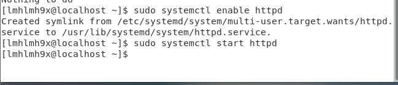
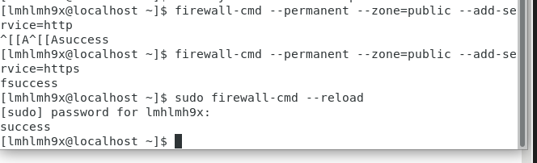
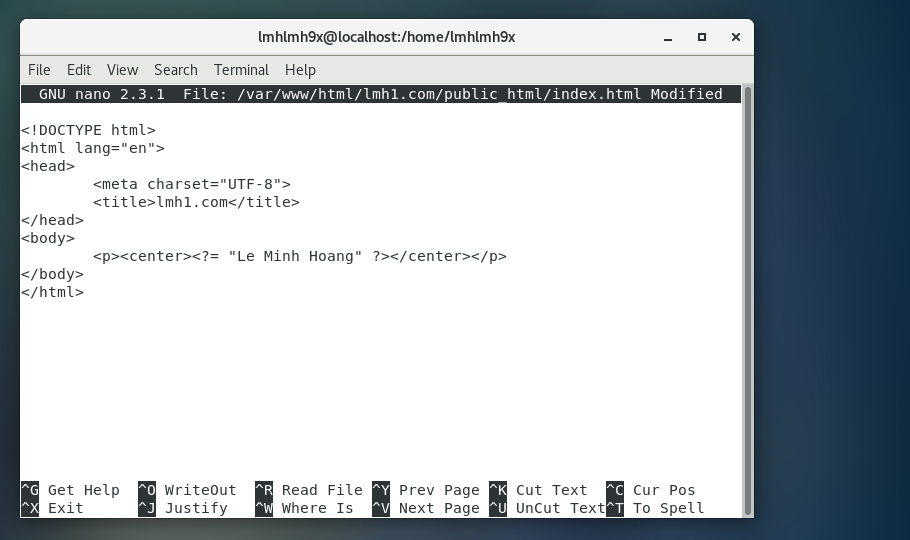
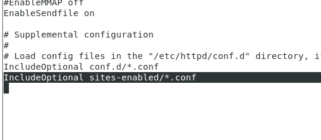

### Cập nhật lên phiên bản mới nhất bằng câu lệnh
- sudo yum update

### Cài đặt apache bằng cầu lệnh:
- sudo yum install httpd

### Khởi động dịch vụ bằng 2 câu lệnh:
- sudo systemctl enable httpd
- sudo systemctl start http

### Cấu hình tường lửa để cho phép truy cập website
- firewall-cmd --permanent --zone=public --add-service=http
- firewall-cmd --permanent --zone=public --add-service=https
- firewall-cmd --reload

### Quản lý Apache Service với systemctl
- Để dừng Apache, dùng lệnh:
    + systemctl stop httpd
- Để khởi động Apache dùng lệnh:
    + systemctl start httpd
- Lệnh khởi động lại Apache:
    + systemctl restart httpd
- Tải lại dịch vụ Apache mỗi khi bạn thay đổi cấu hình:
    + systemctl reload httpd
- Nếu không muốn Apache tự động chạy mỗi khi khởi động lại VPS sử dụng lệnh sau:
    + systemctl disable httpd
- Nếu muốn Apache tự động chạy mỗi khi khởi động lại VPS sử dụng lệnh sau:
    + systemctl enable httpd
### Cấu hình vhost
1. Tạo thư mục để lưu trữ vhost
- sudo mkdir -p /var/www/html/lmh1.com/
2. Cấp quyền
- chown -R apache:apache /var/www/html/lmh1.com/public_html
- chmod -R 755 /var/www/html
2. Tạo file index.html
- sudo nano /var/www/html/lmh1.com/public_html/index.html
    

3. Tạo 2 folder sites-avalable và site-enabled tại /etc/httpd
4. Mở file httpd.conf tại /etc/httpd/conf/httpd.conf

- IncludeOptional sites-enabled/*.conf
Thêm dòng này ở cuối cùng

5. Cấu hình file .conf cho các vhost tại sites-available giống ubuntu
6. Sau đó chuyển các file .conf ở sites-available sang sites-enabled
7. Restart service
- sudo systemctl restart httpd.
8. sudo setenforce 0
- dùng lệnh này để tắt SELinux trên centos.
9. Bên windows cấu hình file hosts để truy cập.

 
 10. sudo ln -s /etc/httpd/sites-avalable/lmh.com.conf /etc/httpd/sites-enabled/lmh.com.conf
Câu lệnh tạo link