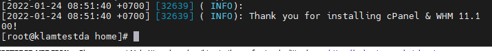
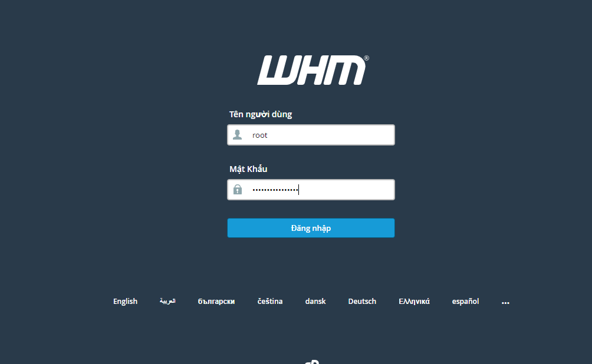
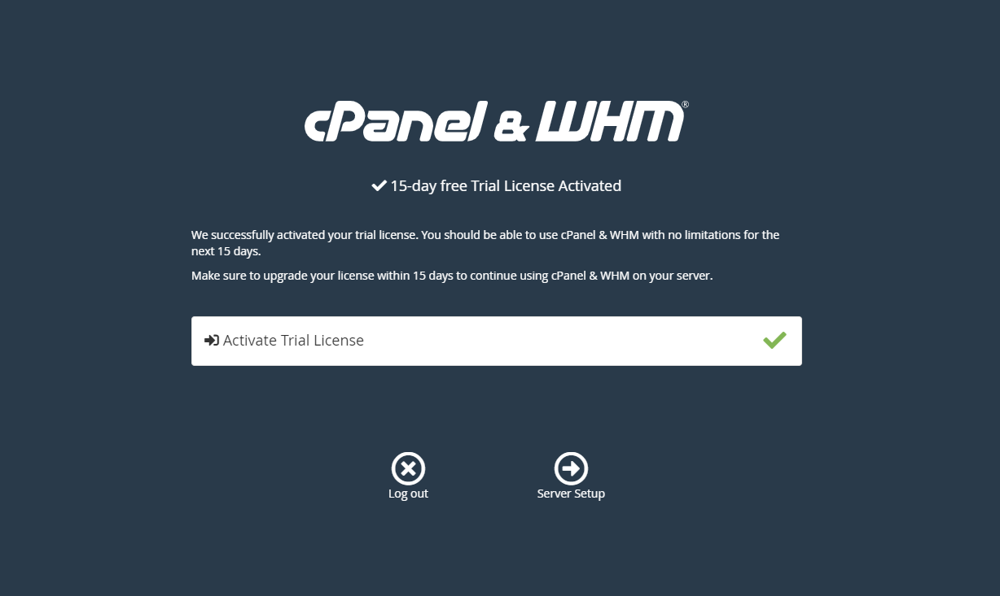
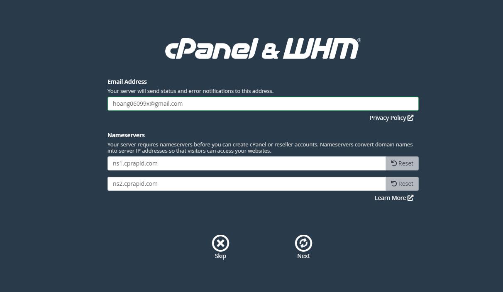
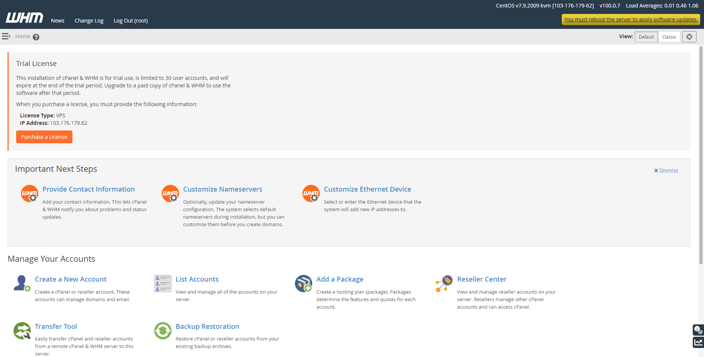

# Các bước cài đặt Cpanel trên Centos 7
## Đầu tiên SSH vào VPS
## Cài và bật tắt 1 số dịch vụ cần thiết
### 1. Perl - Curl
- yum install perl
- yum install curl
### 2. Tắt SeLinux
- sed -i 's/SELINUX=/#SELINUX=/g' /etc/selinux/config
- SELINUX=disabled >> /etc/selinux/config
### 3. Tắt Network Manager
- systemctl stop NetworkManager.service
- systemctl disable NetworkManager.service
### 4. Update

- yum update -y
## Cài đặt cPanel
- cd /home && curl -o latest -L https://securedownloads.cpanel.net/latest && sh latest

- Ngồi đợi

## Sau khi xong, truy cập địa chỉ :2087 để vào trang đăng nhập

- Đăng nhập vào cPanel bằng tài khoản root của VPS.
    

- Sau đó login tài khoản đã đăng khí trên web của cPanel để dùng thử 15 ngày.

- Một số thông tin nữa:

## Xong
- Giao diện của cPanel:

