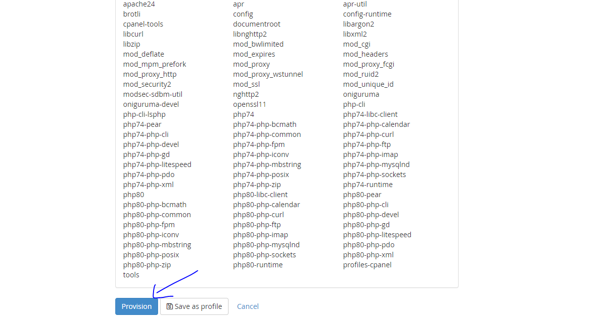

# Tìm hiểu về easeapache trên cPanel
## Giới thiệu
- EasyApache 4 là một bộ công cụ hữu ích được tích hợp sẵn trên cPanel, hỗ trợ cài đặt, cấu hình, cập nhật Apache services và nhiều tùy biến cho các phiên bản PHP trên server. Đồng thời, EasyApache còn hỗ trợ lựa chọn và gán phiên bản PHP khác nhau cho từng domain.

## Cách dùng

## Build thêm PHP 5.4 và 7.1 trên ezapache

- Sau đó next liên tục, đến review để check lại:

- Thực hiện :

- Thế là xong, cài rất rất nhanh.

## Build theo profile

