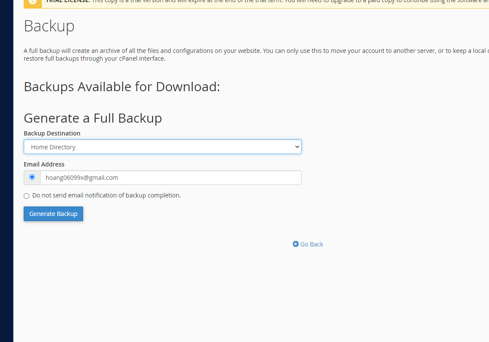

# Sử dụng 1 số chức năng của WHM

- Truy cập bằng port 2087
## Tạo package

## Tạo người dùng

## Cài SSL cho domain

## Site Software wordpress

## Cài WP-Toolkit
- Chạy câu lệnh:
- sh <(curl https://wp-toolkit.plesk.com/cPanel/installer.sh || wget -O - https://wp-toolkit.plesk.com/cPanel/installer.sh)

# Một số chức năng của cPanel
- Truy cập bằng port 2083

## 1. Cài WP bằng toolkit

## Backup/restore web
- Có thể full backup hoặc backup từng phần như backup thư mục chính, cơ sở dữ liệu, email...

## Quản lí file/thư mục

## Tạo subdomain

## Đổi version PHP

