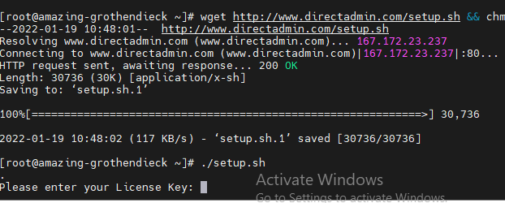
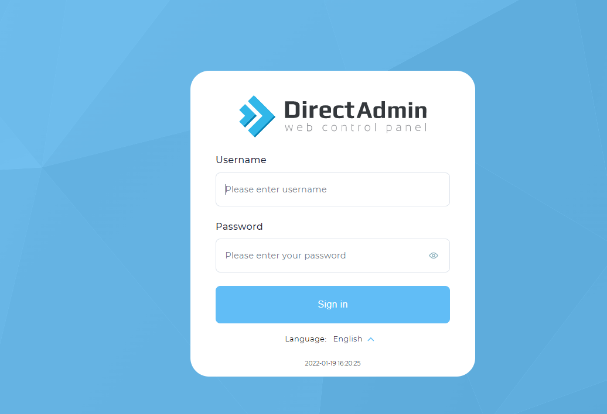
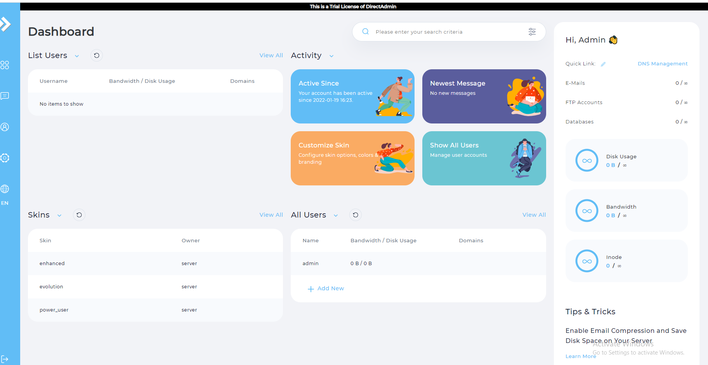

# Cài DirectAdmin trên Centos 7
1. Cài các gói cần thiết cho DirectAdmin
- yum install wget gcc gcc-c++ flex bison make bind bind-libs bind-utils openssl openssl-devel perl quota libaio \
libcom_err-devel libcurl-devel gd zlib-devel zip unzip libcap-devel cronie bzip2 cyrus-sasl-devel perl-ExtUtils-Embed \
autoconf automake libtool which patch mailx bzip2-devel lsof glibc-headers kernel-devel expat-devel
- yum install psmisc net-tools systemd-devel libdb-devel perl-DBI xfsprogs rsyslog logrotate crontabs file
2. Tải gói DirectAdmin về cài đặt
- wget http://www.directadmin.com/setup.sh && chmod 755 setup.sh 

- ./setup.sh

- Khi chạy câu lệnh trên thì phải nhập Key:

3. Sau khi xong truy cập tên lmhlmh9x.xyz port 2222 để vào trang đăng nhập DA. Thông tin được hệ thống trả lại với user là admin và mật khẩu được tạo tự động.

4. Trang quản trị của DA

