## Cài Plesk trên Linux
1. Chạy câu lệnh:
- sh <(curl https://autoinstall.plesk.com/one-click-installer || wget -O - https://autoinstall.plesk.com/one-click-installer)
- Pha trà hay cafe rồi ngồi dợi, lâu lắm.
2. Xong nó trông ntn.

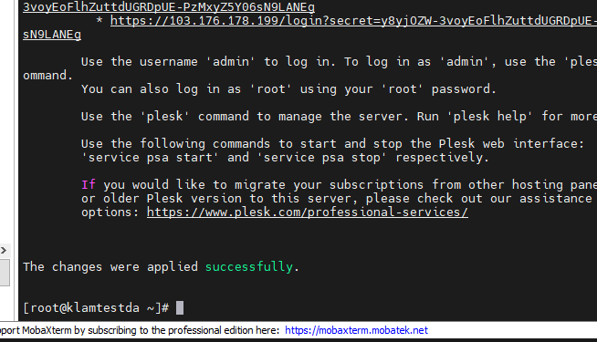

3. Vào trình duyệt truy cập port 8880 hoặc 8443.
- Đăng nhập bằng tài khoản root của server
- Cấu hình thông tin:
 
 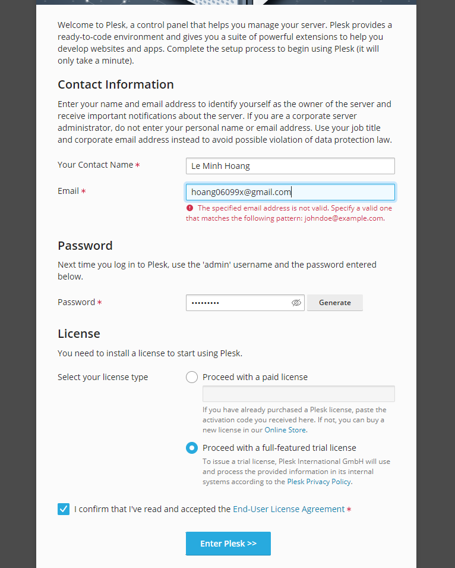
4. Sau thì giống như cài bên windows.

# Cài SSL free cho Wordpress 
1. vào link https://zerossl.com/
2. Tạo tài khoản hoặc đăng nhập
3. Tạo chứng chỉ mới

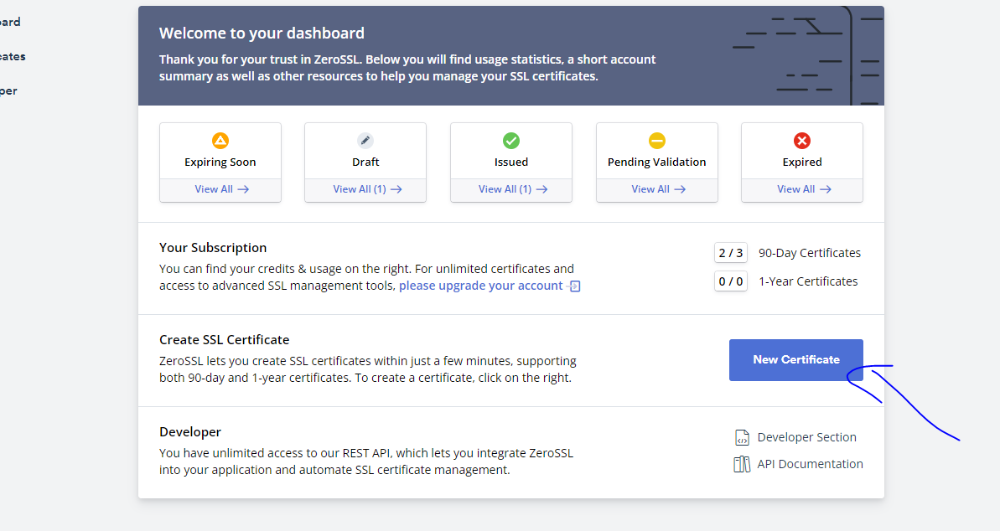

4. Nhập tên domain

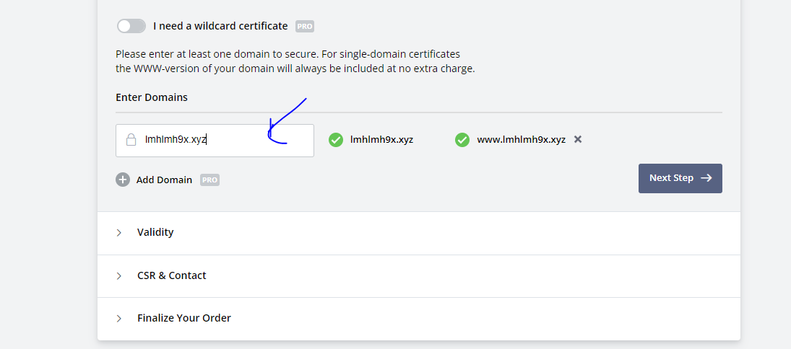

5. Chọn 90 ngày thì mới miễn phí

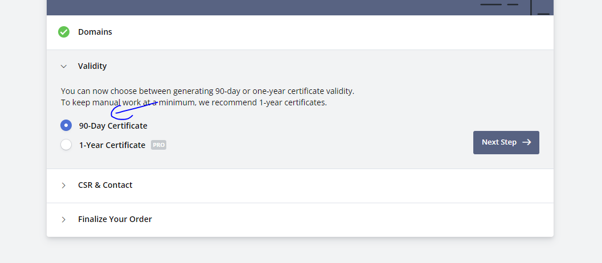

6. Next

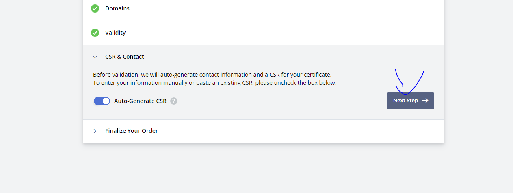

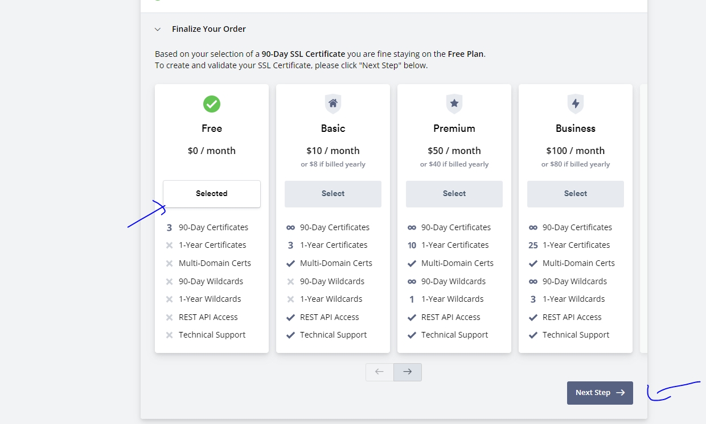
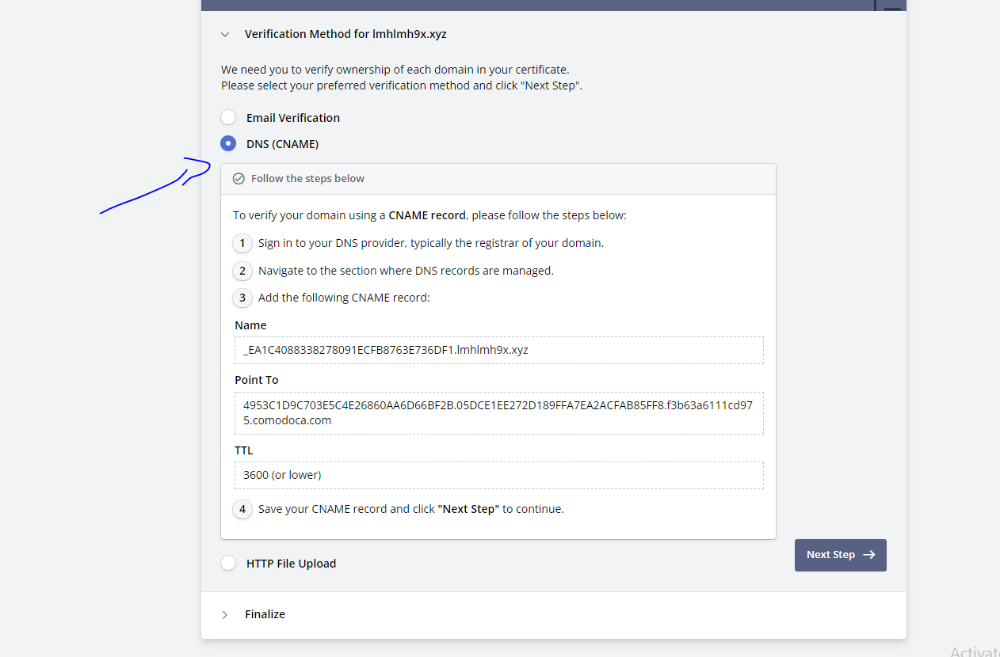

7. Vào ZoneDNS tạo record theo yêu cầu

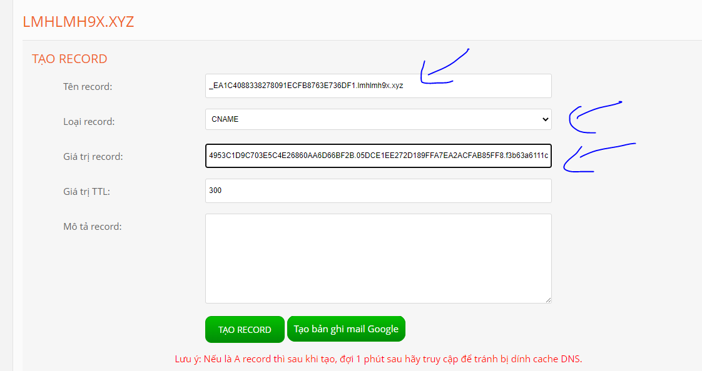

8. Đợi 1 lúc rồi confirm. Sau đó dowload Zip về

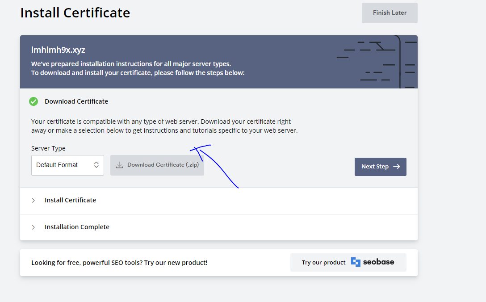

9. Winrar

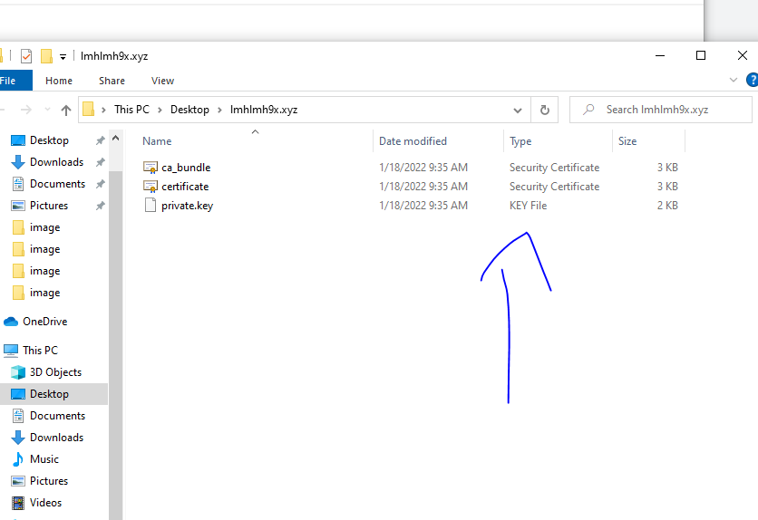

10. Vào Plesk, tới mục ...

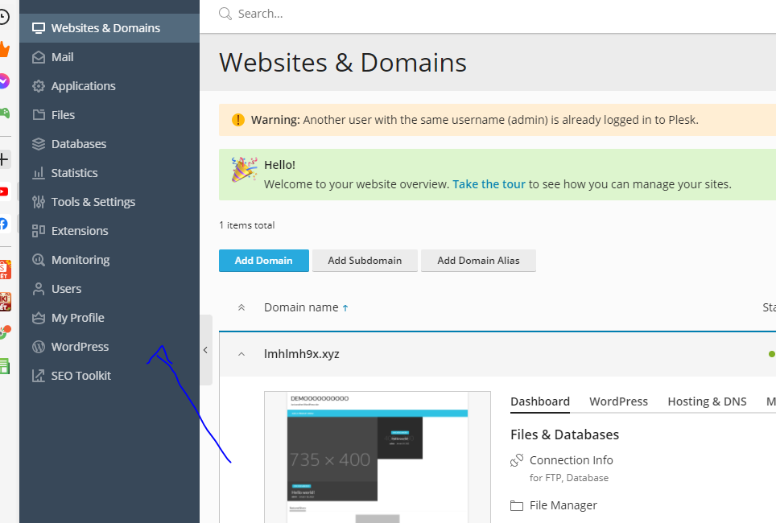
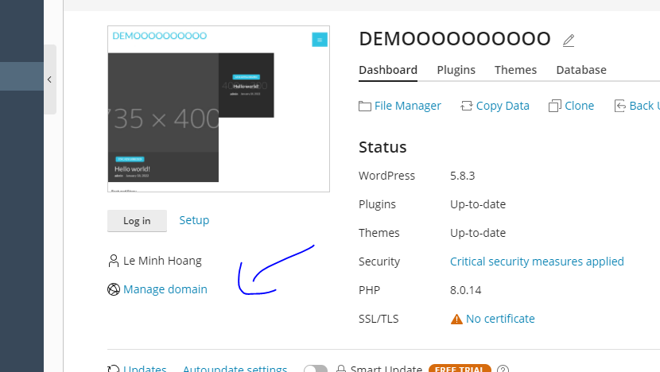
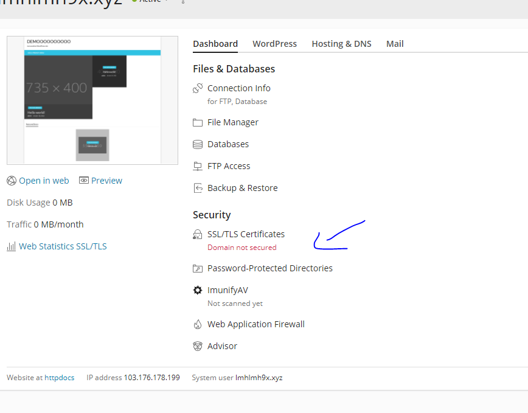

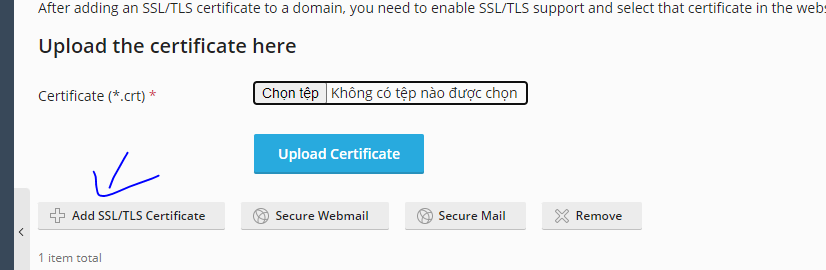
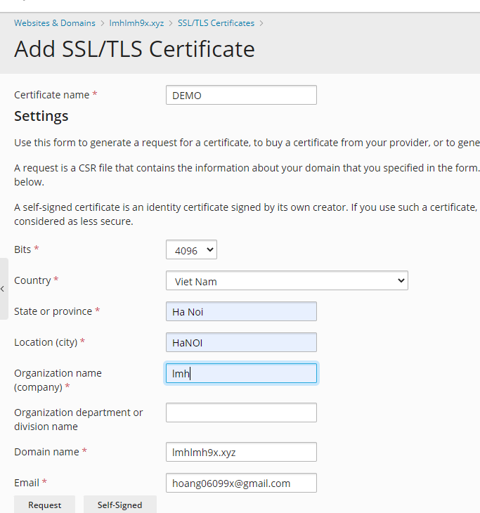
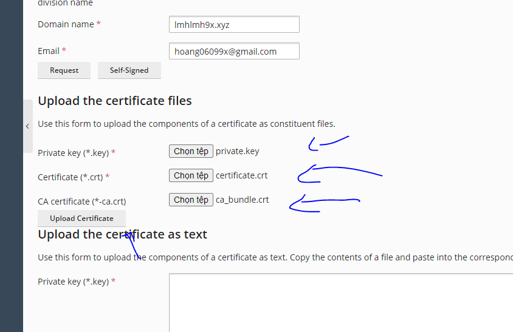

11. OK 

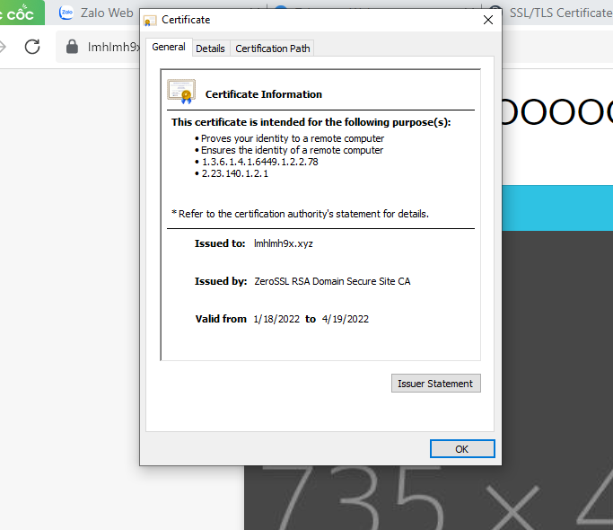
