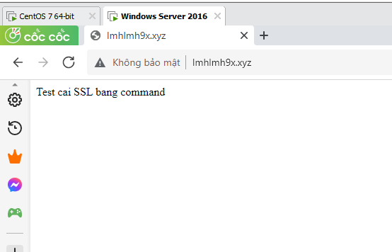
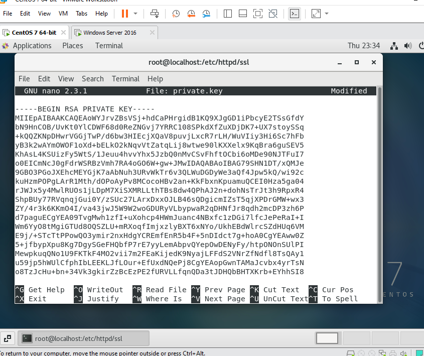
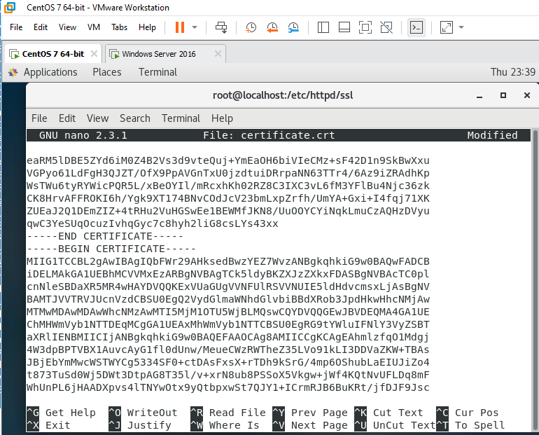
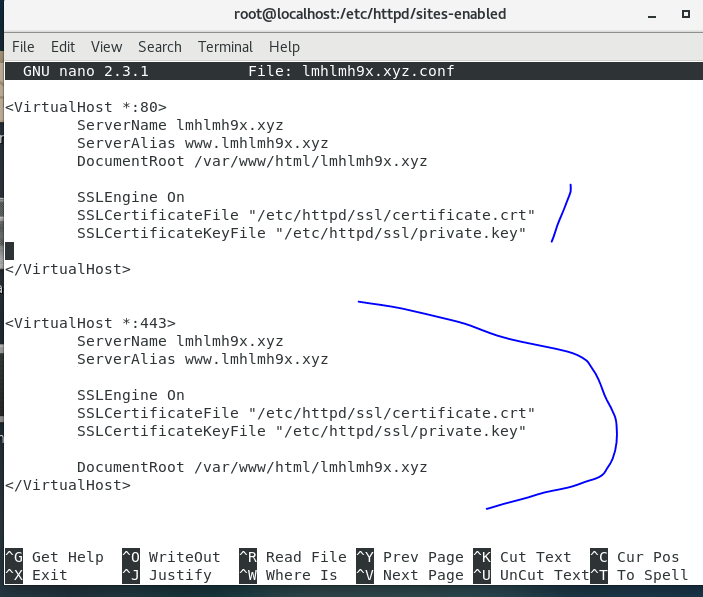
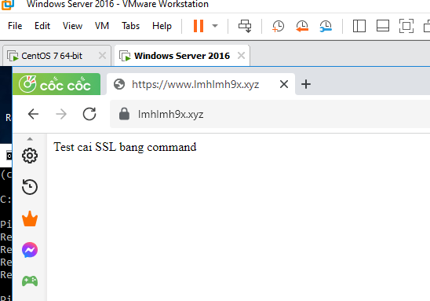
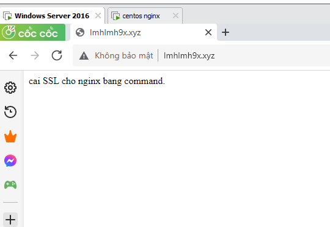
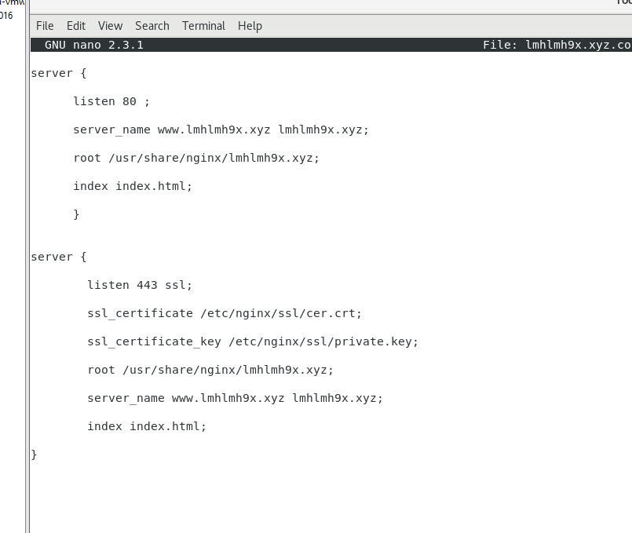

# Cài SSL trên Apachewebserver sử dụng command

## Đầu tiên tạo vhost lmhlmh9x.xyz như những lần trước 

##  Cài mod_ssl
- yum install mod_sll

## Tạo thư mục chứa SSL
- mkdir /etc/httpd/ssl
## Tạo file private.key và dán key vào.
- nano private.key

## Tạo file chứa crt và ca rồi dán vào

- nano certificate.crt

## Sửa file config 

<VirtualHost *:80>
        ServerName lmhlmh9x.xyz
        ServerAlias www.lmhlmh9x.xyz
        DocumentRoot /var/www/html/lmhlmh9x.xyz

        SSLEngine On
        SSLCertificateFile "/etc/httpd/ssl/certificate.crt"
        SSLCertificateKeyFile "/etc/httpd/ssl/private.key"

</VirtualHost>

<VirtualHost *:443>
        ServerName lmhlmh9x.xyz
        ServerAlias www.lmhlmh9x.xyz

        SSLEngine On
        SSLCertificateFile "/etc/httpd/ssl/certificate.crt"
        SSLCertificateKeyFile "/etc/httpd/ssl/private.key"

        DocumentRoot /var/www/html/lmhlmh9x.xyz
</VirtualHost>

## Reload service

- systemctl reload httpd.

## Kết quả:

# Cài SSL trên Nginx Webserver

## Cài Nginx tạo Vhost các thứ như mọi lần

##  Cài mod_ssl
- yum install mod_sll

## Tạo thư mục chứa SSL
- mkdir /etc/httpd/ssl
## Tạo file private.key và dán key vào.
- nano private.key

## Tạo file chứa crt và ca rồi dán vào

- nano certificate.crt

## Sửa file config 

server {

      listen 80 ;

      server_name www.lmhlmh9x.xyz lmhlmh9x.xyz;

      root /usr/share/nginx/lmhlmh9x.xyz;

      index index.html;

      }

server {

        listen 443 ssl;

        ssl_certificate /etc/nginx/ssl/cer.crt;

        ssl_certificate_key /etc/nginx/ssl/private.key;

        root /usr/share/nginx/lmhlmh9x.xyz;

        server_name www.lmhlmh9x.xyz lmhlmh9x.xyz;

        index index.html;

}

 

 