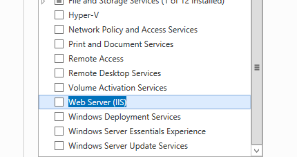

## Cài đặt IIS
1. Ở Server Manager, chọn Add Roles...
 
 

2. Next đến chỗ 

 
+ Chọn Add features xong next.
3. Next tiếp xong install, thiếu features nào cài sau.

4. Vào chỗ Tools, chọn IIS manager 

## Tạo web html
1. Mở notepad bằng quyền admin, type ....
2. Save vào thư mục C:/interput/wwwroot với tên index.html

3. Kiểm tra bằng cách vào trình duyệt của máy gõ 127.0.0.1 hoặc localhost.

## Dựng web PHP
1. Cài php manager.
- 2012 là IIS 8.
- Link tải : https://github.com/picassio/PHPManagerForIIS-Versiones
- Vào IIS manager, thấy php manager.

- Tiếp đến tải PHP về cho Windows tại link : https://windows.php.net/download/

- Về Winrar xong, mở lại php manager.

- Chọn registry..., đường dẫn trỏ đến PHP-cgi mới giải nén lúc nãy.

- Ok các thứ xong restart IIS.

