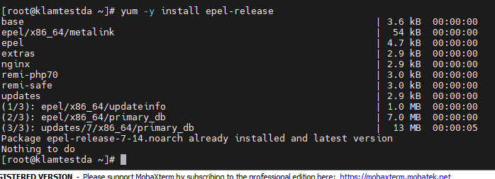
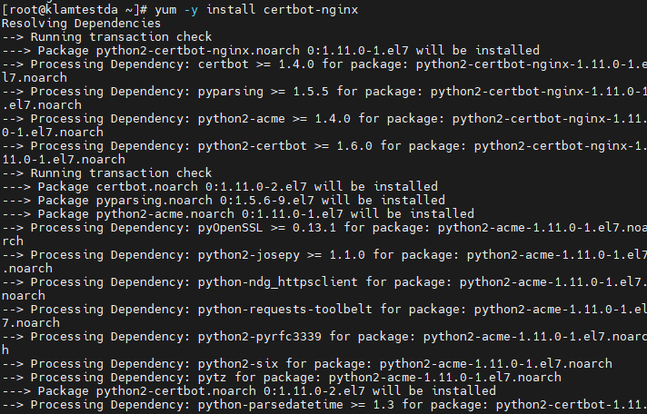
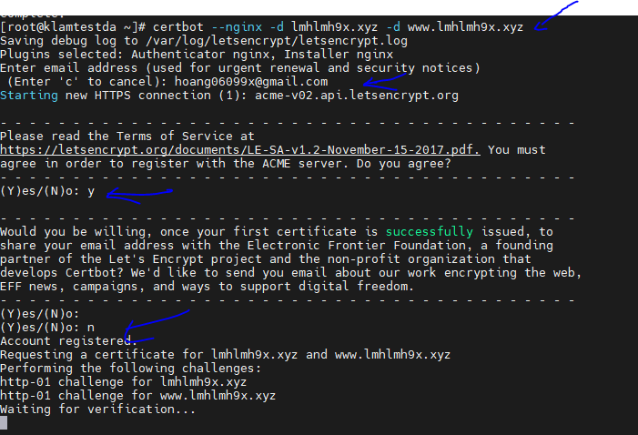
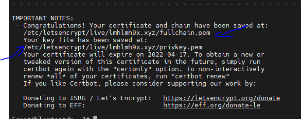
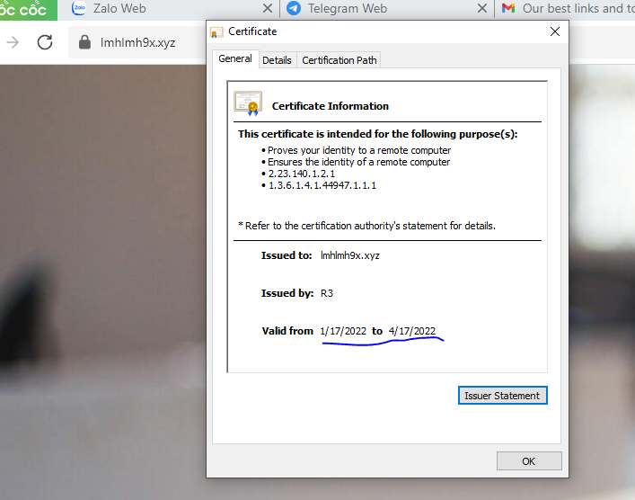
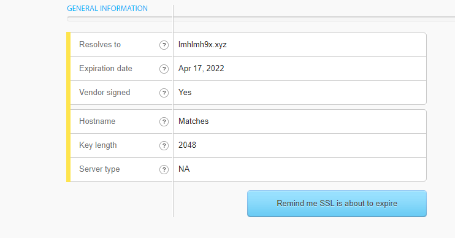
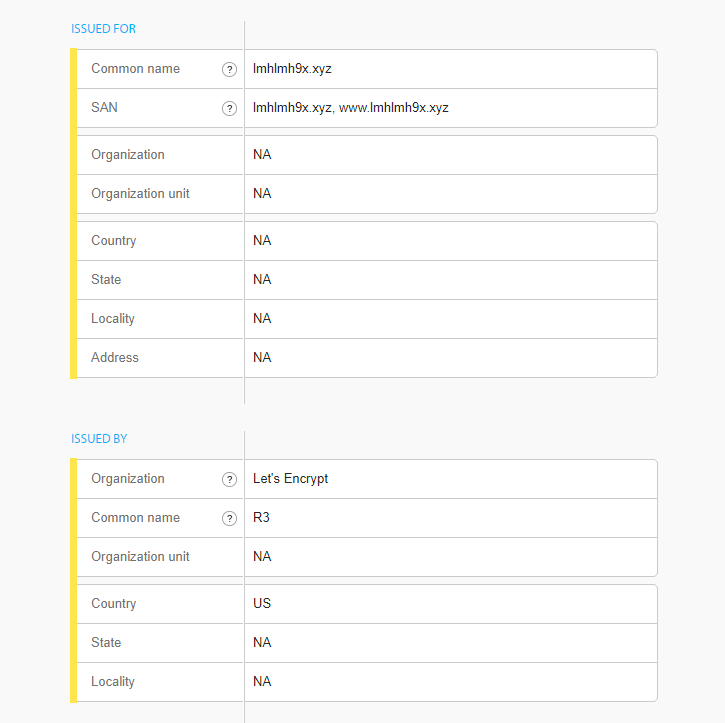
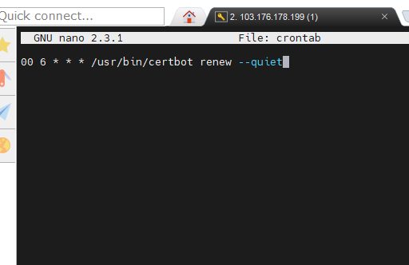

## Cài đặt SSL Let's Encrypt với Certbot trên Nginx.
### 1. Cài đặt Cerbot Let's Ecrypt Client
- Đầu tiên cài đặt EPEL repository: 
    + yum -y install epel-release

    

- Tiếp đến cài đặt certbot-nginx bằng câu lệnh:
    + yum -y install certbot-nginx

    

### 2. Cài đặt SSL Let's Encrypt
- Chạy câu lệnh : certbot --nginx -d lmhlmh9x.xyz -d www.lmhlmh9x.xyz

    

    + Đầu là nhập domain theo của mình
    + Tiếp là mail
    + y để chấp nhận điều khoản
    + n để không nhận thông tin

- Khi thành công ta sẽ có thông tin về chứng chỉ và khóa được lưu tại đường dẫn nào.

     

### Kiểm tra kết quả
- Có thể kiểm tra trực tiếp trên trình duyệt:

    

- Hoặc kiểm tra trên SSL Checker:

    

    

### Cấu hình gia hạn tự động
- Chứng chỉ Let's Encrypt chỉ có hiệu lực trong 90 ngày.
- Mở cửa sổ thêm Cronjob:
    + nano crontab
- Thêm cấu hình 
    + 00 6 * * * /usr/bin/certbot renew --quiet
    + Cronjob này có nghĩa là cứ đúng 6:00 AM nó sẽ check chứng chỉ, nếu chứng chỉ hết hạn sẽ tự động gia hạn. Ngược lại, nếu còn hạn sẽ không thực hiện gia hạn.

    

# Cài trên apache
- Tương tự như trên nginx:
- Khác ở bước cài đặt cerbot apache ta dùng câu lệnh: 
    + yum -y install certbot python2-certbot-apache mod_ssl