## Những lệnh liên quan đến hệ thống
1. exit: thoát khỏi cửa sổ dòng lệnh.

2. reboot: khởi động lại hệ thống.

3. halt: tắt máy.
- Phải ở quyền root
- Không nên dùng, bị treo máy ảo
4. startx: khởi động chế độ xwindows từ cửa sổ terminal.
5. mount: gắn hệ thống tập tin từ một thiết bị lưu trữ vào cây thư mục chính.
6. unmount: ngược với lệnh mount.
7. ps: kiểm tra hệ thống tiến trình đang chạy.

    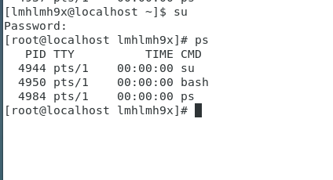

8. kill: dừng tiến trình khi tiến trình bị treo. Chỉ có người dùng super-user mới có thể dừng tất cả các tiến trình còn người dùng bình thường chỉ có thể dừng tiến trình mà mình tạo ra.

    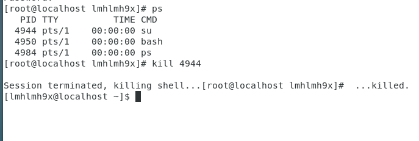

10. top: hiển thị sự hoạt động của các tiến trình, đặc biệt là thông tin về tài nguyên hệ thống và việc sử dụng các tài nguyên đó của từng tiến trình.

    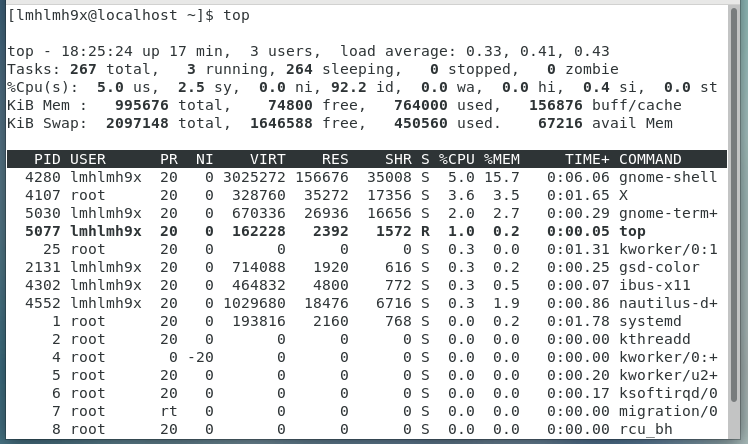

11. pstree: hiển thị tất cả các tiến trình dưới dạng cây.

    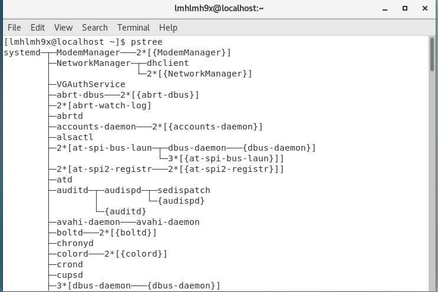

12. man: xem hướng dẫn về dòng lệnh như cú pháp, các tham số...

    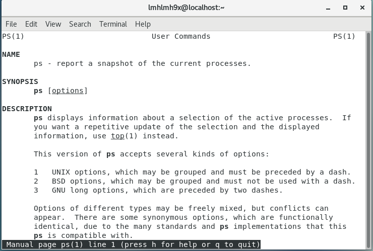

## Những lệnh thao tác với tập tin
1. ls: lấy danh sách tất cả các file và thư mục trong thư mục hiện hành.

    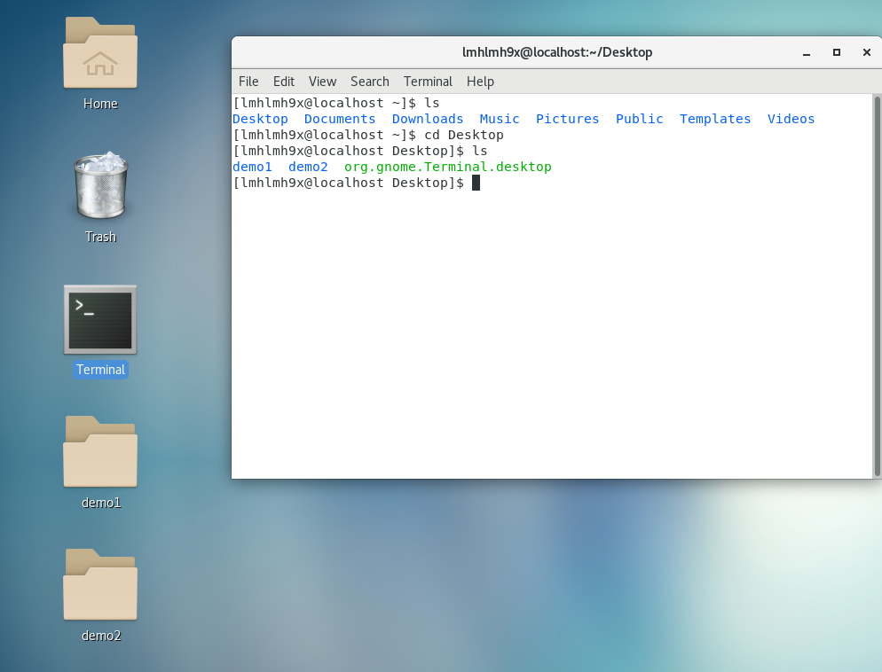

2. pwd: xuất đường dẫn của thư mục làm việc.

    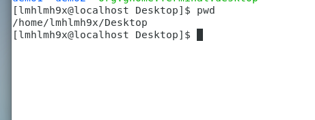

3. cd: thay đổi thư mục làm việc đến một thư mục mới.

    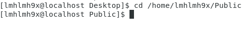

4. mkdir: tạo thư mục mới.

    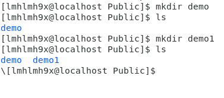

5. rmdir: xoá thư mục rỗng.

    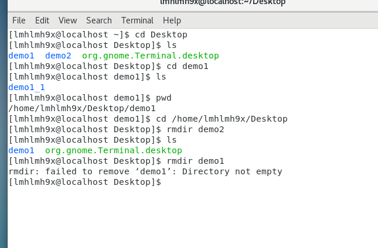

6. cp: copy một hay nhiều tập tin đến thư mục mới.

    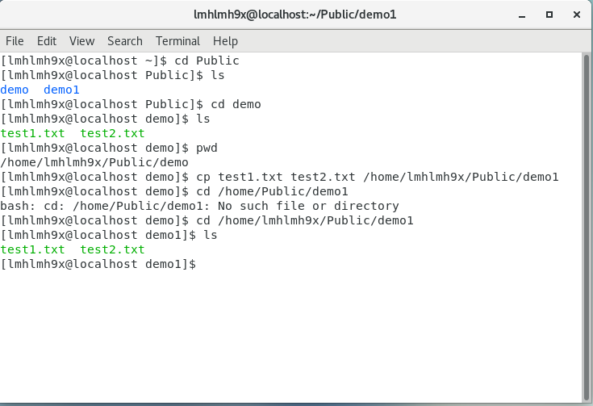

7. mv: đổi tên hay di chuyển tập tin, thư mục.

    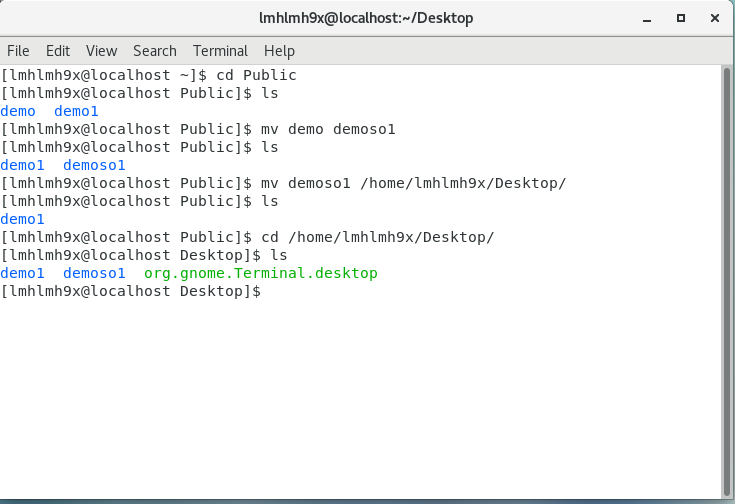

8. rm: xóa tập tin.

    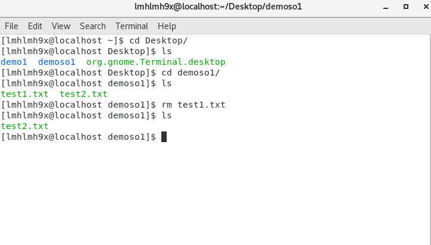

9. touch: tạo một tập tin.

    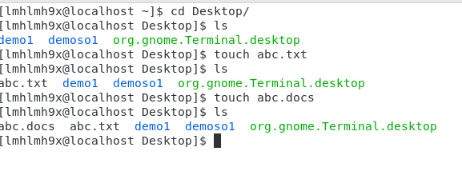

10. cat: xem nội dung tập tin.

    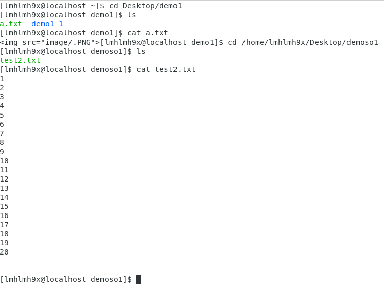

11. vi: khởi động trình soạn thảo văn bản vi.

    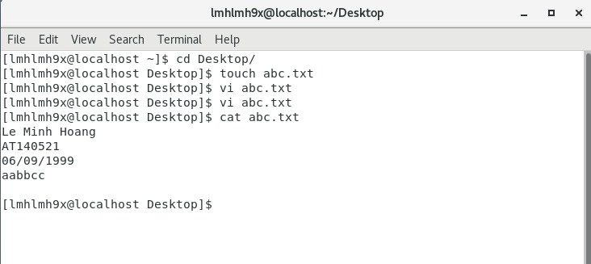

    - Insert để chèn text, :wq để lưu và quit...

## Lệnh khi làm việc ở cửa sổ Terminal
1. clear: xoá trắng cửa sổ dòng lệnh.
2. date: xem ngày, giờ hệ thống.
3. cal: xem lịch hệ thống.

    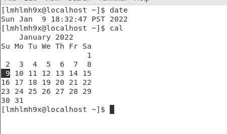

## Nhóm lệnh kiểm tra thông tin trong hệ thống
1. cat /proc/cpuinfo    Kiểm tra thông tin CPU (số core)

    

2. cat /proc/meminfo    Kiểm tra thông tin về RAM đang sử dụng

    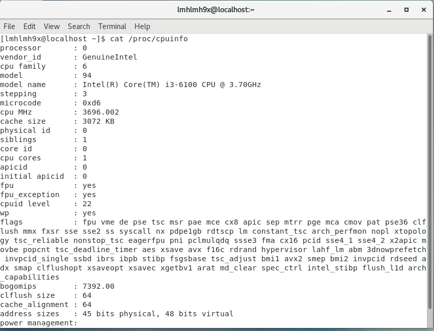

3. cat /proc/version    Kiểm tra phiên bản của Kernel Linux

    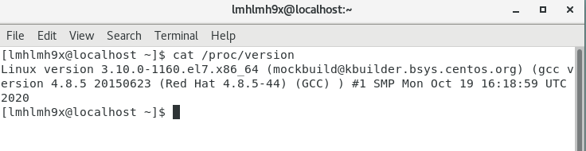

4. cat /proc/ioports    Xem thông tin port I/O

    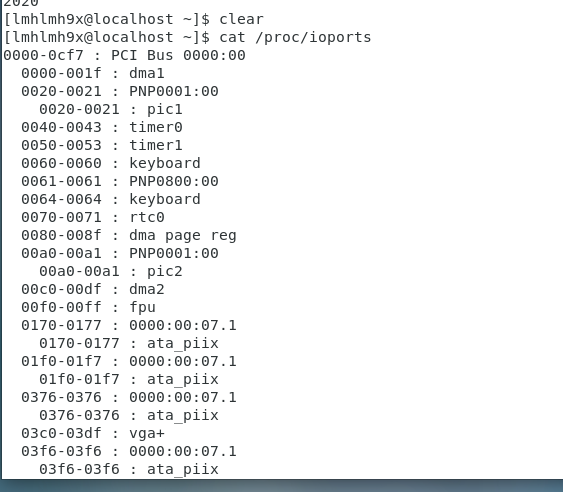

5. cat /etc/redhat-release    Kiểm tra phiên bản Centos

    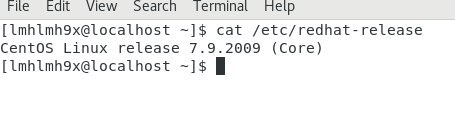

6. uname -a    Kiểm tra các thông tin về Kernel
7. free -m    Kiểm tra dung lượng RAM còn trống

    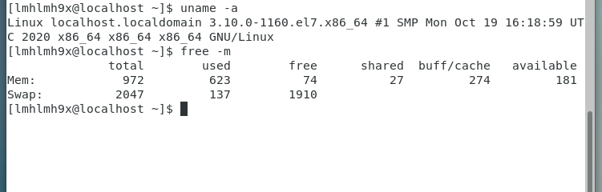
8. df -h    Hiển thị thông tin những file hệ thống, nơi file được lưu hoặc tất cả những file mặc định. Lệnh này có thể xem được dung lượng ổ cứng đã sử dụng và còn trống.

    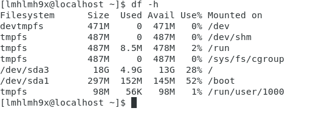

9. ifconfig  Xem các địa chỉ IP của máy

    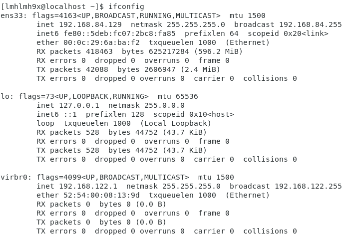

10. last reboot    Xem lịch sử reboot máy  

## Lệnh liên quan đến cài đặt

1. gunzip : chuyển file .tar.gz về file taz

    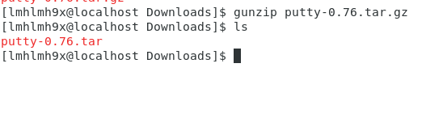

2. tar -xvf : Giải nén file .tar

