# Các thao tác trên Hosting
1. Từ trang home, vào Customer

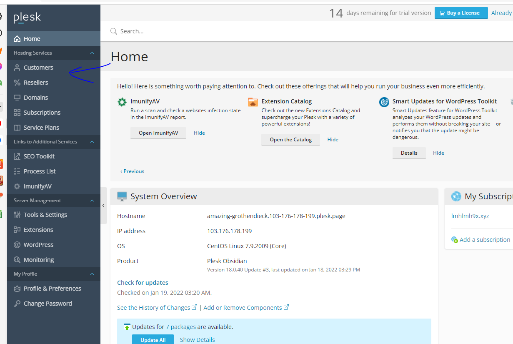

2. Danh sách các khánh hàng sẽ hiện ra, chọn khách hàng demo123.

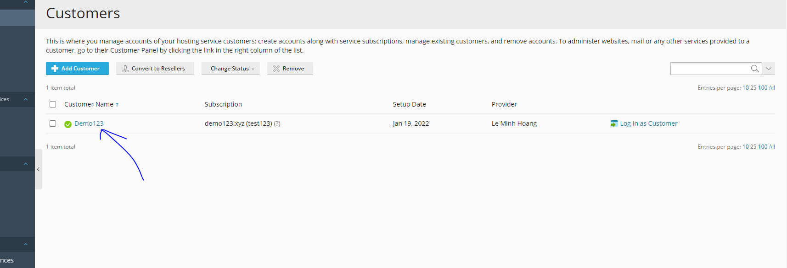

3. Đến trang quản lí của demo123, thấy được khách hàng này chỉ có 1 trang web, những thông tin về khách hàng ở phía bên tay phải.

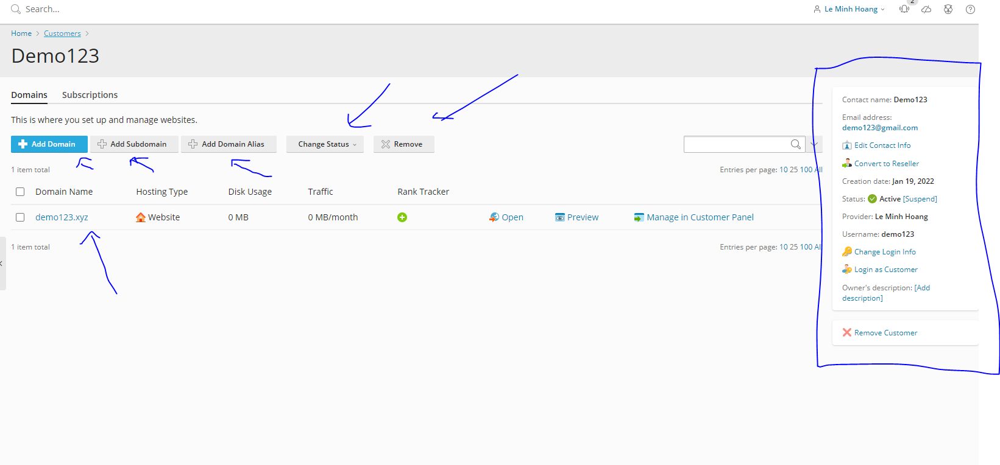

- Tại đây ta có thể thêm domain, subdomain, alias. Có thể thay đổi trạng thái của các domain nếu có nhiều domain, xóa domain và hơn thế nữa...
4. Khi chọn vào domain demo123.xyz, ta được đưa tới trang quản lí của demo123.xyz

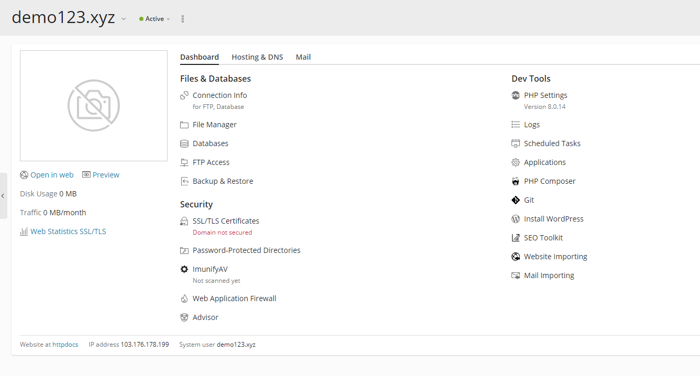

5. Ở trang quản lí, có thể vào File Manager để quản lí source code của web.

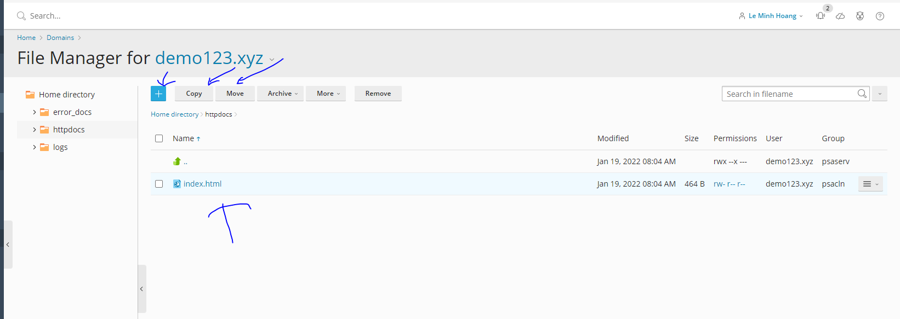

- Có thể sửa code tại trang html:

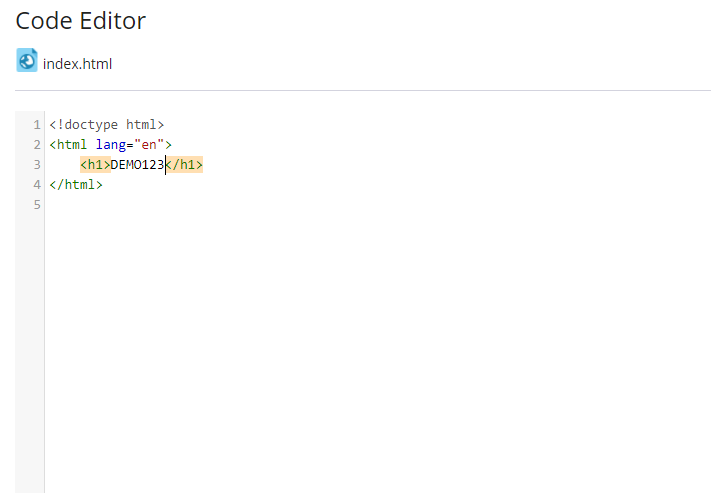

- Vào preview để xem thử.

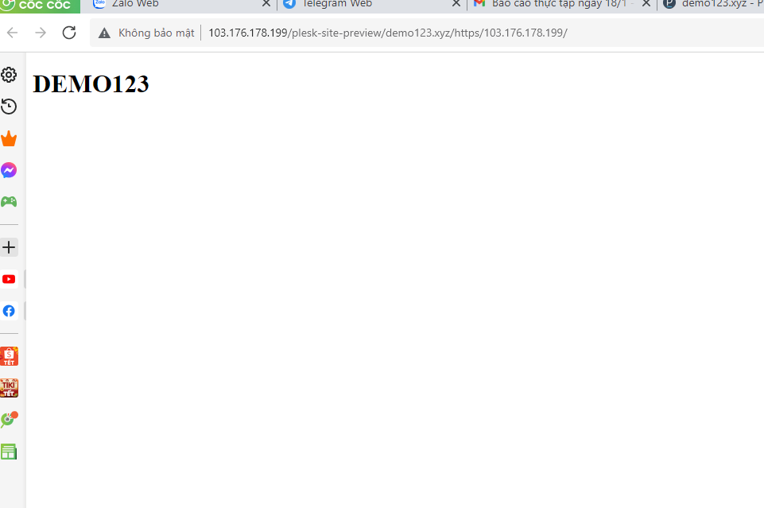

6. Upload Sourcecode
- Vào phần +, chọn up load thư phục.

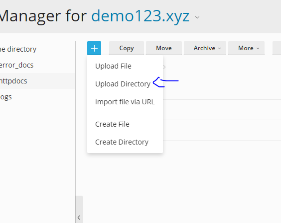

- Giao diện up load:

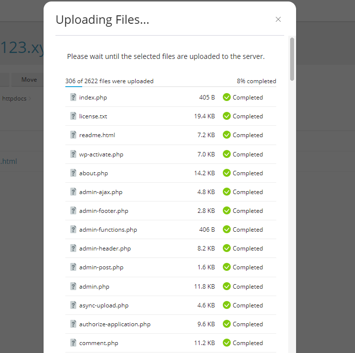

7. Cài ứng dụng

- Tại trang quản lí, chọn applications.

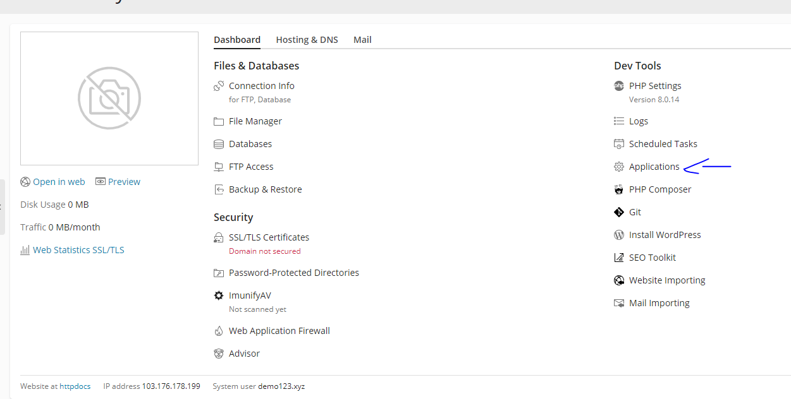

- Tiếp chọn ứng dụng muốn cài, ở đây tôi chọn WP.

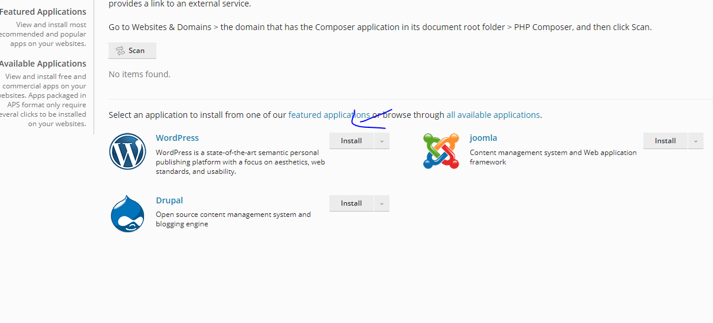

- Ứng dụng đang cài

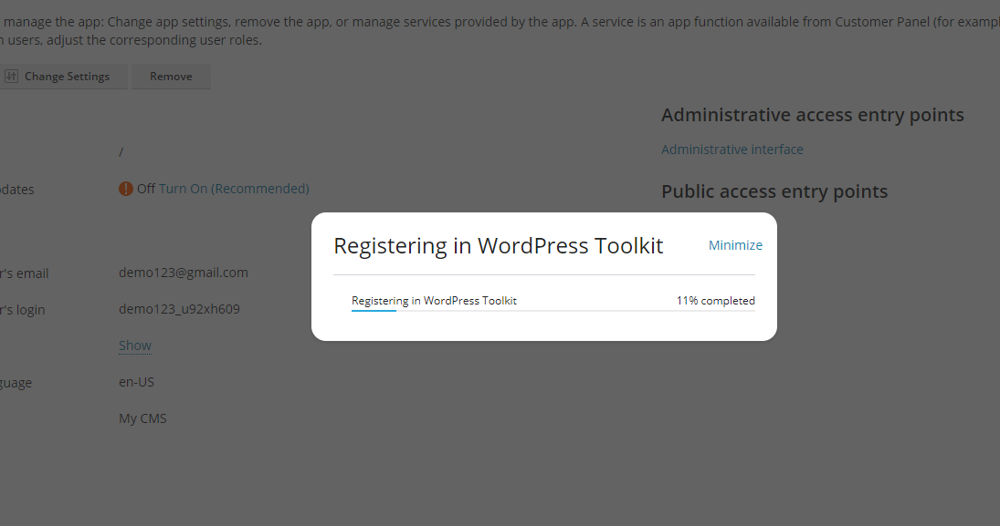

- Xong vào preview xem kết quả: 

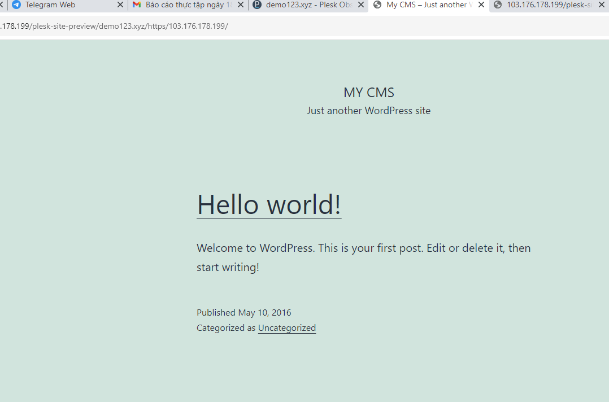

8. Có thể vào phần log để xem log.

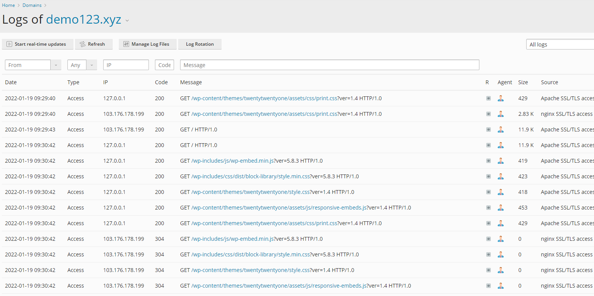

9. Có thể tạo accout FTP

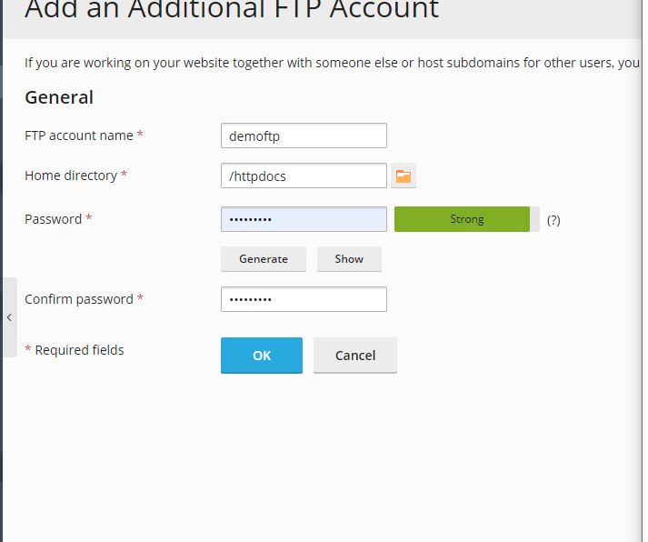

10. Có thể vào mục import website để nhập các phiên bản, thư mục, cơ sở dữ liệu từ trang web sở hữu khác.

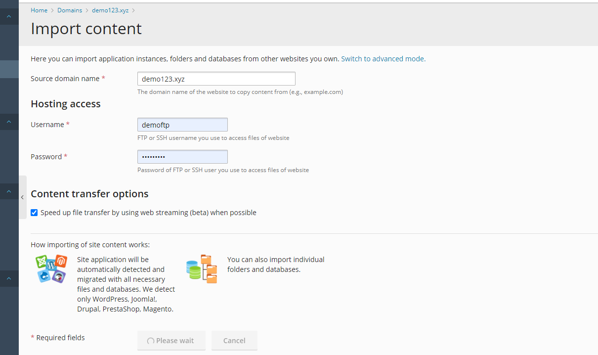

11. Tạo Database.

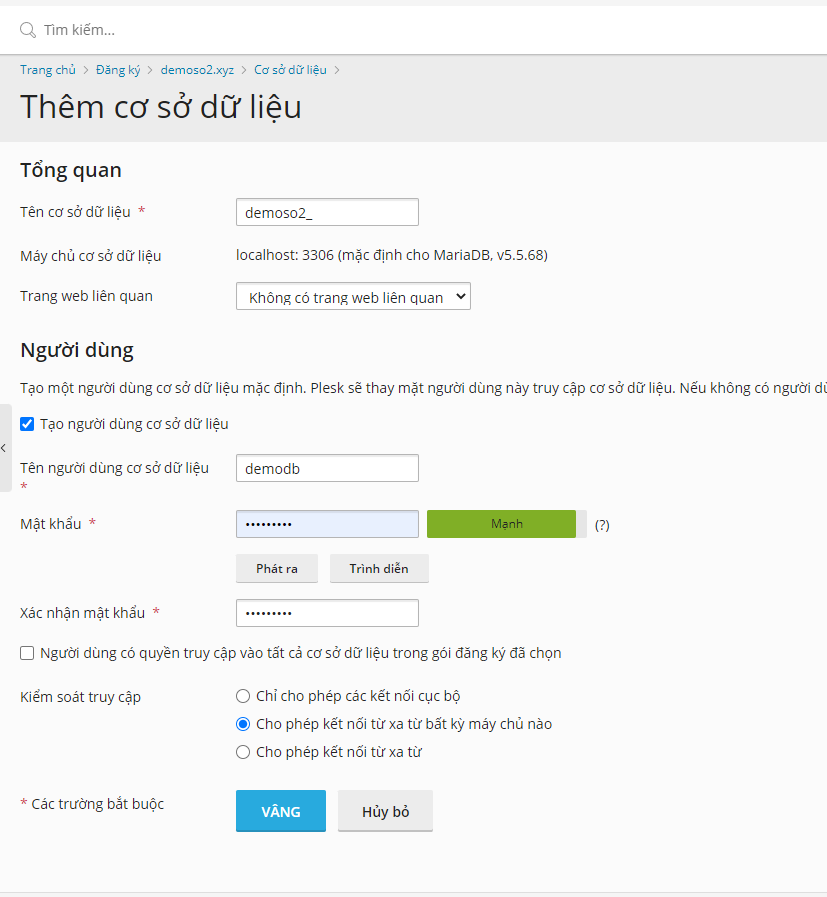

12. Vào Schedule Task để tạo thêm nhiệm vụ:

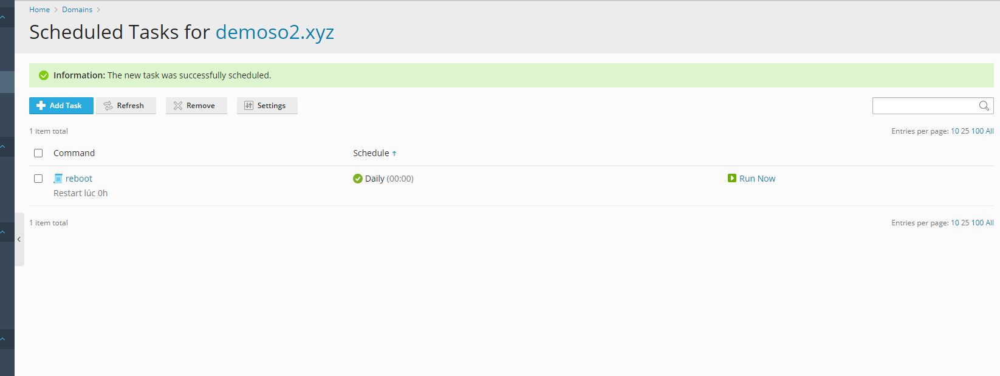

13. Có thể backup restore web

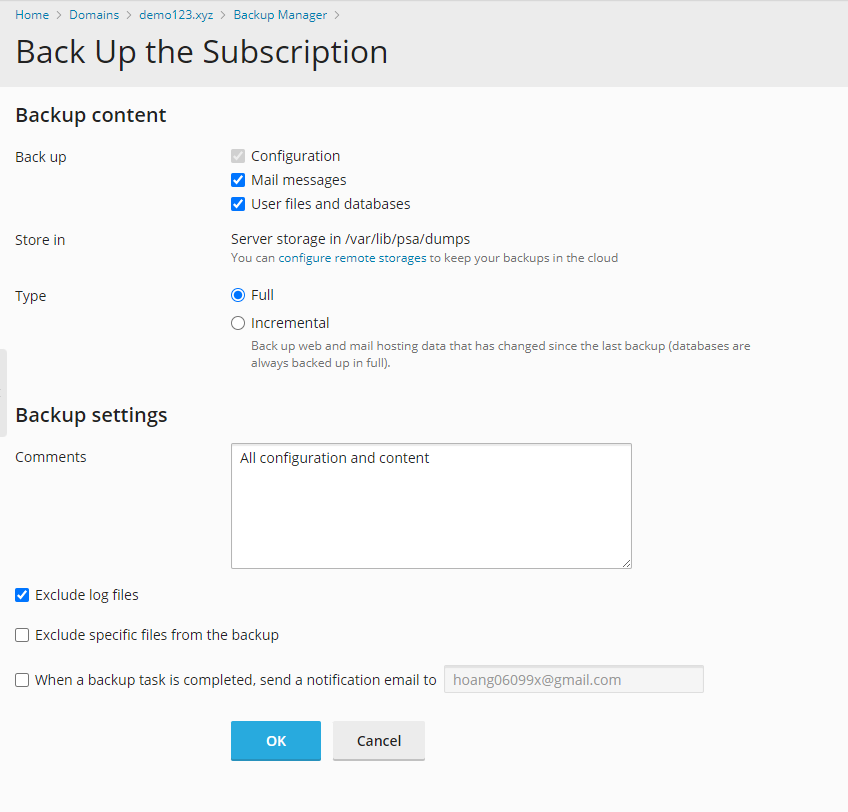

14. Cài SSL như những lần trước...

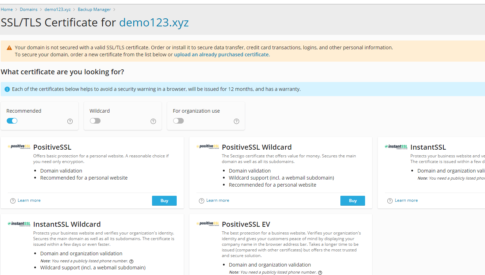