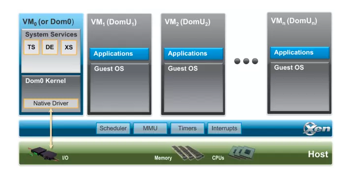

# Xen Hypervisor
## Giới thiệu
- Xen Hypervisor là một trình giám sát máy ảo Virtual Machine Monitor (VMM) hypervisor loại 1 và là một sản phẩm mã nguồn mở. Nó được sử dụng làm cơ sở cho một số ứng dụng thương mại mã nguồn mở khác nhau như: server virtualization, Infrastracture as a Service (IaaS), desktop virtualization, security application, embedded and hardware devices

## Một số tính năng chính
- Size và Interface nhỏ (có kích thước khoảng 1MB). Bởi vì nó sử dụng thiết kế microkernel, với dung lượng memory và interface hạn chế cho máy guest, nên nó mạnh mẽ và an toàn hơn so với các trình ảo hóa khác.

- Hệ điều hành không rõ ràng: Hầu hết các cài đặt chạy với Linux là do stack điều khiển chính ( còn gọi là "domain 0"). Nhưng một số hệ điều hành có thể thay thế, bao gồm NetBSD và OpenSolaris.

- Trình điều khiển được cách ly: Xen Project hypervisor có khả năng cho phép trình điều khiển thiết bị chính của hệ thống chạy bên trong một máy ảo. Nếu trình điều khiển gặp sự cố hoặc bị xâm phạm, VM (Virtual Machine) có chứa trình điều khiển có thể được khởi động lại mà không hề ảnh hưởng đến phần còn lại của hệ thống.

- Paravirtualization - Ảo hóa song song : Fully paravirtualized guests đã được tối ưu như một máy ảo. Điều này cho phép guest chạy nhanh hơn nhiều so với các tiện ích mở rộng phần cứng ( Hardware Virtual Machine - HVM). Ngoài ra, trình ảo hóa có thể chạy trên phần cứng không hỗ trợ các tiện ích mở rộng ảo hóa.

## Kiến Trúc Của XEN
- Trình ảo hóa Xen Hypervisor chạy trực tiếp và chịu trách nghiệm xử lý CPU, bộ nhớ, bộ hẹn giờ và ngắt. Đây là chương trình đầu tiên chạy sau khi thoát khỏi bộ nạp khởi động. Một phiên bản đang chạy của máy ảo sẽ được gọi là domain hoặc guest. 
- Một domain đặc biệt, được gọi là domain0 chứa trình điều khiển cho tất cả các thiết bị trong hệ thống. Domain0 cũng chứa control stack và các service systems khác để quản lý hệ thống trên Xen. 
- Lưu ý rằng thông qua Dom0 Disaggregation, có thể chạy một số trình điều khiển dịch vụ và thiết bị này trong một máy ảo chuyên dụng: tuy nhiên đây không phải là thiết lập hệ thống thông thường.

- Guest Domain/ Virtual Machines Là môi trường ảo hóa, mỗi môi trường chạy hệ điều hành và ứng dụng riêng của chúng. Trình ảo hóa hỗ trợ một số chế độ ảo hóa khác nhau, được mô tả chi tiết dưới đây. Guest VM hoàn toàn tách biệt với phần cứng: nói cách khác, chúng không có quyền truy cập vào phần cứng hoặc functions I/O. Do đó chúng còn được gọi là domain không có đặc quyền (hoặc DomU)

- Domain Điều Khiển (hoặc Dom0) Là một máy ảo chuyên dụng có đặc quyền đặc biệt như khả năng truy cập trực tiếp vào phần cứng, xử lý tất cả các quyền truy cập vào functions I/O của hệ thống và tương tác với VM khác. Không thể sử dụng trình ảo hóa Xen mà không có Domain0, đây là VM đầu tiên được khởi động. Trong một thiết lập tiêu chuẩn, Dom0 chứa các chức năng sau:

    + System Services: chẳng hạn như XenStore/XenBus(XS) để quản lý cài đặt. Toolstack(TS) hiển thị giao diện người dùng Xen sử dụng thiết bị mô phỏng (DE) dựa trên QEMU(Quick EMUlator) trong các hệ thống được sử dụng bởi Xen.
    + Native Device Drivers: Dom0 là nguồn của trình điều khiển thiết bị vật lý và do đó hỗ trợ phần cứng riêng cho hệ thống Xen.
    + Virtual Device Drivers: Dom0 chứa trình điều khiển thiết bị ảo (còn được gọi back-ends)
    + Toolstack: Cho phép người quản lý việc tạo, hủy và cấu hình máy ảo. Bộ công cụ hiển thị giao diện được điều khiển bởi bảng điều khiển dòng lệnh, giao diện đồ họa hoặc bởi cloud orchestration stack như OpenStack hoặc CloudStack. Lưu ý rằng một số công cụ khác nhau có thể được sử dụng với Xen.

## Công cụ ảo hóa cho Web server

### Công nghệ của Xen Citrix
- Đây là giải pháp ảo hóa miễn phí phù hợp với các doanh nghiệp vừa và nhỏ. XenServer cung cấp những tính năng cao cấp không trả phí bao gồm:

    + Hỗ trợ số lượng máy chủ không giới hạn, máy ảo và bộ nhớ vật lý.
    + Cho phép chuyển đổi từ một máy chủ ảo thành một máy chủ vật lý và ngược lại nếu cần (tính năng này có tính phí ).
    + Chia sẻ hệ thống lưu trữ SAN và NAS giữa các máy chủ.
    + Quản lý dễ dàng các máy chủ ảo từ một nơi duy nhất.
    + Khi máy chủ vật lý bị lỗi, những máy ảo bị ảnh hưởng sẽ được tự động khởi động trên một máy chủ vật lý khác.
    + Một thư viện máy ảo mẫu được cấu hình sẵn.
    + Quản lý tập trung việc cập nhật các bản vá lỗi cho máy chủ ảo
    + Nhân bản dễ dàng các máy chủ ảo từ máy chủ vật lý này sang máy chủ vật lý khác.
   +  XenServer là mã nguồn mở nên có ưu thế là nhiều người cùng đóng góp và xây dựng.
   +  XenServer tương thích hầu hết với phần cứng hiện tại.
### Xen Desktop
- Đây là giải pháp ảo hóa Desktop của Citrix. XenDesktop sẽ phân phối giao diện người dùng đến bất cứ đâu. Các tính năng bao gồm:

    + Người dùng có thể truy cập vào giao diện người dùng của họ ở bất kì đâu và trên nhiều thiết bị hỗ trợ khác nhau như PC, Mac, Smart Phone, ...
    + Được tối ưu hóa hiệu suất và bảo mật cho người dùng.
    + Tương thích với hầu hết hết thiết bị người dùng đầu cuối.
### Xen App
- XenApp: là giải pháp ảo hóa ứng dụng của Citrix cho phép người dùng kết nối trực tiếp đến ứng dụng Windows thông qua một máy Desktop hay một trình duyệt web. Những tính năng bao gồm:

    + Truy cập ứng dụng Windows trên các thiết bị sử dụng hệ điều hành không thuộc Windows có hơn 30 hệ điều hành được hỗ trợ .
    + Giải pháp này yêu cầu chỉ một bản sao ảo của ứng dụng như là Office được cài đặt, trong khi nó cho phép số lượng không giới hạn người dùng truy cập và sử dụng.
   +  Ứng dụng có thể được truyền đi trực tiếp từ máy chủ đến người dùng đang làm việc trong mạng cục bộ hay ở xa cho phép người dùng tải và truy cập ứng dụng trong khi đang Offline. Tương thích với hầu hết hết thiết bị người dùng đầu cuối