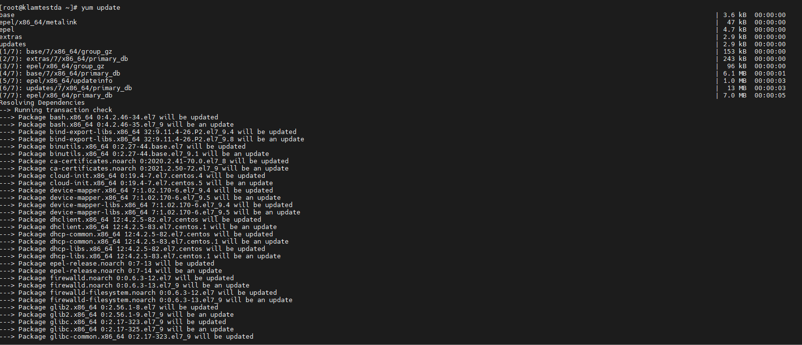
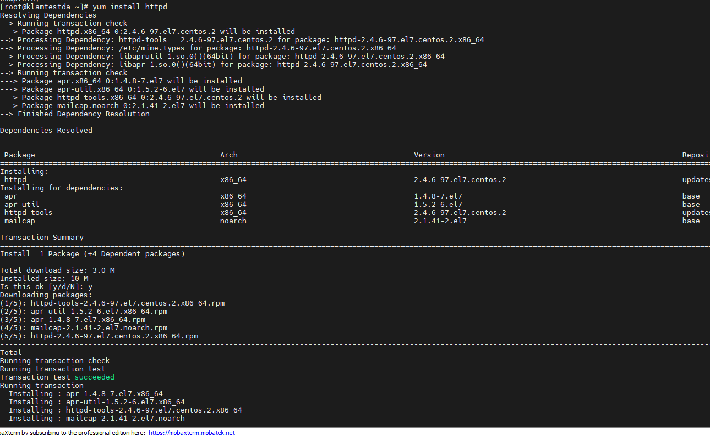
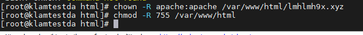
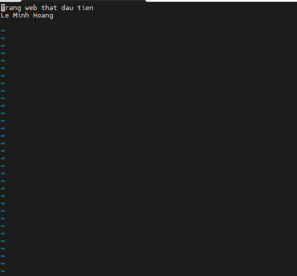
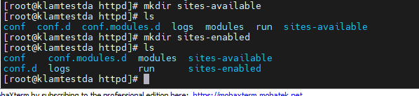
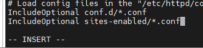
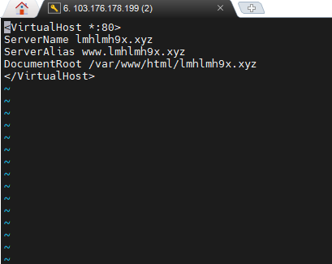
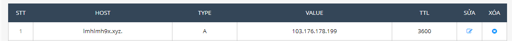
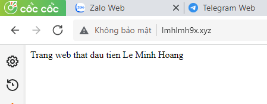

## Bước đầu đăng nhập SSH bằng MobaXterm
- Cái này dễ không nói thêm.
## Update 

## Cài httpd

## Bật dịch vụ

   

## Tạo folder chứa web

## Cấp quyền

## Tạo file index.html chứa trang chủ của web

## Tạo thư mục sites-available và sites-eabled

## Cấu hình httpd.conf

## Tạo và cấu hình lmhlmh9x.xyz ở sites-available

## Chuyển file conf sang enabled

## Trỏ tên miền về IP của Webserver.

## Kết quả 

