## Cấu hình thời gian chuẩn

- mv /etc/localtime /etc/localtime.Old && ln -s /usr/share/zoneinfo/Asia/Ho_Chi_Minh /etc/localtime

## Cấu hình chính sách mật khẩu và đăng nhập

- Mật khẩu min 8 max 64 kí tự, gồm ít nhất một hoa 1 số, khi đăng nhập sai quá 5 lần tài khoản sẽ bị khóa trong 1h.

## Fix lỗi: 
### SSL connect attempt failed error:1416F086:SSL routines:tls_process_server_certificate:certificate verify failed when connecting to ldap master.

- Su zimbra

- Chạy 2 câu lệnh:

- zmlocalconfig -e ldap_starttls_required=false
- zmlocalconfig -e ldap_starttls_supported=0

- Restart lại là xong.

## Đổi domain cho Zimbra

*https://wiki.zimbra.com/index.php?title=How_to_rename_a_domain*
1. Đầu tiên phải backup dữ liệu cẩn thận
- Backup vào ổ đĩa cục bộ:
    + rsync -axvzKHS / opt / zimbra / mnt / zimbra_backup

2. Thực hiện đổi domain:
- su zimbra
- zmprov -l rd mail.zimbra.email-nhanhoa.com zimbra.email-nhanhoa.com

## Đổi pass admin

- su zimbra
- zmprov gaaa
- Sẽ thấy account nào quản trị

- zmprov admin@email-nhanhoa.com <pass mới>

- Vào lại bằng trình duyệt để kiểm tra

## Xem log đăng nhập của 1 user

- cd /opt/zimbra/log
- cat audit.log|grep user2

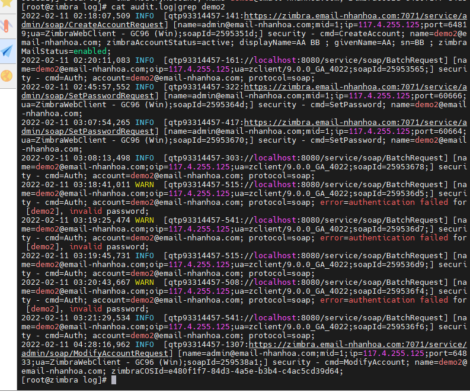

## Tạo lớp dịch vụ

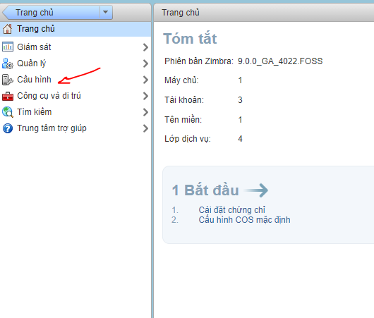

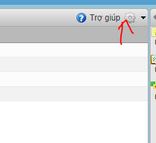

- Chọn thêm mới, rồi chỉnh các cấu hình liên quan

- Gán COV cho user:

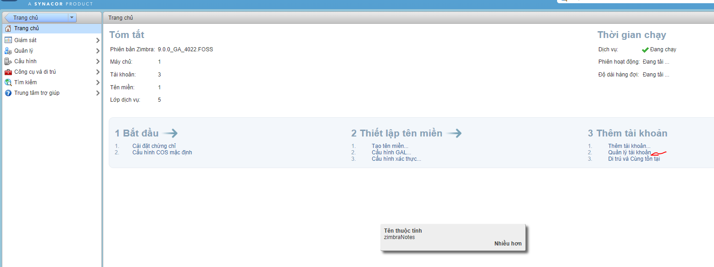

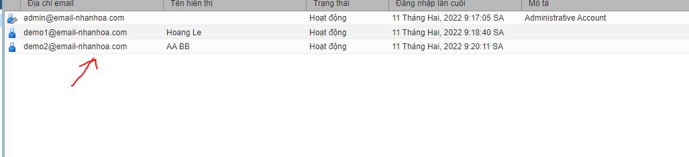

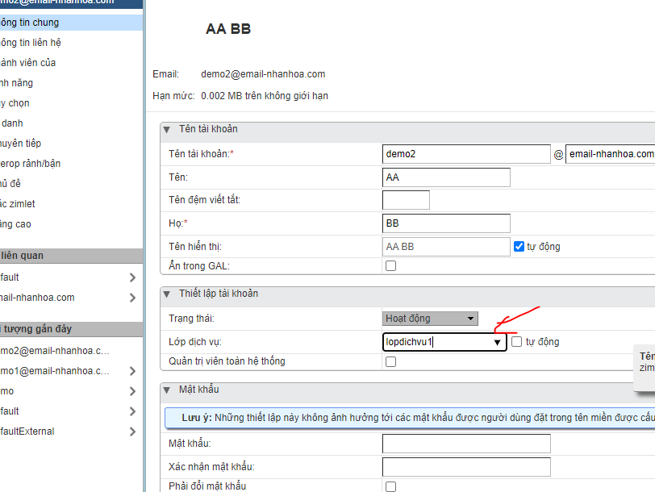

## Cài SSL 
*Tham khảo : https://github.com/minhhoang699x/thuctap_lmh/blob/main/Email/C%C3%A0i%20SSL%20tr%C3%AAn%20Zimbra/C%C3%A0i%20SSL%20tr%C3%AAn%20Zimbra%20l%E1%BA%A5y%20ch%E1%BB%A9ng%20ch%E1%BB%89%20%E1%BB%9F%20ssls.com.md*

- Tạo CSR thủ công
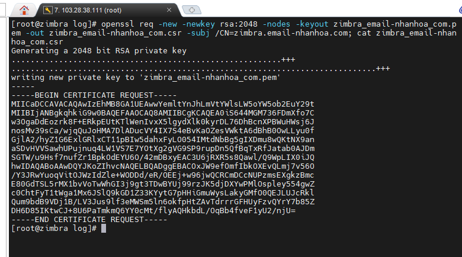

- Chọn xác thực qua mail

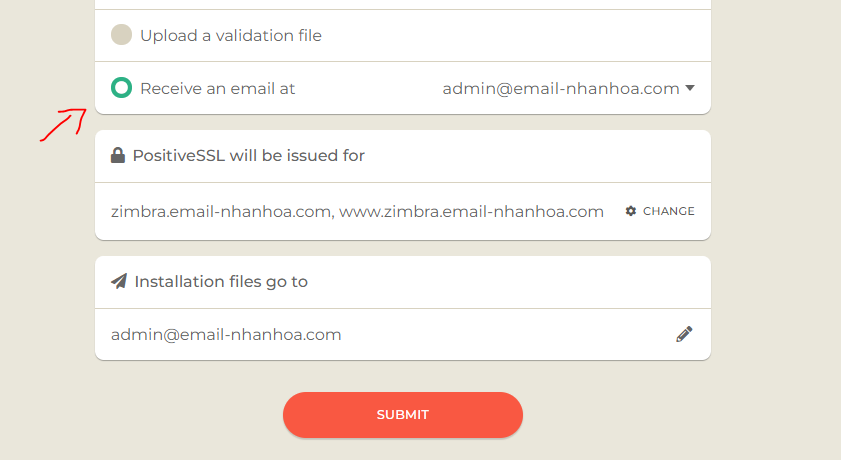

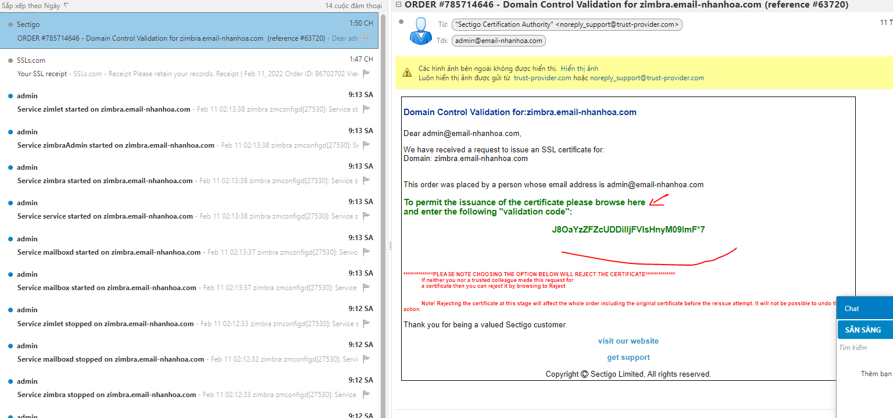

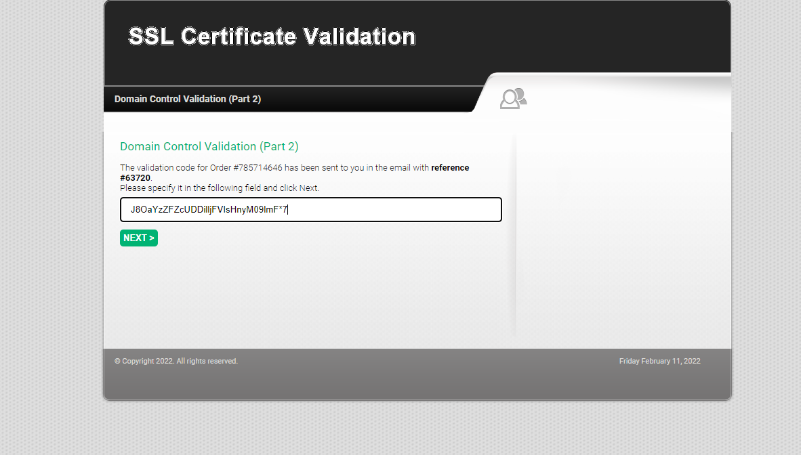

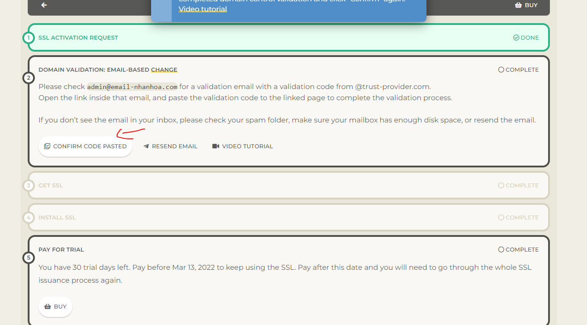

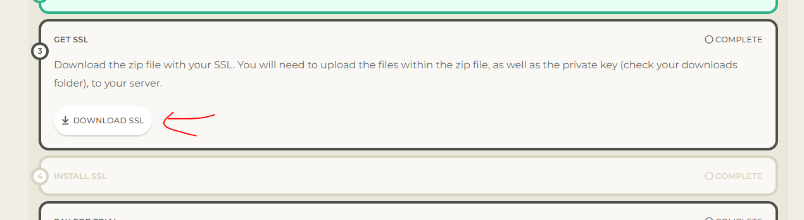

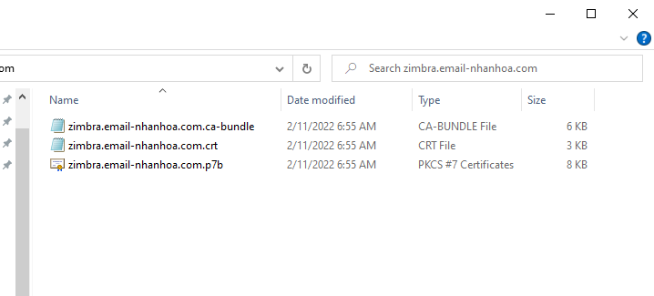

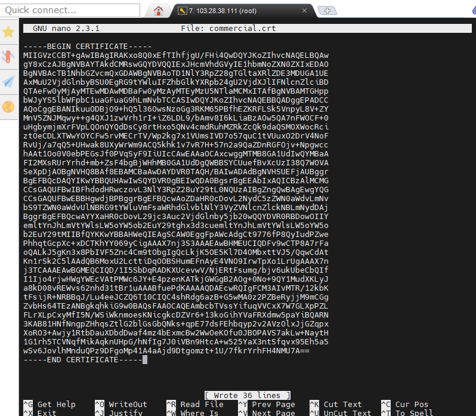

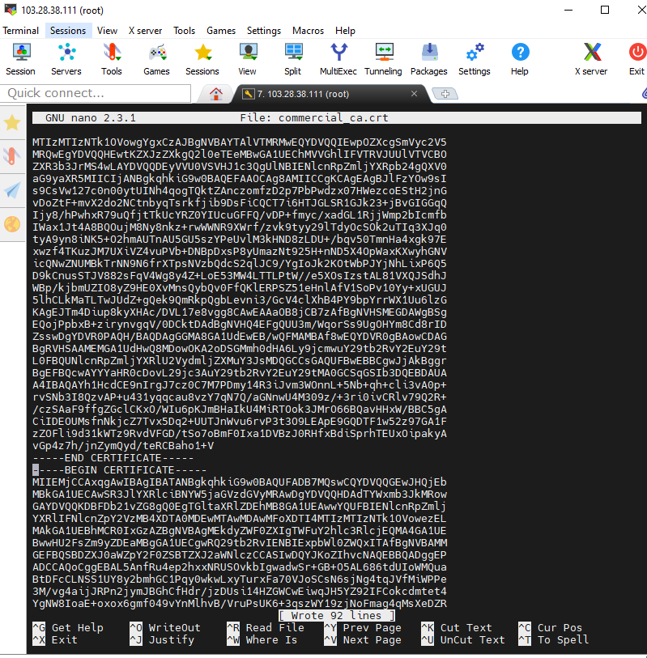

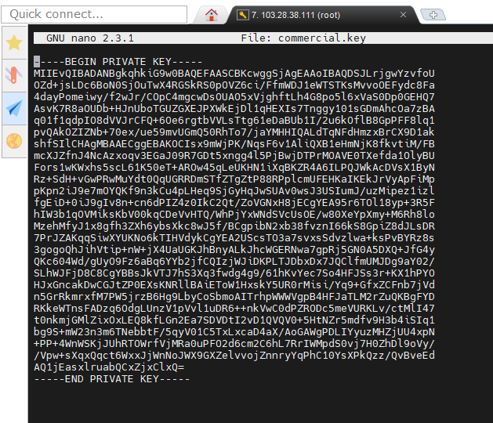

- Verify ssl
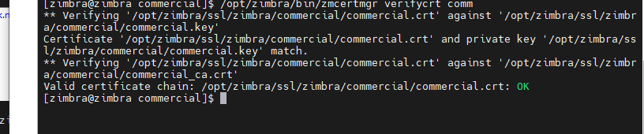

- Deploy
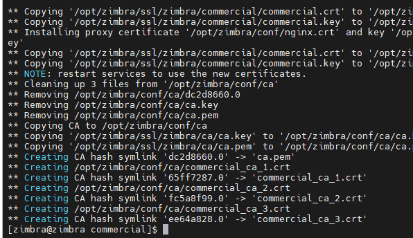

- Xem kết quả
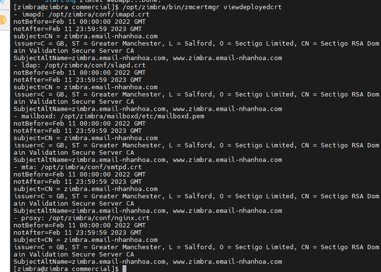

- Trực tiếp trên trình duyệt
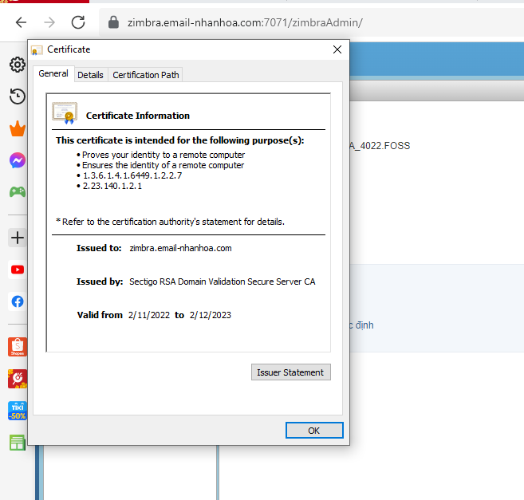

## Tạo spf, dkim, dmarc record để gửi thư được cho gmail.

### Tạo spf
- Tên : @
- Loại : TXT
- Giá trị: v=spf1 +a +mx +ip4:103.28.38.111 ~all

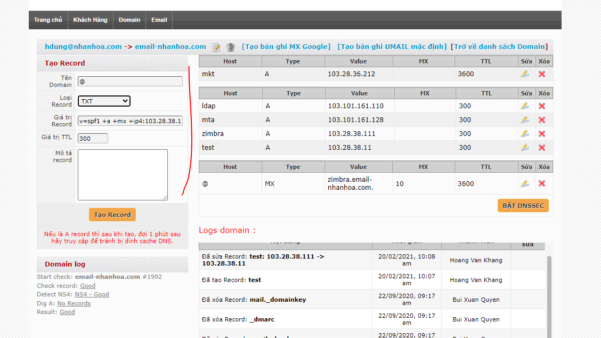

### Tạo Dmarc
- Tên: @
- Loại : TXT
- Giá trị: v=DMARC1; p=none; rua=mailto:mailauth-reports@zimbra.email-nhanhoa.com

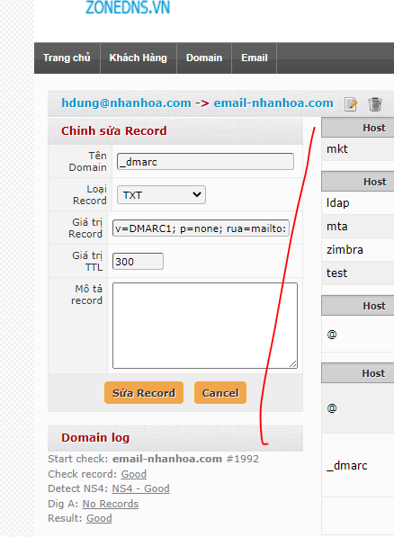

### Tạo Dkim

1. Active Dkim

- su zimbra
- /opt/zimbra/libexec/zmdkimkeyutil -a -d email-nhanhoa.com

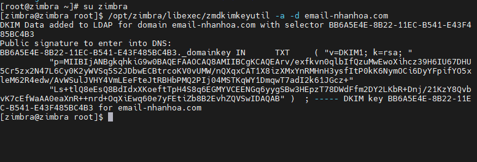

2. Get Dkim
- /opt/zimbra/libexec/zmdkimkeyutil -q -d email-nhanhoa.com

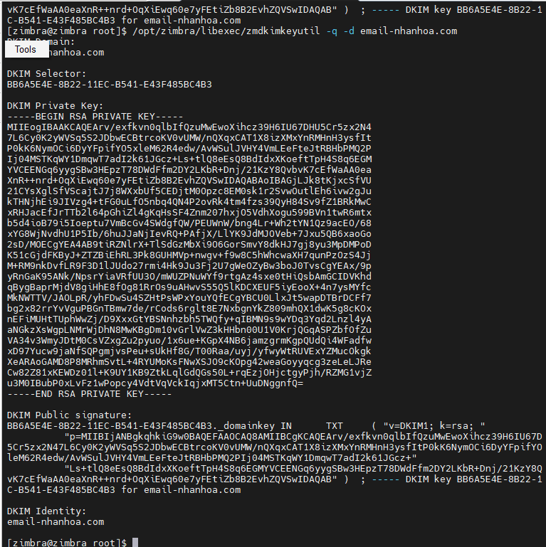

3. Tạo record

- Tên : BB6A5E4E-8B22-11EC-B541-E43F485BC4B3._domainkey 
- Loại : TXT
- Khi lấy giá trị thì bỏ các dấu " để gộp thành chuỗi:

+ "v=DKIM1;k=rsa;p=MIIBIjANBgkqhkiG9w0BAQEFAAOCAQ8AMIIBCgKCAQEArv/exfkvn0qlbIfQzuMwEwoXihcz39H6IU67D5Cr5zx2N47L6Cy0K2yWVSq5S2JDbwECBtrcoKV0vUMW/nQXqxCAT1X8izXMxYnRMHnH3ysfItP0kK6NymOCi6DyYFpifYOleM62R4edw/AvWSulJVHY4VmLEeFteJtRBHbPMQ2PIj04MSTKqWY1DmqwT7adI2k61JGcz+Ls+tlQ8eEsQ8BdIdxXKoeftTpH4S8q6EGMYVCEENGq6yygSBw3HEpzT78DWdFfm2DY2LKbR+Dnj/21KzY8QvK7cEfWaAA0eaXnR++nrd+OqXiEwq60e7yFEtiZb8B2EvhZQVSwIDAQAB"

4. Test kết quả
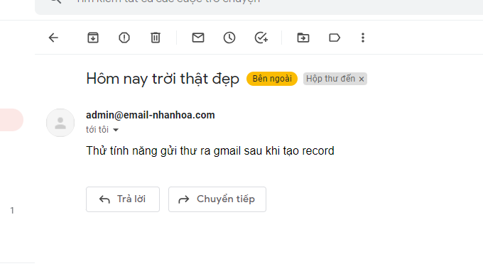

- OK