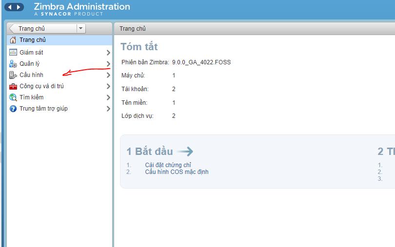
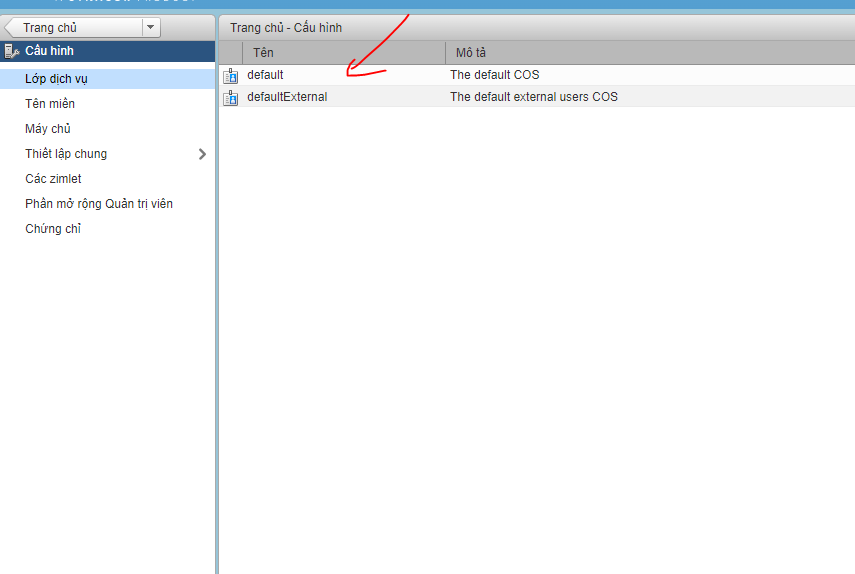
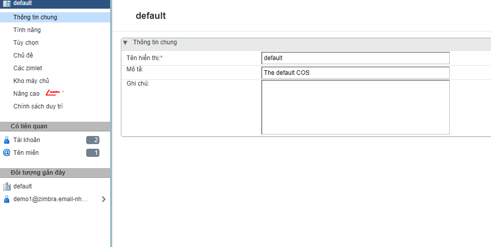
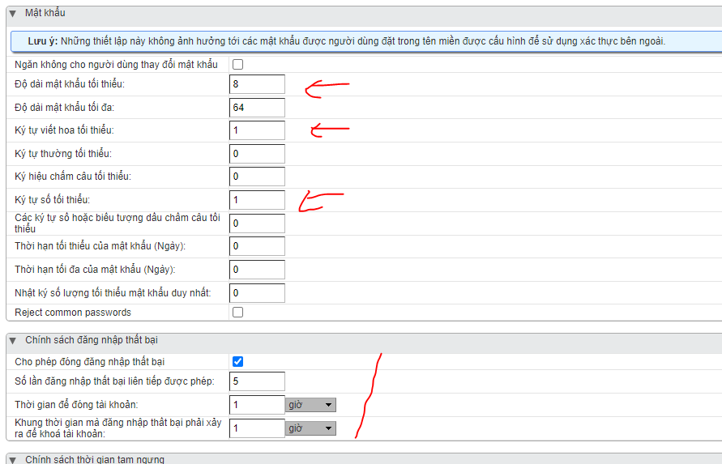

## Cấu hình thời gian chuẩn

- mv /etc/localtime /etc/localtime.Old && ln -s /usr/share/zoneinfo/Asia/Ho_Chi_Minh /etc/localtime

## Cấu hình chính sách mật khẩu và đăng nhập

- Mật khẩu min 8 max 64 kí tự, gồm ít nhất một hoa 1 số, khi đăng nhập sai quá 5 lần tài khoản sẽ bị khóa trong 1h.

## FIx lỗi: 
* SSL connect attempt failed error:1416F086:SSL routines:tls_process_server_certificate:certificate verify failed when connecting to ldap master.

- Su zimbra

- Chạy 2 câu lệnh:

- zmlocalconfig -e ldap_starttls_required=false
- zmlocalconfig -e ldap_starttls_supported=0

- Restart lại là xong.

## Đổi domain cho Zimbra

*https://wiki.zimbra.com/index.php?title=How_to_rename_a_domain*
1. Đầu tiên phải backup dữ liệu cẩn thận
- Backup vào ổ đĩa cục bộ:
    + rsync -axvzKHS / opt / zimbra / mnt / zimbra_backup

2. Thực hiện đổi tên:
- su zimbra
- zmprov -l rd zimbra.email-nhanhoa.com email-nhanhoa.com

3. Xóa zmloggerhostmap cũ

- zmloggerhostmap

