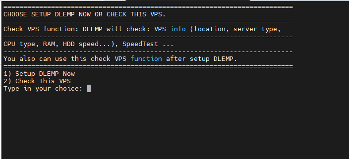
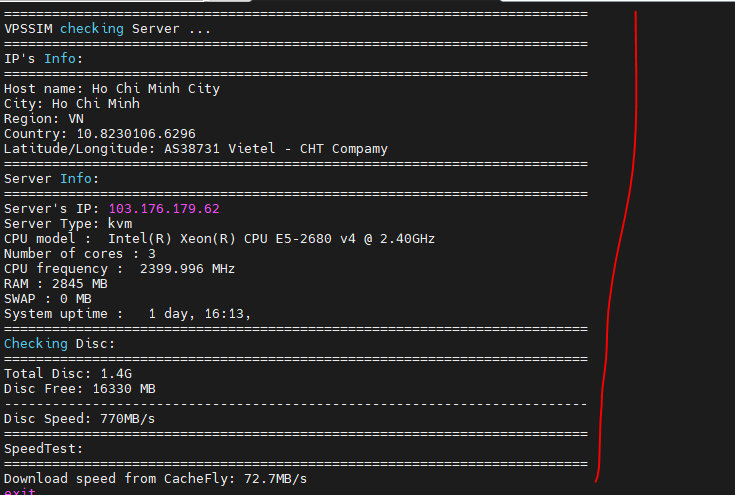
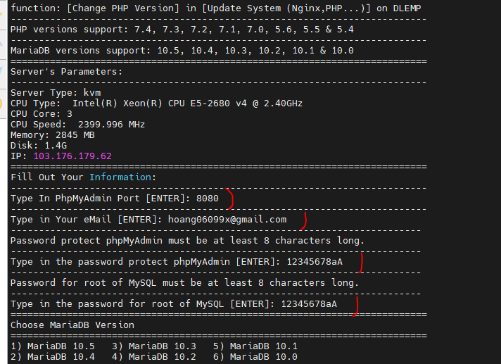
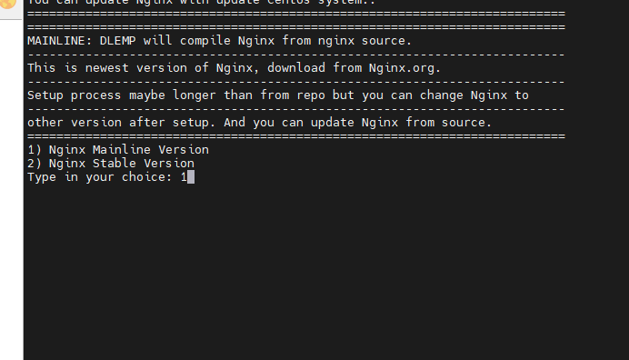
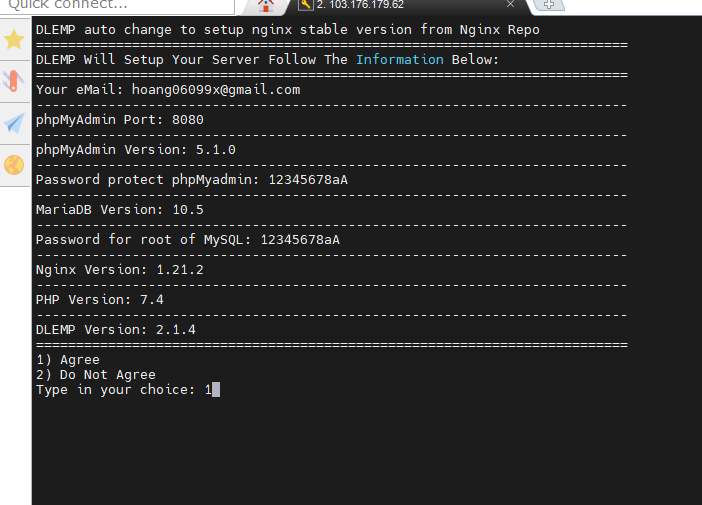

# DLEMP
## Giới thiệu về DLEMP
- DLEMP là bộ phần mềm tích hợp trên Linux (CentOS) với nhiều đoạn mã được cấu hình sẵn, giúp việc sử dụng & cấu hình máy chủ Linux trở nên đơn giản. Thành phần bao gồm: Đoạn script cấu hình sẵn, Linux, Engine-x, MySQL và PHP. DLEMP được các lập trình viên tại Việt Nam phát triển miễn phí cho cộng đồng dựa trên nền tảng VPSSIM cũ (VPSSIM là nền tảng có tính phí) do VPSSIM đột ngột ngừng hỗ trợ người dùng từ năm 2020.
- Vì sao nên chọn DLEMP:
    + DLEMP nhanh, nhẹ & an toàn: DLEMP không phải là một hosting controller và không có bất kỳ dịch vụ dư thừa nào chạy ngầm. Chúng chỉ là đoạn script được cấu hình sẵn và được tối ưu cực kỳ cao, chỉ thực thi lệnh khi chúng ta gọi. Vì thế sử dụng DLEMP bạn sẽ thấy VPS của mình trở nên nhanh chóng & mạnh mẽ.
- DLEMP nhiều tính năng & tiện ích, đáng kể đến như:
    + Tự động cài đặt và cấu hình WordPress
    + Cài đặt & tự động gia hạn SSL miễn phí
    + Tự động sao lưu dữ liệu website và cơ sở dữ liệu hàng ngày, hàng tuần, hàng tháng tùy theo cấu hình.
    + Tự động upload backup lên Google Drive để bảo vệ dữ liệu.
    + Dễ dàng cấu hình & thay đổi phiên bản Engine-x, MySQL và PHP.
    
    + DLEMP rất dễ sử dụng: Thay vì gõ lệnh Linux dài thòng lòng, từ nay bạn chỉ cần chọn hành động theo số đã được các lập trình viên cấu hình sẵn.
    + DLEMP hoàn toàn miễn phí: chúng được phát triển vì cộng đồng & hoàn toàn miễn phí. Mình cũng đã tìm hiểu và dùng thử rất nhiều script khác (kể cả của nước ngoài) trước khi đến với DLEMP (tiền thân là VPSSIM). Và hoàn toàn hài lòng về chất lượng của scipt này. Ngay cả khi DLEMP tính phí thì mình cũng sẵn sàng đóng góp để giúp tác giả có thêm động lực phát triển.
## Cài đặt DLEMP trên centos7.
1. Cài đặt dlemp
- Đầu tiên chạy lệnh:
    + curl -L https://script.dlemp.net -o dlemp && bash dlemp

- Chọn 2 để xem thông tin VPS của mình:

- Thống kê thông tin của VPS: 

- Ctrl Z ra chạy lại lệnh trên, chọn 1 để setup :vv

- Làm theo như hình:

- Ngồi chờ để Dlemp cài đặt

- Khi cài đặt xong hệ thống sẽ tự động reboot

- Để gọi ra menu dlemp, ta dùng lệnh dlemp

