# Một số chức năng của dlemp

## Add Wordpress tự động
- Làm theo hình
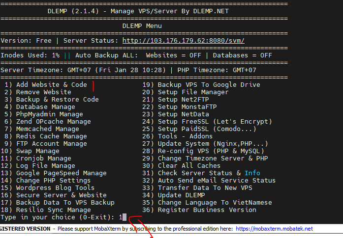
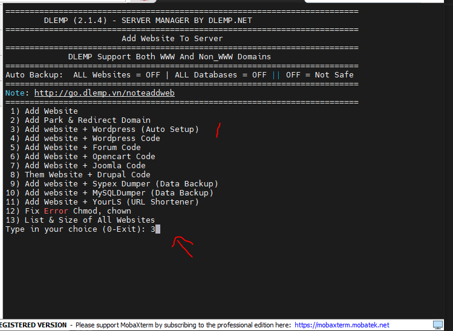
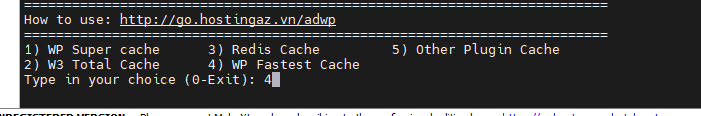
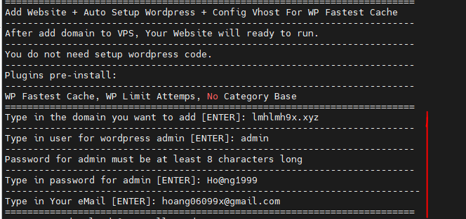

- Xong, Chi tiết ở đây:

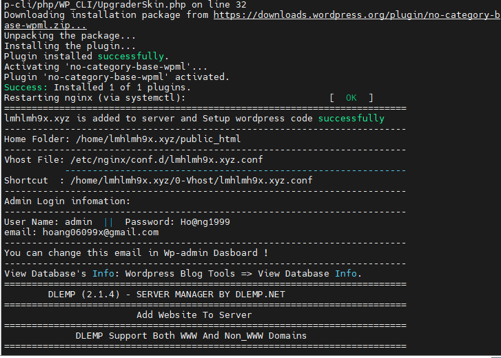

- Thử trên web:

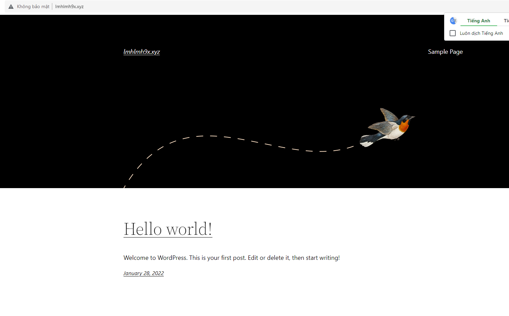
- OK luôn, xịn vcl.

## Cài SSL cho WP vừa tạo

1. Đầu tiên chạy lệnh:

curl https://get.acme.sh | sh -s email="hoang06099x@gmail.com"

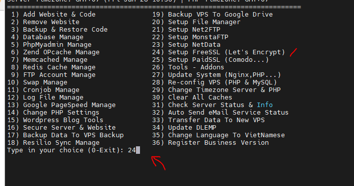
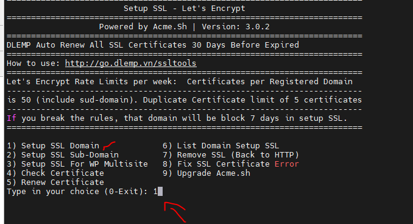
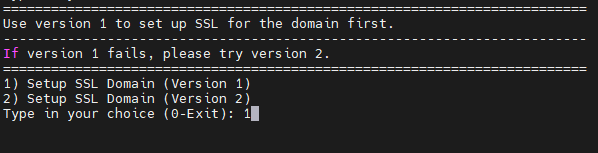
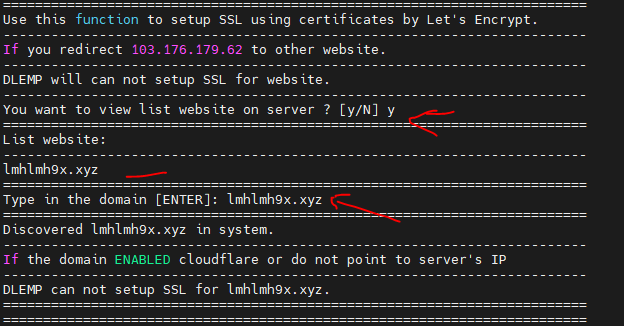

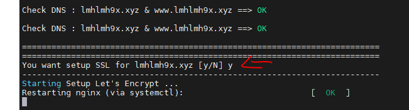

- Thành công :

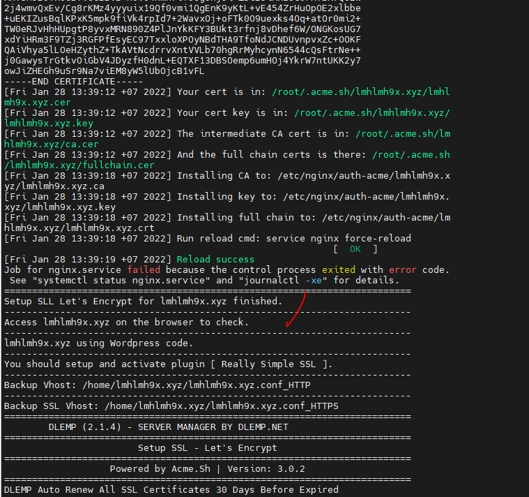

- Có thể kiểm tra lại trong menu của dlemp:

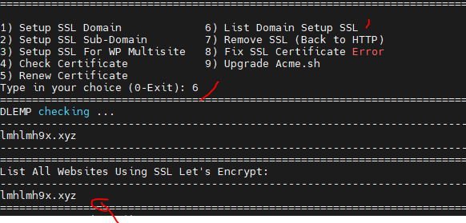
