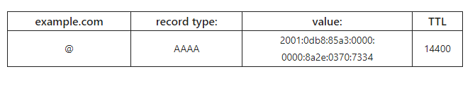
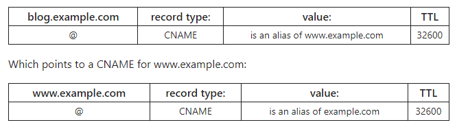
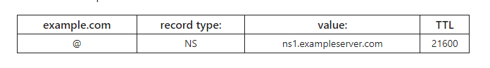
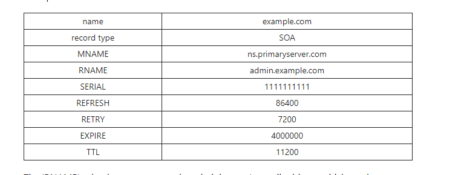
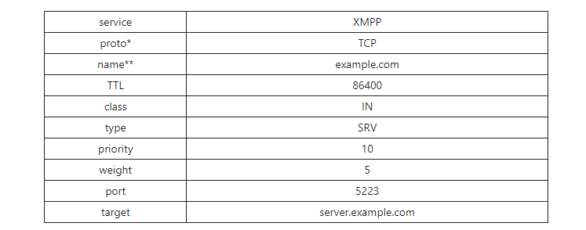

## DNS Record là gì
- DNS Record - Bản ghi DNS (hay còn gọi là zone file) là các hướng dẫn nằm trong máy chủ DNS có thẩm quyền cung cấp thông tin về miền bao gồm địa chỉ IP nào được liên kết với tên miền đó và cách xử lí các yêu cầu cho tên miền đó. Các bản ghi này bao gồm một loạt các tệp văn bản được viết bằng cú pháp DNS. 
- Cú pháp DNS chỉ là một chuỗi kí tự được sử dụng ra lệnh cho máy chủ DNS phải làm gì.
- Tất cả các record đều có tường TTL, cho biết tần suất máy chủ DNS sẽ làm mới record đó.

## Các loại record phổ biến
### 1. A record
- A được hiểu là "Adress", và đây là loại record phổ biến nhất, nó dược dùng để trỏ một địa chỉ IP đến một tên miền.
- A record chỉ được đùng cho IPv4, còn với IPv6, phải dùng AAAA record.
- Một cái ví dụ về A record:

    
- Ký tự @ tượng trưng cho bản ghi tên miền gốc và giá trị TTL =14400, tương đương với 14400s=4h, điều này có nghĩa là nếu 1 A record được cập nhật, thì phải mất 4h nó mới có hiệu lực.
- Đại đa số các trang web chỉ có một A record. Nhưng cũng có những trang web lớn sẽ có 1 vài bản ghi A record khác nhau phục vụ cho cân bằng tải Round Robin - để phân phối lưu lượng truy cập đến một số địa chỉ IP, mỗi IP đều lưu trữ nội dung giống hệt nhau.

-  A record được sử dụng khi nảo?
    + Các sử dụng phổ biến nhất của các A record là truy vấn IP: match cái tên miền với một địa chỉ IPv4. Điều này cho phép thiết bị của người dùng kết nối và tải trang web mà không cần nhập địa chỉ IP thực. Trình duyệt web của người dùng sẽ tự động thực hiện bằng cách gửi một truy vấn tới DNS resolver.
    + A record cũng được sử dụng để vận hành danh sách lỗ hổng bảo mật dựa trên hệ thống tên miền DNSBL. DNSBL có thể giúp máy chủ thư xác định và chặn mail từ các miền gửi mail rác đã biết.
### 2. AAAA record
- AAAA record khớp tên miền với một địa chỉ IPv6. AAAA record không khác gì A record ngoài việc nó lưu trữ địa ipv6 của tên miền thhay vì địa chỉ IPv4 của tiên miền đó.
- IPv6 là phiên bản mới nhất của giao thức IP. 
- Một ví dụ về AAAA record.

    
    
- AAAA record được sử dụng khi nào?
    + Giống như A record, AAAA record cho phép các thiết bị của người dùng tìm địa chỉ IPv6 cho một tên miền, sau đó thiết bị có thể kết nối và tải trang web.
    + AAAA record chỉ được sử dụng khi tên miền có địa chỉ IPv6, và thiết bị của người dùng phải được cấu hình để phục vụ IPv6. 
    + Một tên miền có một hoặc nhiều địa chỉ IPv4 và các A record đi kèm, nhưng không phải tất cả đều có địa chỉ IPv6 và các thiết bị của người dùng đều được cấu hình IPv6
### 3. CNAME record
- CNAME record là gì?
    + Canonical Name - CNAME record được sử dụng thay cho A record khi tên miền hoặc miền con là Alias của một tên miền khác. Tất cả các CNAME record phải trỏ đến một tên miền, không bao giờ trỏ đến địa chỉ IP.
    + Ví dụ như :
        + lmh.minhhoang.com có CNAME record là minhhoang.com, điều này có nghĩa là khi máy chủ truy cập các DNS record cho lmh.minhhoang.com, nó thực sự tạo 1 cái tra cứu khác tới minhhoang.com và trả về IP của minhhoang.com thông qua A record của nó.
        + Có thể gọi minhhoang.com là tên thật của lmh.minhhoang.com.
        + Thông thường, khi các trang web có tên miền phụ, các miền phụ đó sẽ có CNAME trỏ tới tên miền gốc. Bằng cách này nếu địa chỉ IP của máy chủ thay đổi, chỉ cần cập nhật cái A record cho tên miền gốc là được.
- Một quan niệm sai lầm về CNAME record.
    + ĐÓ là CNAME record luôn phân giải đến cùng một trang web mà tên miền đó trỏ tới.
    + CNAME record chỉ trỏ máy khách đến cùng địa chỉ IP với miền gốc. Khi máy khách truy cập địa chỉ IP đó, máy chủ web vẫn sẽ xử lí url tương ứng. Vậy nên khi truy cập lmh.minhhoang.com, máy chỉ sẽ xem url và nhận thấy nó là của lmh.minhhoang.com và sẽ phân phối trang lmh chứ không phải là trang chủ.
- Ví dụ về CNAME record: 

    

    + Tại ví dụ này có thể thấy blog.example.com trỏ đến example.com và theo như ví dụ ở A record thì nó sẽ phân giải thành địa chỉ IP 192.0.2.1.
- CNAME record có thể trỏ đến CNAME record khác không?
    + Theo nguyên lí là có thể nhưng thực tế không hiệu quả ví nó yêu cầu nhiều lần tra cứu DNS trước khi tên miền có thể được tải -> sẽ bị chậm.

    

    + Ở đây blog.example.com trỏ tới www.example.com, www.example.com trở tới example.com.
    + Chúng ta có thể trỏ trực tiếp từ blog đến example.com, nên việc trỏ CNAME đến CNAME là thừa.
- Hạn chế của CNAME record: 
    + MX record và NS record không thể trỏ đến CNAME, nó phải trỏ đến A record hoặc AAAA record.
### 4. MX record
- MX record là gì?
    + Mail exchange - MX record là record chuyển hướng tới mail server. MX record cho biết cách gửi mail theo SMTP(Simple mail transfer Protocal, một giao thức tiêu chuẩn cho tất cả email). 
    + Giống như CNAME record, MX record luôn phải trỏ tới 1 tên miền khác.
    + Ví dụ: 

    

    + Trường priority trước tên miền của các MX record biểu thị sự ưu tiên, giá trị càng thấp thì độ ưu tiên càng lớn. Theo trên, máy chủ mặc định sẽ là mailhost1, nếu lỗi, máy chủ sẽ trở thành mailhost2.
    + Ta cũng có thể cấu hình 2 MX record để cả hai máy chủ có mức độ ưu tiên ngang nhau và nhận được một lượng thư bằng nhau.
        
    

    + Cấu hình này cho phép nhà cung cấp mail cân bằng tải giữa 2 máy chủ.

- Quá trình truy vấn MX record là gì:
    + Message transfer agent - MTA là một phần mềm chịu trách nhiệm truy vấn các MX record. Khi người dùng gửi mail, MTA sẽ gửi một truy vấn DNS để xác định máy chủ thư cho người nhận mail. MTA thiết lập kết nối SMTP với các mail server đó, bắt đầu với các tên miền ưu tiên như ví dụ ở trên.
- MX record dự phòng là gì?
    + MX record dự phòng là một MX record dành cho mail server có giá trị ưu tiên cao hơn - tương đương với mức ưu tiên thấp. Để cho những trường hợp không bình thường, thư vẫn sẽ được nhận mà k bị mất
- MX record có thể trỏ đến CNAME không
    + CNAME record được sử dụng để tham chiếu alias vì thay vì tên gốc của nó. CNAME thường trỏ đến A record hoặc AAAA record. 
    + Tuy nhiên MX record phải trỏ trực tiếp đến A hoặc AAAA record của máy chủ. 
    + Việc trỏ từ MX đến CNAME bị cấm bởi các tài liệu RFC.
### 5. TXT record
- TXT record là gì?
    + Text - TXT record cho phép quả trị viên tên miền nhập văn bản vào hệ thống tên miền. 
    + TXT record ban đầu được dự định là nơi lưu trữ các ghi chú mà con người có thể đọc được. Tuy nhiên bây giờ cũng có thể đưa một số dữ liệu mà máy có thể đọc được vào TXT record.
   
    

    + Ngày nay, 2 cách sử dụng quan trọng nhất của TXT record là ngăn chặn thư rác và xác minh quyền sở hữu tên miền.
- Loại dữ liệu nào có thể ghi vào trong TXT record.
    + Các tài liệu RFC gốc chỉ ra là các chuỗi text có thể ghi vào trường value của TXT record.
    + Hầu hết các DNS server sẽ đặt giới hạn về độ lớn của TXT record và số lượng record mà chúng có thể lưu trữ, vì lẽ đó không thể sử dụng TXT record để ghi một lượng lớn dữ liệu.

- Định dạng để lưu trữ dữ liệu trong TXT record.
    + Đơn giản là thuộc tính = giá trị trong ngoặc kép.
- TXT record ngăn chặn thư rác như thế nào?
    + Những kẻ spam mail thường cố gắng giả mạo các tên miền. TXT record là thành phần chính của một số phương pháp xác thực email giúp cho mail server xác định xem thư có phải từ một nguồn đáng tin cậy hay không.
- TXT record giúp xác minh quyền sở hữu miền như thế nào!
    + Xác minh quyền sở hữu ban đầu không phải là một tính năng của TXT record, nhưng phương pháp này được một số nhà quản trị web và cung cấp cloud áp dụng.
    + Bằng cách tải lên TXT record mới với thông tin cụ thể được bao gồm hoặc chỉnh sửa TXT record hiện tại, quản trị viên có thể chứng minh họ kiểm soát tên miền đó. Nhà cung cấp công cụ hoặc cloud có thể kiểm tra TXT record và thấy răng nó đã được thay đổi theo yêu cầu.
### 6. NS record
- NS record là gì?
    + Nameserver - NS record cho biết DNS server nào có thầm quyền cho tên miền đó ( tức là những server nào chứa các DNS record thực tế )
    + Về cơ bản , các NS record cho internet biết nơi cần đến để tìm ra địa chỉ IP của tên miền. Một tên miền thường có nhiều NS record có thể chỉ ra các server đích danh chính và dự phòng cho tên miền đó.
    + Nếu không có NS record hoặc NS record cấu hình đúng thì người dùng sẽ không thể tải 1 web hoặc ứng dụng.
    + ví dụ :

    
    
    + NS record không bao giờ trỏ tới CNAME.
- Name server là gì:
    + Nameserver là một loại DNS server, nó lưu trữ tất cả các DNS record của một tên miền, bao gồm A, MX, CNAME record.
    + Hầu hết tất cả các tên miền đều dựa vào nhiều nameserver để tăng độ tin cậy: nếu một nameserver gặp sự cố hoặc không khả dụng, các truy vấn DNS có thể chuyển sang một server khác. 
    + Thông thường có một nameserver chính và một số server phụ, lưu trữ các bản sao của các DNS record trong server chính. Cập nhật server chính cũng sẽ kích hoạt nameserver phụ.
    + NS record nên liệt kê nhiều hơn một server.
- Khi nào NS record nên được cập nhật hoặc thay đổi?
    + Quản trị viên tên miền nên cập nhập NS record của họ khi cần thay đổi nameserver của tên miền của mình.
    + QTV cũng có thể phải cập nhật NS record nếu họ muốn một tên miền phụ sử dụng các nameserver khác nhau
    + Khi các NS record được cập nhật, có thể phải mất vào giờ để các thay đổi được sao chép trong toàn bộ DNS.
### 7. SOA record
- SOA record là gì?
    + Start of Authority - SOA record lưu trữ thông tin quan trọng về tên miền hoặc zone cũng như email của admin, khi tên miền được cập nhật lần cuối và server sẽ đợi bao lâu giữa các lần làm mới.
    + Tất cả các DNS zone cần một SOA recore để tuân theo các tiêu chuẩn của IETF, các SOA record cũng rất quan trọng trong việc chuyển zone.

    

    + Trường RNAME là địa chỉ mail của admin. SOA lưu admin.example.com tương đương với admin@example.com
- Zone seri là gì?
    + Trong DNS, zone là nơi kiểm soát không gian tên. Một zone có thể bao gồm 1 tên miền duy nhất, một tên miền và các tên miền phụ hoặc nhiều tên miền. Trong một số trường hợp, zone tương đương với tên miền.
    + Zone seri là số phiên bản cho SOA record, trong ví dụ trên, số seri được liệt kê ở serial. Khi số seri thay đổi, điều này cảnh báo cho các server phụ rằng chúng nên cập nhật các bản sao của file zone thông qua chuyển zone.
- Các phần còn lại của SOA record là gì?
    + MNAME: đây là tên của nameserver chính cho khu vực. 
    + Refresh: Khoảng thời gian tính bằng giây server phụ phải đợi trước khi yêu cầu server chính cung cấp SOA record xem nó đã được cập nhật hay chưa.
    + Retry: Khoảng thời gian server phải đợi để yêu cầu 1 nameserver
    chính không phản hồi cập nhật lại.
    + Expire: Nếu server phụ không nhận được phản hổi từ server chính trong khoảng thời gian này, nó sẽ ngừng phản hồi các truy vấn cho zone.
- Zone transfer là gì:
    + Chuyển vùng DNS là quá trình gửi dữ liệu DNS record từ nameserver chính đến nameserver phụ. SOA record được chuyển đầu tiên. Số seri cho server phụ biết liệu phiên bản của nó có cần được cập nhật hay không. Chuyển vùng diễn ra qua giao thức TCP.
### 8. SRV record
- SRV record là gì?
    + Service - SRV record chỉ định server và port cho các dịch vụ cụ thể như gọi điện mạng (VoIP), tin nhắn tức thì... Hầu hết các DNS record chỉ xác định một server hoặc một IP, nhưng các SRV record cũng bao gồm một cổng tại địa chỉ IP đó. Một số giao thức internet yêu cầu sử dụng các SRV record để hoạt động.
- Port là gì?
    + Trong mạng, port là nơi ảo - chỉ định những tiếng trình nào mà lưu lượng mạng đi đến trong một máy tính. Các port cho phép máy tính dễ dàng phân biệt các loại lưu lượng khác nhau: các luồng VoIP đi đến 1 port khác với các thông điệp mail.
    + Mỗi một giao thức cụ thể phải được kết nối với 1 port cụ thể.
- Điều xảy ra trong một SRV record?
    + Một SRV record chứa những thông tin sau:

        

    + Tuy nhiên, SRV record được định dạng theo cách: 
    _service._proto.name. TTL class type of record priority weight port target.
    + Do đó theo ví dụ ở trên, một SRV record sẽ trông giống:
    _xampp._tcp.example.com 86400 IN SRV 10 5 5223 server.example.com

    + SRV record phải trỏ đến A record hoặc AAAA record.
### 9. PTR record
- PTR record là gì?
    + Pointed record - PTR record cung cấp tên miền được liên kết với địa chỉ IP. PTR record ngược với A record.
    + PTR record được sử dụng trong tra cứu DNS ngược.
- PTR record được lưu trữ như thế nào?
    + Trong IPv4:
        + Trong khi các A record được lưu trữ dưới tên miền nhất định, các PTR record được lưu trữ theo IP đã đảo ngược và có thêm ".in-addr.arpa". Ví dụ : bản ghi PTR cho ip 192.168.0.1 sẽ được lưu trữ trong "1.0.168.192.in-addr.arpa".
    + Trong IPv6: 
        + Địa chỉ IPv6 được xây dựng khác với địa chỉ IPv4 và các bản ghi IPv6 PTR tồn tại trong một không gian khác bên trong .arpa. Cũng được viết ngược + ".ipv6.arpa"

- Một số mục đích sử dụng chính cho PTR record:
    + PTR record được sử dụng trong truy vấn DNS ngược; những cách sử dụng phổ biến cho DNS ngược bao gồm:

        + Chống thư rác: Một số bộ lọc chống thư rác sử dụng DNS ngược để kiểm tra tên miền của địa chỉ email và xem liệu các địa chỉ IP liên kết có khả năng được sử dụng bởi các máy chủ email hợp pháp hay không.

        + Khắc phục sự cố gửi email: Vì các bộ lọc chống thư rác thực hiện các kiểm tra này, các vấn đề gửi email có thể do bản ghi PTR bị định cấu hình sai hoặc bị thiếu. Nếu một miền không có bản ghi PTR hoặc nếu bản ghi PTR chứa miền sai, các dịch vụ email có thể chặn tất cả các email từ miền đó.

        + Ghi nhật ký: Nhật ký hệ thống thường chỉ ghi lại địa chỉ IP; tra cứu DNS ngược có thể chuyển những tên miền này thành tên miền cho nhật ký mà con người dễ đọc hơn.

