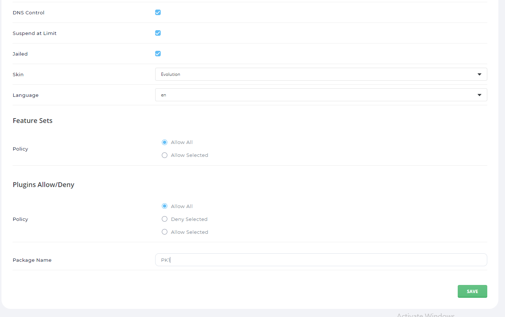

# Sử dụng các chức năng trên DA
## Admin
### Account Manager
1. Tạo và quản lí các packages cho user

- Sau khi ấn create, nhập tên và các thông số liên quan rồi lưu:

- Tại danh sách các user package, có thể chọn 1 hoặc nhiều các gói để xóa hoặc export.

- Tại dạng export, có thể dùng data đấy để import lại mà không phải cấu hình thủ công.

2. Thêm user

3. Xem dah sách user

4. Ngoài ra còn tất nhiều các chức năng:

- Tạo reseller, xem danh sách reseller, quản lí các gói của reseller
- Chuyển đổi giữa user với reseller và ngược lại
- Thêm các Admin, xem danh sách các admin
- Thay đổi message, mật khẩu
- Show tất cả các người dùng có trong hệ thống

### Server Manager
1. Administrator Settings

- Được phân thành 4 mục nhỏ, có thể cấu hình các thông số theo ý muốn.

2. Custom HTTPD Configurations.

- Hiện thị những file httpd.conf của tất cả các tên miền, có thể truy cập để cấu hình theo ý muốn.

3. DNS Admintration

- Hiển thị danh sách các domain, từ đó có thể vào để quản lí các record của từng tên miền, 

4. Ngoài ra còn có thêm các chức năng như quản lí IP, các DNS server, config PHP, Key SSH....

### Admin Tools
1. Admin Backup/Transfer

- Tại đây có thể lên lịch Backup hoặc Restore:

- Có các tùy chọn Backup như Backup cho ai, vào lúc nào, lưu dữ liệu ở đâu và backup những cái gì.

2. Brute Force 
- Tại đây lưu những lần đăng nhập không thành công.

3. Process Monitor

- Hiện các tiến trình của server

4. Service Monitor
- Hiển thị các dịch vụ chạy trên Server

5. Ngoài ra còn các chức năng như quản lí mail admin, backup hệ thống, message cho các user, thay đổi-custom giao diện.

### System Info & Files
- Có các chức năng như tạo các cron Jobs, quản lí - chỉnh sửa các file, xem log, thông tin hệ thống.

### Extra Features

- Các features liên quan :

## Reseller
### Account Manager 
- Tương tự như của Admin nhưng ít chức năng hơn:

### Server Manager
- Cũng thế, nhưng chỉ còn 3 chức năng:

### Reseller Tools

### System Info & Files

### Extra Features

## User
### Account Manager
- Gồm rất hiều các chức năng như :
    + Cấu hình domain
    + Quản lí những domain con
    + Quản lí DNS
    + Chứng chỉ SSL
    + Truyền file FTP
    + MySQL
    + Chuyển hướng trang web

............

### Email Manager

### Advaned Features

### System Info & Files

### Features

