# Các bước cài Zimbra trên Centos7.
## Thiết lập bản ghi DNS

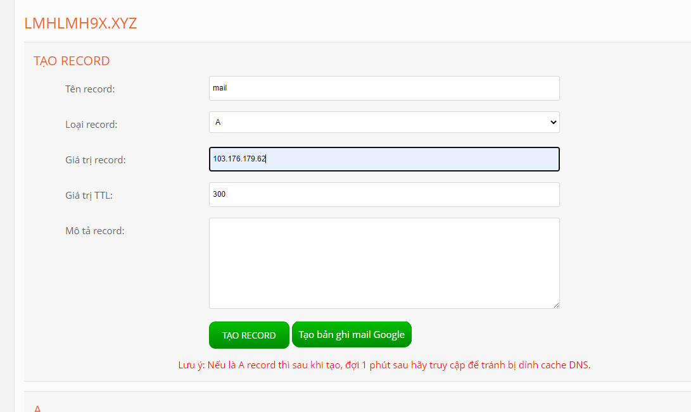

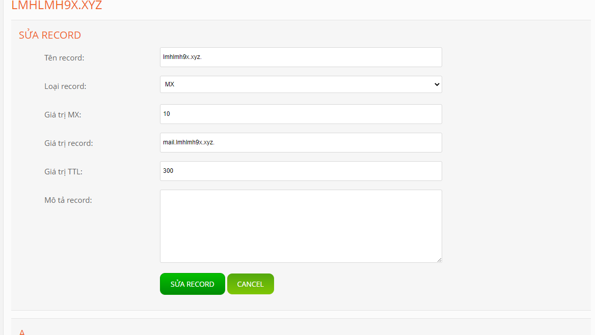

## Cài các package cần thiết

- yum update -y
- yum install perl epel-release -y

## Stop postfix
- systemctl stop postfix
- systemctl disable postfix

## Chỉnh sửa hostname

- hostnamectl set-hostname mail.lmhlmh9x.xyz
- reboot
- Kiểm tra lại:
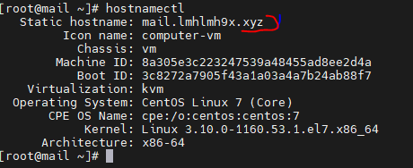

## Chỉnh sửa file hosts
- nano /etc/hosts
- Thêm dòng :
    + 103.176.179.62 mail.lmhlmh9x.xyz mail

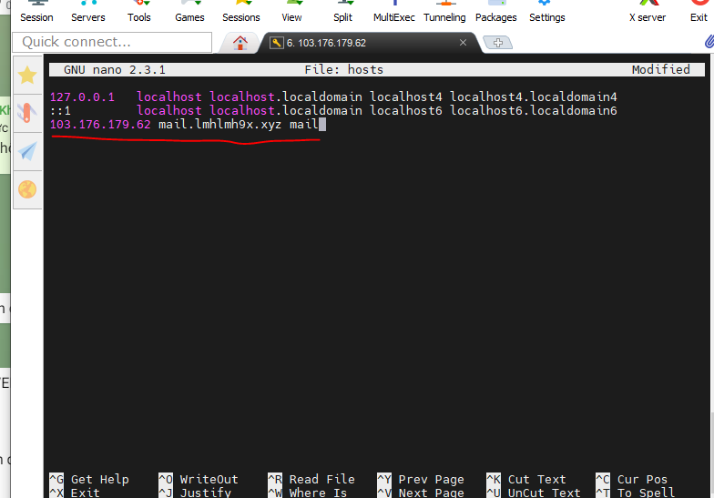

## Tải Zimbra về và giải nén
- wget https://files.zimbra.com/downloads/8.8.15_GA/zcs-8.8.15_GA_3869.RHEL7_64.20190918004220.tgz
- tar -xvf zcs-8.8.15_GA_3869.RHEL7_64.20190918004220.tgz

## Cài đặt Zimbra
1. 
- cd zcs-8.8.15_GA_3869.RHEL7_64.20190918004220
- ./install.sh
2. Các tùy chọn tiếp chọn yes hết, trừ 1 cái dưới chọn no.

 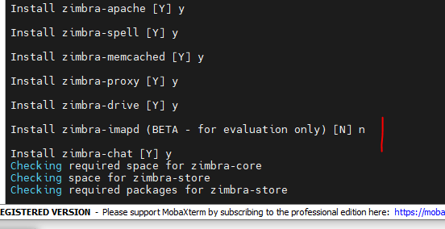

3. 

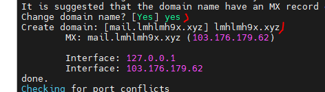

4. 
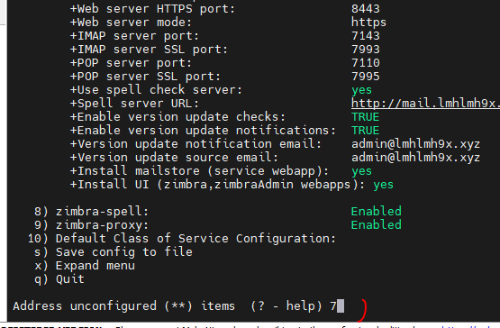
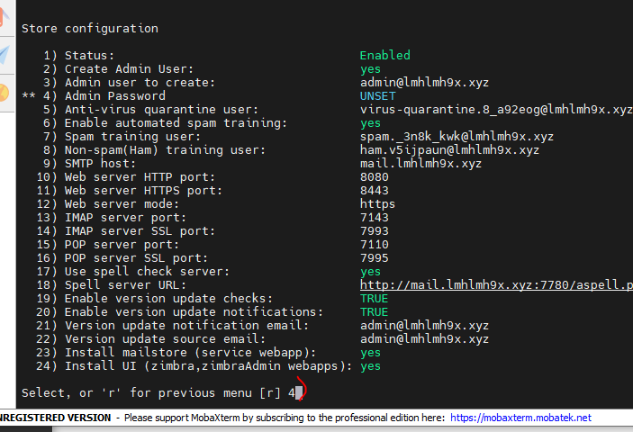
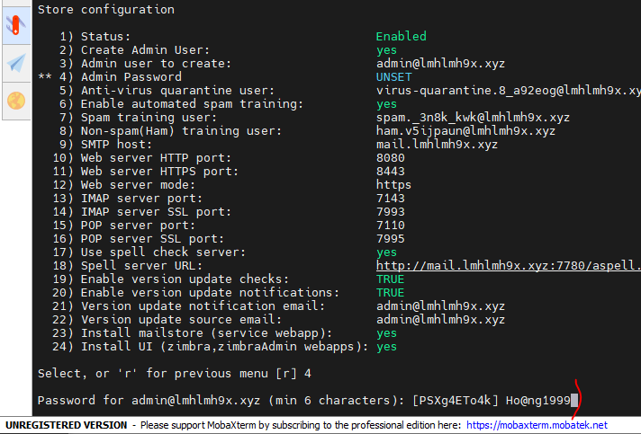
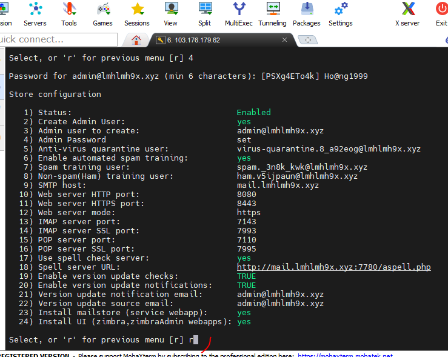
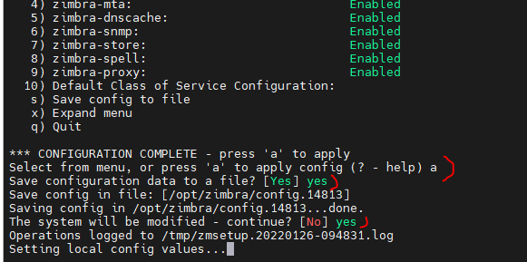

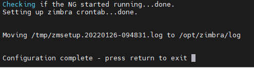

- Xong.

5. Blocking Memcached Exploit

- su - zimbra
- /opt/zimbra/bin/zmprov ms `zmhostname` zimbraMemcachedBindAddress 127.0.0.1 
- /opt/zimbra/bin/zmprov ms `zmhostname` zimbraMemcachedClientServerList 127.0.0.1

## Thành công.

- Truy cập bằng địa chỉ https://mail.lmhlmh9x.xyz:7071/zimbraAdmin/

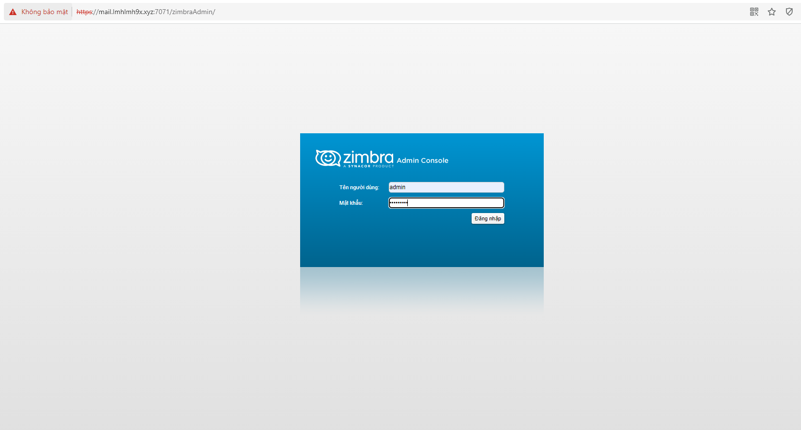

- Giao diện :

