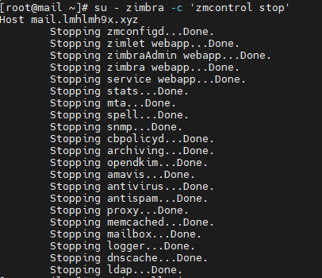

# Các bước cài SSL free trên Zimbra

### Truy cập vào server zimbra và stop service

- su - zimbra -c 'zmcontrol stop'

### Cài git cho server và dowload lets encrypt

- yum install git -y
- cd mnt 
- git clone https://github.com/certbot/certbot

