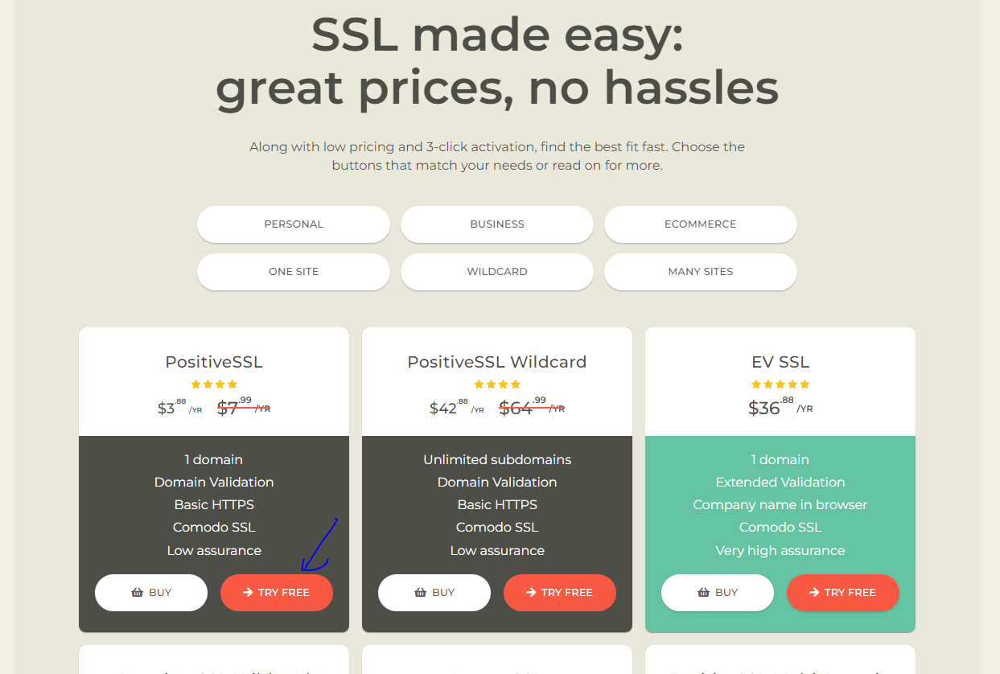
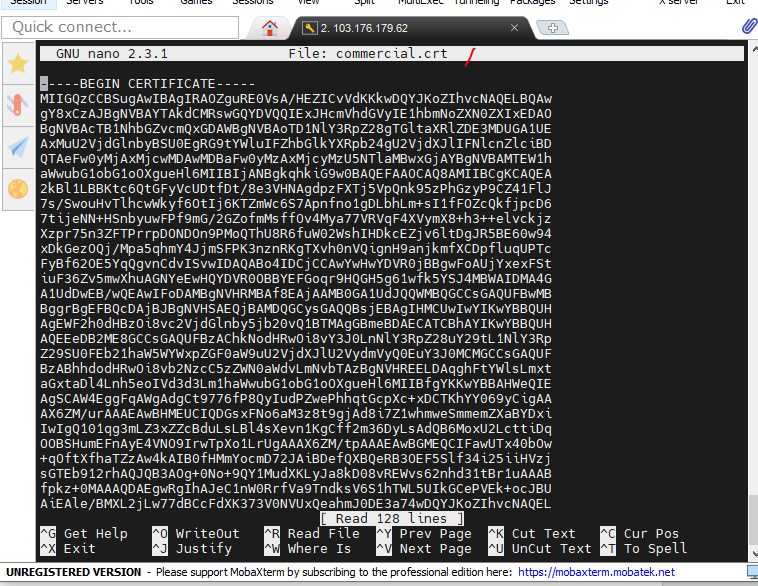
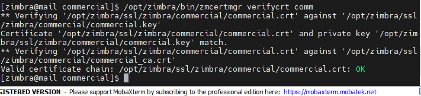

# Các bước thực hiện
## Lấy chứng chỉ
1. Vào trang web ssls.com để đăng kí một tài khoản

## Cài đặt

Trước tiên cd /opt/zimbra/ssl/zimbra/commercial/

1. Tạo file commercial.crt

2. Tạo file commercial_ca.crt

3. Tạo file commercial.key lấy nội dung từ file .pem

4. Verify chứng chỉ

- Trước tiên cấp quyền:
    + chown zimbra:zimbra * -R

- su zimbra
- /opt/zimbra/bin/zmcertmgr verifycrt comm

5. Deploy chứng chỉ

- /opt/zimbra/bin/zmcertmgr deploycrt comm commercial.crt ./commercial_ca.crt

6. Khởi động lại zimbra

- zmcontrol restart 

5. Xem thông tin chứng chỉ đã cài đặt bằng lệnh
- /opt/zimbra/bin/zmcertmgr viewdeployedcrt

6. Xem thành quả trực tiếp:

