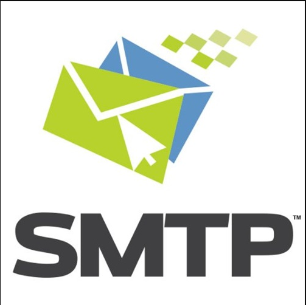
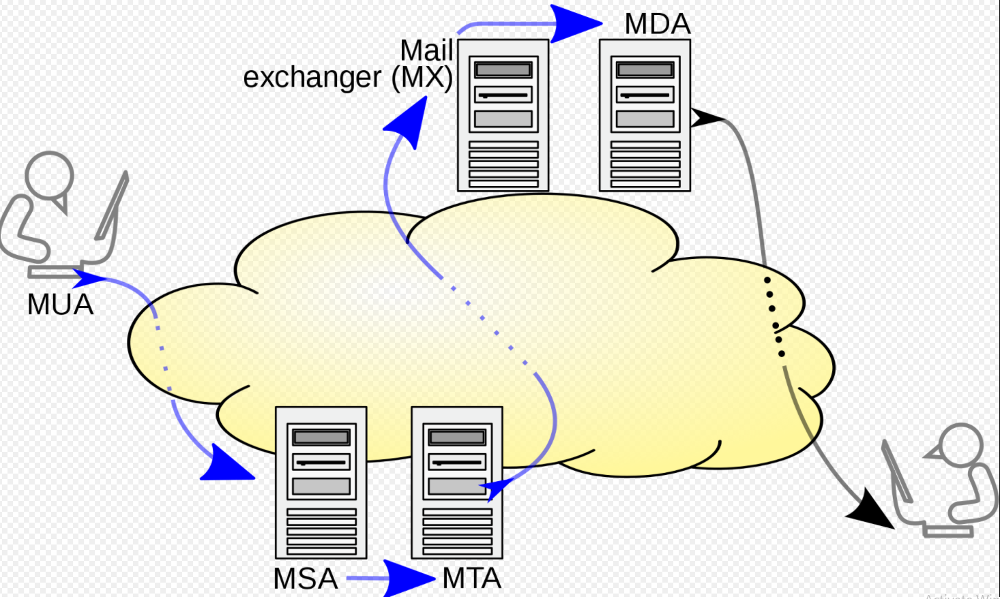

# Các giao thức được sử dụng trong email

*Tại đây sẽ nói về 4 giao thức : SMTP, IMAP, POP3*

## SMTP
*Tham khảo tại: https://en.wikipedia.org/wiki/Simple_Mail_Transfer_Protocol#Mail_processing_model*
### 1. SMTP là gì
- SMTP là viết tắt của Simple Mail Transfer Protocol - là giao thức gửi thư đơn giản hóa. Như vậy, nhìn vào tên cũng dễ thấy được chức năng chính của SMTP chính là gửi email. Còn nhận email, truy xuất dữ liệu từ email sẽ có giao thức IMAP hay POP3 đảm nhận trách nhiệm.
- Việc gửi email được giao thức SMTP thực hiện thông qua TCP hoặc IP. Vì vậy, người dùng có thể an tâm về khả năng bảo mật và tính tiện lợi. 
- Sử dụng giao thức SMTP giúp người dùng nâng cao hiệu suất làm việc. Bởi chúng hỗ trợ việc gửi lượng lớn thư điện tử chỉ trong thời gian ngắn. Nhờ thế, người dùng tiết kiệm rất nhiều thời gian và công sức so với việc gửi thư thủ công.
- Giao thức SMTP còn cho phép gửi tệp tin đính kèm với khả năng lưu trữ dung lượng lớn.

### 2. SMTP Server là gì
- Máy chủ SMTP là một dịch vụ gửi email số lượng lớn với tốc độ cao mà không bị giới hạn. Cũng có thể hiểu đơn giản, máy chủ giúp người dùng thực hiện thao tác gửi thư. Hiện nay có các hộp máy chủ SMTP miễn phí như Gmail hay hộp email đi kèm hosting.
- Thông thường, máy chủ SMTP gửi thư thông qua port 25. Tuy nhiên, ở Châu Âu, phương thức được sử dụng rộng rãi, thay thế cho SMTP của Gmail là X.400. Ngoài ra, còn có nhiều máy chủ email hỗ trợ giao thức gửi thư mở rộng là ESMTP. Đây là giao thức hỗ trợ gửi các tập tin đa phương tiện dưới dạng email một cách đơn giản, nhanh chóng.
- Khi sử dụng hệ thống email, người dùng cần tìm hiểu kỹ về giao thức được hỗ trợ để nâng cao hiệu suất, khai thác tối đa các chức năng của chúng, từ đó, tạo ra một email chuyên nghiệp. Bên cạnh đó, người dùng cũng chú ý đến khả năng đính kèm tập tin, các loại định dạng file được phép gửi, dung lượng lưu trữ… Tất cả giúp tạo nên một tổng thể hoàn hảo cho giải pháp trao đổi thông tin qua email của doanh nghiệp.  

### 3. Phương thức hoạt động của SMTP là gì
- Dưới đây là mô hình xử lí mail khi dùng SMTP

- Email được gửi bời mail clien là tác nhân người dùng thư (Mail User Agent - MUA) đến mail server là tác nhân gửi thư (Mail Submission Agent - MSA),sử dụng SMTP trên port TCP 587.  Những nhà cung cấp mail box vẫn cho phép gửi thư trên port truyền thống 25.
- MSA gửi thư đến đại lí truyển thư (Mail transfer Agent - MTA). Thông thường, 2 tác nhận này là đều xuất phát từ cùng một phần mềm được khởi chạy với các tùy chọn khác nhau trên cùng một máy. Quá trình xử lí cục bộ có thể được thực hiện trên một máy vật lí duy nhất.
- MTA sử dụng DNS để tra cứu MX record cho miền của người nhần (phần bên phải của @). MX record chứa tên MTA của mục tiêu. Dựa trên server đích và các yếu tố khác, MTA sẽ chọn máy chủ người nhận và kết nối với nó để hoàn tất quá trình trao đổi thư.
- Việc truyền thư có thể xảy ra trong một kết nối duy nhất giữa 2 MTA hoặc qua 1 chuỗi các hệ thống trung gian.
- Tại bước cuối cùng, thư được giao cho đại lí chuyển phát thư (Mail Delivery Agent) để chuyển về local. MDA lưu thư dưới dạng mailbox có liên quan. Cũng như khi gửi, việc tiếp nhận này có thể được thực hiện bằng một hoặc nhiều máy tính.
- Sau khi được gửi đến máy chủ thư cục bộ, thư được lưu trữ để truy xuất hàng loạt bằng mail client đã xác thực (MUA).

### 4. Lợi ích của SMTP 
- Giao thức SMTP mạng lại cho người dùng 3 lợi ích chính:
    + Tăng tỉ lệ gửi email thành công cao hơn.
    + Người dùng không cần cài đặt máy chủ nếu dùng hosting VPS.
    + Hầu hết email của người dùng gửi đều được hệ thống mail server của người nhận đánh dấu an toàn. Vì thế, số lượng email bị chuyển vào thư mục Junk, Spam giảm đáng kể.

## POP3
### 1. POP3 là gì
- POP3 - Post Office Protocol version 3 - là một giao thức dùng để kết nối tới mail server và tải mail xuống máy tính cá nhân thông qua một ứng dụng mail như Outlook, Thunderbird, Windows Mail, Mac Mail...
- Thông thường, email client sẽ có tùy chọn muốn giữ mail trên server sau khi tải về hay không. Nếu người dùng truy cập 1 tài khoản trên nhiều thiết bị, thì nên giữ lại bản copy trên server nếu không thiết bị thứ 2 sẽ không thể tải mail về vì nó đã bị xóa sau khi tải về trên thiết bị 1.
- POP3 là giao thức một chiều.
- Port mặc định của POP3:
    + 110 - port không mã hóa
    + 995 - SSL/TLS port, có thể gọi là port POP3S

### 2. Cơ chế hoạt động
- Kết nối đến server
- Nhận toàn bộ email
- Lưu cục bộ như mail mới
- Xóa mail trên server
- Ngắt kết nối tới server
### 3. Ưu nhược điểm
#### Ưu điểm
- Mail được lưu cục bộ, tức luôn có thể truy cập ngay cả khi không có kết nối internet.
- Kết nối internet chỉ dùng để gửi và nhận mail
- Tiết kiệm không gian lưu trữ tren server.
- Được lựa chọn để lại bản sao trên mail server.
- Hợp nhất nhiều tài khoản email và nhiều server vào một hộp thư đến.
#### Nhược điểm
- Mỗi lần nhận mail, POP sẽ dowload email đó về máy local mà mặc định xóa mail đó trên server đi, nên sẽ không thể sử dụng nhiều thiết bị để quản lí cùng một tài khoản email qua giao thức POP - Tuy nhiên có thể cấu hình để POP3 không xóa email trên server mà chỉ mark as read

## IMAP
### 1. IMAP là gì
- IMAP - Internet Message Access Protocol : là một giao thức để kéo mail về mail client, khác biệt với POP3, nó chỉ kéo email headers về, nội dung mail vẫn còn trên server.
- Đây là kênh liên lạc 2 chiều, thay đổi email trên client sẽ được chuyển lên server. Sau này giao thức này trở nên phổ biến nhớ nhà cung cấp mail lớn nhất thế giới - Gmail - khuyên dùng thay vì POP3.

- Do không tải email về máy tính cục bộ nên IMAP cho phép người dùng đăng nhập vào nhiều email client hay nhiều webmail để xem cùng 1 email.

- Port mặc định của IMAP
    + 143 - port không mã hóa
    + 993 - SSL/TLS port, cũng có thể được gọi là IMAPS.

### 2. Cơ chế hoạt động
- Kết nối đến server
- Lấy nội dung được yêu cầu từ người dùng và lưu đệm cục bộ
- Xử lí các biên tập từ người dùng, ví dụ như đánh dấu email là mail để đọc hay xóa...
- Ngắt kết nối tới server

### 3. Ưu nhược điểm
#### Ưu điểm
- Mail được lưu trên server đầu xa, tức có thể truy cập từ nhiều địa điểm khác nhau
- Xem nhanh hơn khi chỉ có các tiêu đề được tải về đến khi nội dung được yêu cầu rõ ràng
- Mail được dự phòng tự động trên server
- Tiết kiệm không gian lưu trữ cục bộ.
- Vẫn cho phép lưu mail cục bộ nếu cấu hình.

#### Nhược điểm
- Vì IMAP lưu các email trên server nên dung lượng hòm thư sẽ bị giới hạn bởi các nhà cung cấp dịch vụ mail.
- Nếu có một lượng lớn mail cần lưu trữ, sẽ gặp nhiều vấn đề khi gửi nhận mail khi hòm thư bị đầy.
- Ngoài ra phải có Internet mới có thể truy cập email vì nó chỉ kéo headers về, nội dung vẫn còn trên server.

