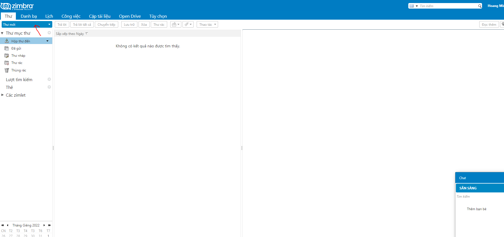

# Các bước khởi tạo và gửi mail trên Zimbra
## Khởi tạo user
1. Đăng nhập bằng tài khoản admin tại port 7071

2. Thiết lập thêm những thông tin liên quan tại kế tiếp. Chọn Hoàn tất để kết thúc

3. Tài khoản đã được tạo

4. Đăng nhập bằng tài khoản vừa tạo ở port 8443

5. Đăng nhập thành công

## Gửi mail

1. Sau khi đăng nhập vào tài khoản mail ở port 8443
- Chọn mục thư mới

- Nhập người gửi, tiêu đề cùng nội dung thư

2. Kết quả khi vào mailbox của admin
