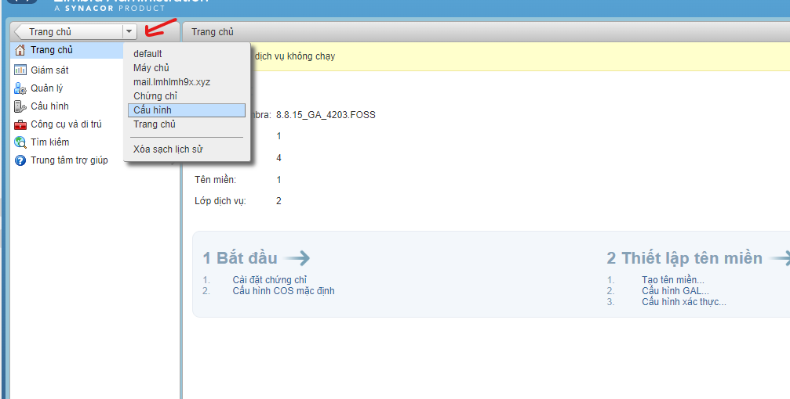
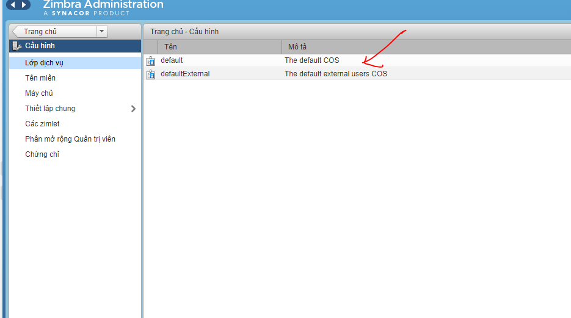
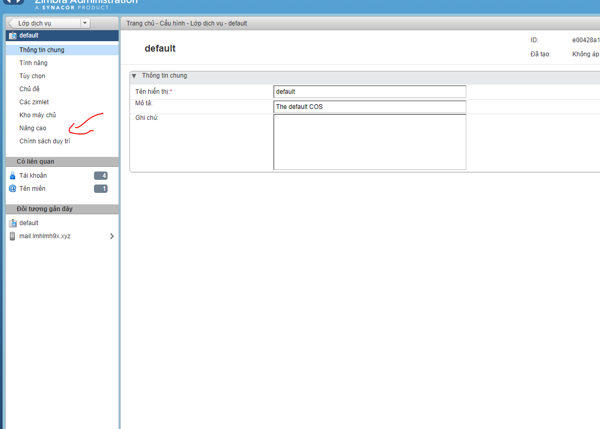
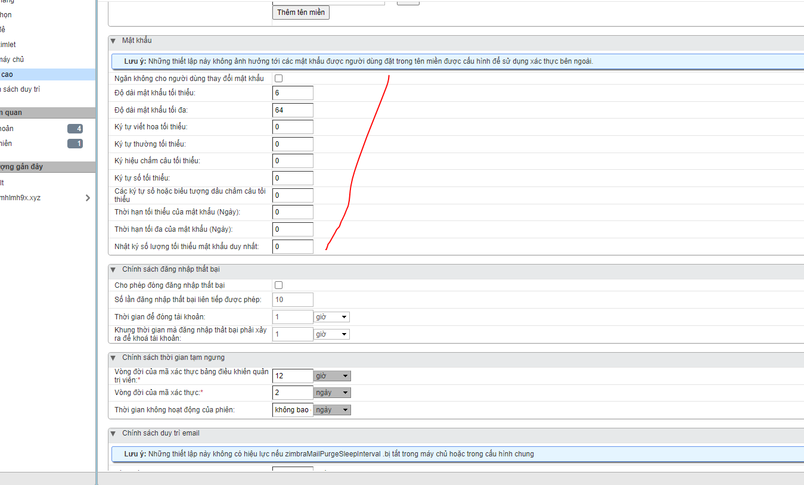
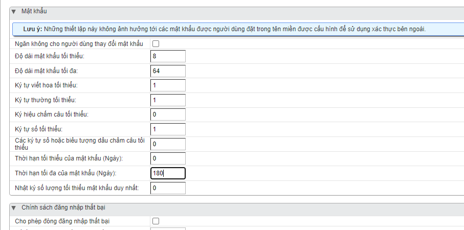

# Các bước thiết lập chính sách mật khẩu trên Zimbra

- Đầu tiên đăng nhập vào port 7071 bằng tài khoản admin

- Tại trang chủ, Click mũi tên xuống, chọn Cấu hình

- Tiếp chọn default

- Chọn nâng cao

- Kéo xuống dưới sẽ thấy phần mật khẩu

- Chỉnh sửa chính sách mật khẩu theo mong muốn

