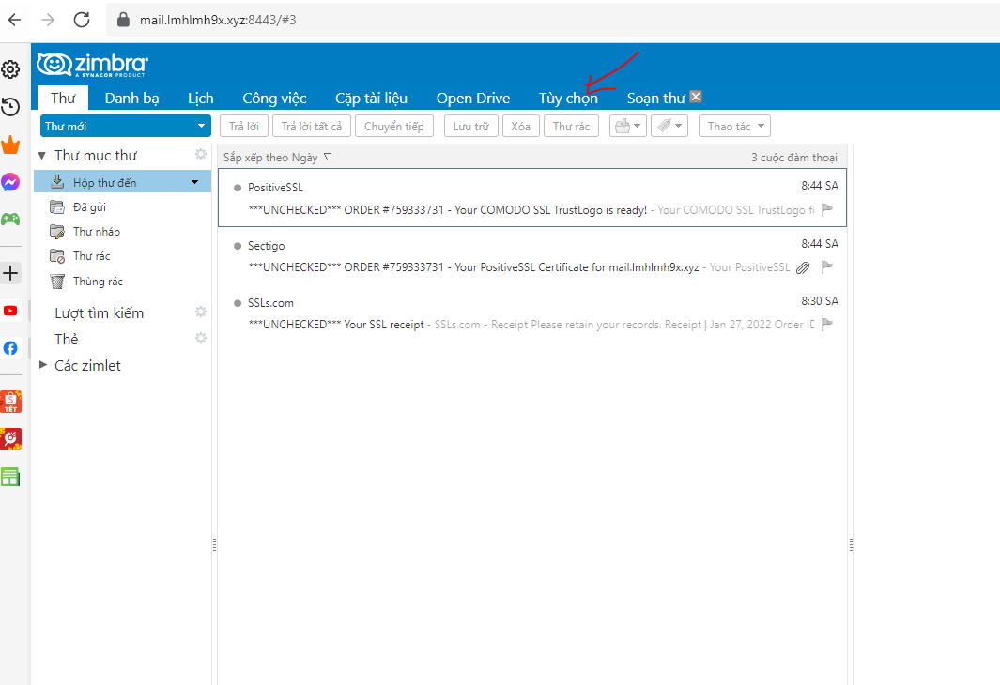
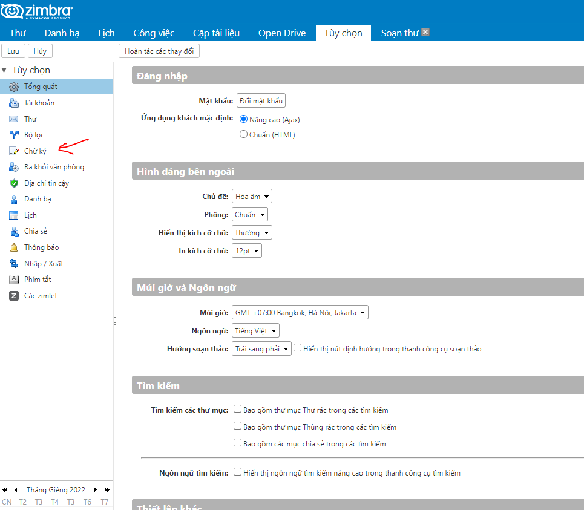
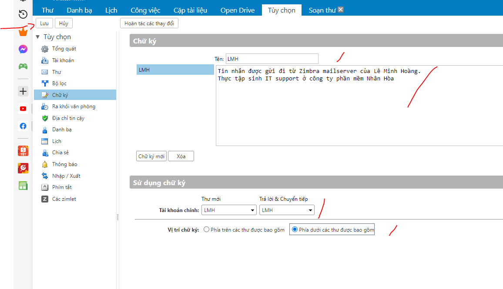
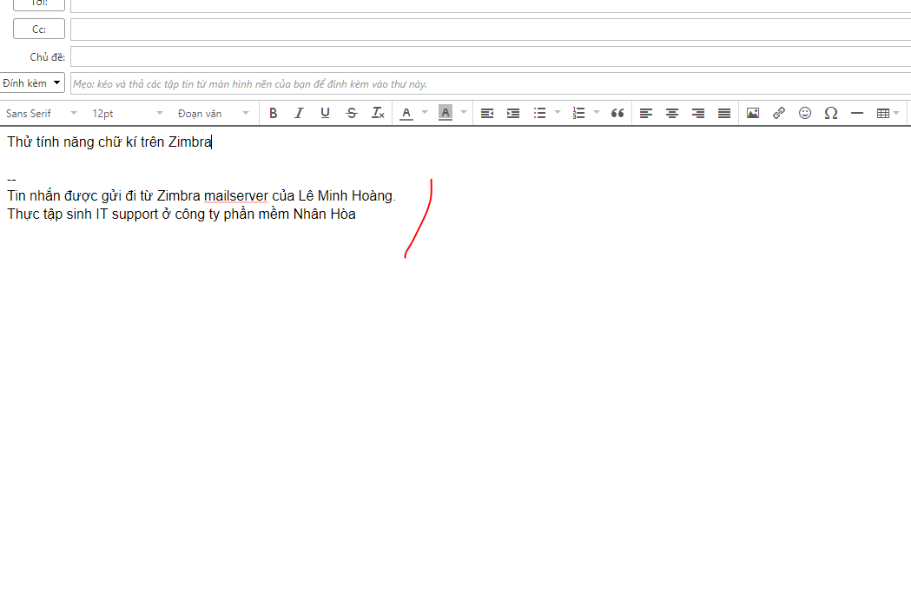

# Tạo chữ kí trên Zimbra

- Đầu tiên login vào mailbox tại port 8443

-  Click tùy chọn:

- Chọn tiếp mục chữ kí

- Thiết lập tên chữ kí cũng như sử dụng chữ kí khi nào, chữ kí đặt tại vị trí nào

- Kiểm tra kết quả

