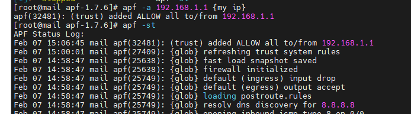

# Giới thiệu về APF
- APF là tên viết tắt của Advance Policy Firewall
- Đây là một loại tường lửa do 1 nhóm phát triển và xây dựng dựa trên các rules của iptables.
- Không giống như tường lửa CSF, APF có tính linh hoạt cao hơn và gần như không cần phải thực hiện các bước cài đặt để có thể có thể sử dụng ngay lập tức.

# Cài đặt APF
- Bước 1: Dowload phiên bản mới nhất về và unzip:
    + wget http://www.rfxn.com/downloads/apf-current.tar.gz
    + tar -zxvf apf-current.tar.gz

- Vào thư mục, chạy file cài đặt
    + cd apf-1.7.6/

    + sh ./install.sh

- Chỉnh sửa file config:

    + nano /etc/apf/conf.apf

    + DEVEL_MODE="1" => Thử nghiệm hay chính thức chạy ? 1 là có, 0 là không.
    + IFACE_IN="eth0" and IFACE_OUT="eth0" => Tên card mạng mà bạn chạy trong máy chủ. Với máy chủ vật lý hoặc công nghệ xen, thì là eth0, còn với OpenVZ thường là venet0
    + IG_TCP_CPORTS="20,21,22,25,26,37,43,53,80,110,113,143,443,465,873,993,995,2077,2078,2082,2083,2086,2087,2095,2096,3306,6666" => danh sách những cổng kết nối vào được mở.
    + IG_UDP_CPORTS="53,6277" => cổng dịch vụ UDP
    + IG_ICMP_TYPES="3,5,11,30" - Cổng vào của các gói tin ICMP

    + EG_TCP_CPORTS="21,25,37,53,80,110,113,123,443,43,873,953,2089,2703" - Các cổng dịch vụ TCP

    + EG_UDP_CPORTS="20,21,53,873,953,6277" - Cổng ra của dịch vụ UDP

    + TCP_STOP="DROP" - Khi gói tin TCP phạm luật, sẽ xử lý thế nào ? Mặc định là DROP

    + UDP_STOP="DROP" - Khi gói tin UDP phạm luật, sẽ xử lý thế nào ? Mặc định là DROP

    + ALL_STOP="DROP" - Khi gói tin bất kỳ phạm luật, sẽ xử lý thế nào. Mặc định là DROP
    + BLK_PRVNET="1" => đặt là 1 sẽ khóa tất cả các địa chỉ IP private.

    + Sau đó lưu lại

- Chạy apf : 
    + service apf start.

## Một số command dành cho APF

- apf -s | Khởi động APF Firewall
- apf -r | Update và khởi động lại APF Firewall
- apf -f | Dọn sạch tường lửa
- apf -st | Trạng thái hiện tại của APF Firewall
- apf -a IP {Lý do mở} | Cho phép một IP nào đó vượt qua tường lửa và điền vào nhóm “Cho phép truy cập” (allow_hosts.rules)
- apf -d IP {Lý do khóa} | Khóa một IP nào đó và xếp vào nhóm “Chặn truy cập” (deny_hosts.rules)

- chkconfig –level 2345 apf on | Thêm APF Firewall vào danh sách tự động chạy khi khởi động lại VPS
- chkconfig –del apf | Gỡ bỏ APF Firewall khỏi list chạy tự động sau khi khởi động lại VPS.
- apf -u IP {lí do remove} |remove đi

- Deny 1 ip

    
    