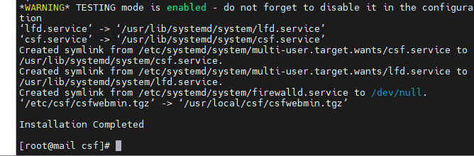
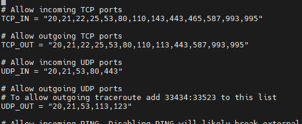
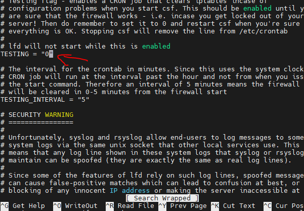
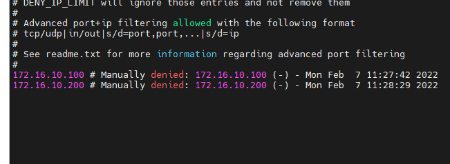
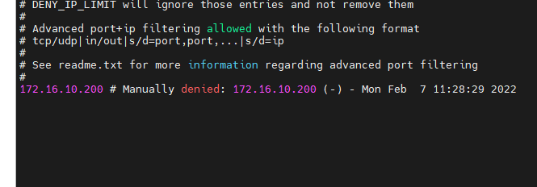

# Giới thiệu về CSF 
- CSF viết tắt của Config Server & Firewall là 1 gói ứng dụng hoạt động trên Linux như 1 Firewall được phát hành miễn phí để tăng tính bảo mật cho server (VPS và Dedicated). 
- CSF hoạt động dựa trên iptables và tiến trình ldf để quyét các file log để phát hiện các dấu hiệu tấn công bất thường.

## Tác dụng của CSF

- Chống DoS các loại
- Chống Scan Port
- Đưa ra các lời khuyên về việc cấu hình server (VD: Nên nâng cấp MySQL lên bản mới hơn)
- Chống BruteForce Attack vào ftp server, web server, mail server,directadmin,cPanel…
- Chống Syn Flood
- Chống Ping Flood
- Cho phép ngăn chặn truy cập từ 1 quốc gia nào đó bằng cách chỉ định - Country Code chuẫn ISO
- Hỗ trợ IPv6 và IPv4
- CHo phép khóa IP tạm thời và vĩnh viễn ở tầng mạng (An toàn hơn ở tầng ứng dụng ) nên webserver ko phải mệt nhọc xử lý yêu cầu từ các IP bị cấm nữa
- Cho phép bạn chuyến hướng yêu cầu từ các IP bị khóa sang 1 file html để thông báo cho người dùng biết IP của họ bị khóa
- Và rất nhiều tính năng khác, các bạn tự tìm hiểu thêm

# Cài đặt CSF Firewall
- Bước 1: Cài đặt module Perl cho CSF script

    + yum install perl-libwww-perl

- Bước 2: Tải CSF

    + cd /tmp
    + wget https://download.configserver.com/csf.tgz

- Bước 3: Giải nén và cài đặt

    + tar -xzf csf.tgz
    + cd csf
    + sh install.sh

    

- Bước 4: Cấu hình CSF

    + Mặc định thì script trên sẽ cài đặt và chạy CSF ở chế độ “Testing”, có nghĩa là server lúc này chưa được bảo vệ toàn diện. Để tắt chế độ “Testing” bạn cần cấu hình các lựa chọn TCP_IN, TCP_OUT, UDP_IN và UDP_OUT cho phù hợp với nhu cầu .

    + Mở file cấu hình CSF

        - nano /etc/csf/csf.conf

    + Chỉnh sửa các thông số cho phù hợp

    + Khi đã cấu hình xong, tắt chế độ Testing bằng cách chuyển TESTING = “1” thành TESTING = “0”

    + Cuối cùng lưu lại file cấu hình CSF

- Bước 5:  Khởi động CSF

    + Chạy CSF và cho phép tự kích hoạt mỗi khi boot VPS

    + chkconfig --level 235 csf on
    + service csf restart

## Những file cấu hình trong CSF
- Toàn bộ thông tin cấu hình và quản lý CSF được lưu ở các file trong folder /etc/csf. Nếu bạn chỉnh sửa các file này thì cần khởi động lại CSF để thay đổi có hiệu lực.

    + csf.conf : File cấu hình chính để quản lý CSF.
    + csf.allow : Danh sách địa chỉ IP cho phép qua firewall.
    + csf.deny : Danh sách địa chỉ IP từ chối qua firewall.
    + csf.ignore : Danh sách địa chỉ IP cho phép qua firewall và không bị block nếu có vấn đề.
    + csf.*ignore : Danh sách user, IP được ignore

## Một số lệnh CSF thường dùng
- Block IP
    + csf -d 172.16.10.100
    + csf -d 172.16.10.200

    

-  Xóa ip đã block:
    + csf -dr 172.16.10.100

- Một vài lệnh khác như:

    + csf -a IPADDRESS //Allow địa chỉ IP
    + csf -ar IPADDRESS //Xóa địa chỉ IP đã được allow
    + csf -g IPADDRESS //Kiểm tra địa chỉ IP có bị block không
    + csf - t  Hiển thị danh sách các IP từ chố và cho  phép TTL and comments
    + csf -r //Khởi động lại CSF
    + csf -x //Tắt CSF
    + csf -e //Mở CS
## Gỡ bỏ CSF Firewall

- /etc/csf/uninstall.sh