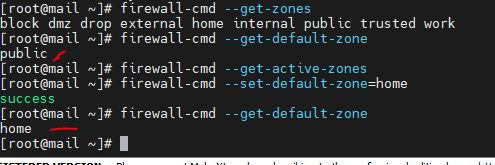

# Giới thiệu về FirewallD
- FirewallD là giải pháp tường lửa mạnh mẽ tương tự Firewall CSF, được cài đặt mặc định trên RHEL 7 và CentOS 7, nhằm thay thế Iptables với những khác biệt cơ bản:

- FirewallD sử dụng “zones” và “services” thay vì “chain” và “rules” trong Iptables.
- FirewallD quản lý các quy tắc được thiết lập tự động, có tác dụng ngay lập tức mà không làm mất đi các kết nối và session hiện có.
## Zone 
- Trong FirewallD, zone là một nhóm các quy tắc nhằm chỉ ra những luồng dữ liệu được cho phép, dựa trên mức độ tin tưởng của điểm xuất phát luồng dữ liệu đó trong hệ thống mạng.

- Các zone được xác định trước theo mức độ tin cậy, theo thứ tự từ “ít-tin-cậy-nhất” đến “đáng-tin-cậy-nhất”:

    + drop: ít tin cậy nhất – toàn bộ các kết nối đến sẽ bị từ chối mà không phản hồi, chỉ cho phép duy nhất kết nối đi ra.
    + block: tương tự như drop nhưng các kết nối đến bị từ chối và phản hồi bằng tin nhắn từ icmp-host-prohibited (hoặc icmp6-adm-prohibited).
    + public: đại diện cho mạng công cộng, không đáng tin cậy. Các máy tính/services khác không được tin tưởng trong hệ thống nhưng vẫn cho phép các kết nối đến trên cơ sở chọn từng trường hợp cụ thể.
    + external: hệ thống mạng bên ngoài trong trường hợp bạn sử dụng tường lửa làm gateway, được cấu hình giả lập NAT để giữ bảo mật mạng nội bộ mà vẫn có thể truy cập.
    + internal: đối lập với external zone, sử dụng cho phần nội bộ của gateway. Các máy tính/services thuộc zone này thì khá đáng tin cậy.
    + dmz: sử dụng cho các máy tính/service trong khu vực DMZ(Demilitarized) – cách ly không cho phép truy cập vào phần còn lại của hệ thống mạng, chỉ cho phép một số kết nối đến nhất định.
    + work: sử dụng trong công việc, tin tưởng hầu hết các máy tính và một vài services được cho phép hoạt động.
    + home: môi trường gia đình – tin tưởng hầu hết các máy tính khác và thêm một vài services được cho phép hoạt động.
    + trusted: đáng tin cậy nhất – tin tưởng toàn bộ thiết bị trong hệ thống.
## Quy tắc Runtime/Permanent

- Trong FirewallD, các quy tắc được cấu hình thời gian hiệu lực Runtime hoặc Permanent.

    + Runtime(mặc định): có tác dụng ngay lập tức, mất hiệu lực khi reboot hệ thống.
    + Permanent: không áp dụng cho hệ thống đang chạy, cần reload mới có hiệu lực, tác dụng vĩnh viễn cả khi reboot hệ thống.
- Việc Restart/Reload sẽ hủy bộ các thiết lập Runtime đồng thời áp dụng thiết lập Permanent mà không hề phá vỡ các kết nối và session hiện tại. Điều này giúp kiểm tra hoạt động của các quy tắc trên tường lửa và dễ dàng khởi động lại nếu có vấn đề xảy ra.

# Cài đặt firewallD

– FirewallD được cài đặt mặc định trên CentOS 7. Cài đặt nếu chưa có:

    + yum install firewalld
– Khởi động FirewallD:

    + systemctl start firewalld
– Kiểm tra tình trạng hoạt động

    + systemctl status firewalld
– Thiết lập FirewallD khởi động cùng hệ thống
    
    + systemctl enable firewalld
- Kiểm tra lại :

    + systemctl is-enabled firewalld
- Ban đầu, bạn không nên cho phép FirewallD khởi động cùng hệ thống cũng như thiết lập Permanent, tránh bị khóa khỏi hệ thống nếu thiết lập sai. Chỉ thiết lập như vậy khi bạn đã hoàn thành các quy tắc tường lửa cũng như test cẩn thận.
– Khởi động lại

    + systemctl restart firewalld
    + firewall-cmd --reload
– Dừng và vô hiệu hóa FirewallD

    + systemctl stop firewalld
    + systemctl disable firewalld

# Cấu hình FirewallD

## Thiết lập các zone
- Liệt kê tất cả các zone trong hệ thống

    + firewall-cmd --get-zones

- Kiểm tra zone mặc định

    + firewall-cmd --get-default-zone

- Kiểm tra zone active (được sử dụng bởi giao diện mạng)
    + Vì FirewallD chưa được thiết lập bất kỳ quy tắc nào nên zone mặc định cũng đồng thời là zone duy nhất được kích hoạt, điều khiển mọi luồng dữ liệu.

    + firewall-cmd --get-active-zones

- Thay đổi zone mặc định, ví dụ thành home:

    + firewall-cmd --set-default-zone=home

    

## Các lệnh liệt kê

- Liệt kê toàn bộ các quy tắc của các zones:
    + firewall-cmd --list-all-zones

- Liệt kê toàn bộ các quy tắc trong zone mặc định và zone active
    + firewall-cmd --list-all

- Liệt kê toàn bộ các quy tắc trong một zone cụ thể, ví dụ home
    + firewall-cmd --zone=home --list-all

- Liệt kê danh sách services/port được cho phép trong zone cụ thể:
    + firewall-cmd --zone=public --list-services
    + firewall-cmd --zone=public --list-ports

## Thiết lập cho Service

- Đây chính là điểm khác biệt của FirewallD so với Iptables – quản lý thông qua các services. Việc thiết lập tường lửa đã trở nên dễ dàng hơn bao giờ hết – chỉ việc thêm các services vào zone đang sử dụng.
- Đầu tiên, xác định các services trên hệ thống:
    + firewall-cmd --get-services
    + Lưu ý: Biết thêm thông tin về service qua thông tin lưu tại /usr/lib/firewalld/services/.
    

- Hệ thống thông thường cần cho phép các services sau: ssh(22/TCP), http(80/TCP), https(443/TCP), smtp(25/TCP), smtps(465/TCP) và smtp-submission(587/TCP)

- Thiết lập cho phép services trên FirewallD, sử dụng –add-service:

    + firewall-cmd --zone=public --add-service=http

    + firewall-cmd --zone=public --add-service=http --permanent

- Ngay lập tức, zone “public” cho phép kết nối HTTP trên cổng 80. Kiểm tra lại

    + firewall-cmd --zone=public --list-services

    

- Vô hiệu hóa services trên FirewallD, sử dụng –remove-service:

    + firewall-cmd --zone=public --remove-service=http
    + firewall-cmd --zone=public --remove-service=http --permanent

    

## Thiết lập cho port
- Mở Port với tham số –add-port:

    + firewall-cmd --zone=public --add-port=9999/tcp
    + firewall-cmd --zone=public --add-port=9999/tcp --permanent
- Mở 1 dải port:
    + firewall-cmd --zone=public --add-port=4990-5000/tcp
    + firewall-cmd --zone=public --add-port=4990-5000/tcp --permanent
- Kiểm tra lại

    + firewall-cmd --zone=public --list-ports

    

- Đóng Port với tham số –remove-port:

    + firewall-cmd --zone=public --remove-port=9999/tcp
    + firewall-cmd --zone=public --remove-port=9999/tcp --permanent

    