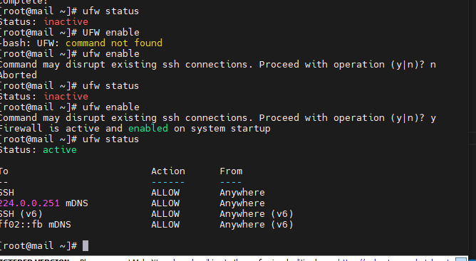
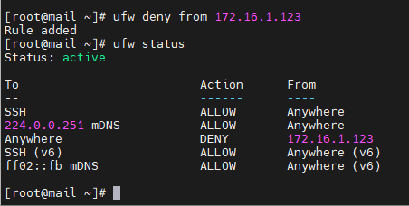
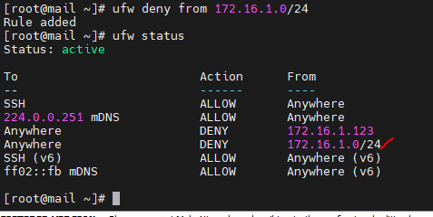
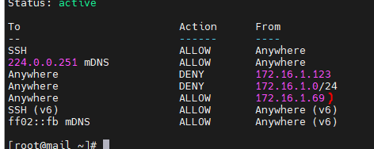
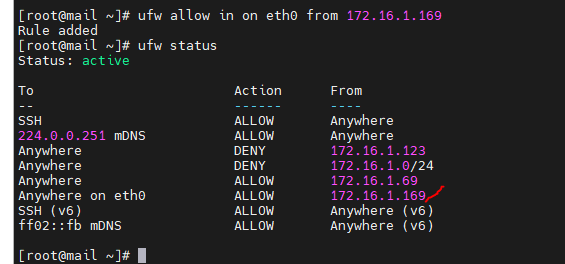
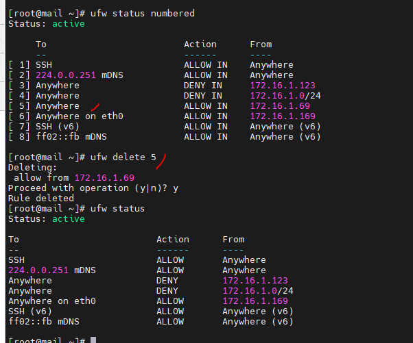
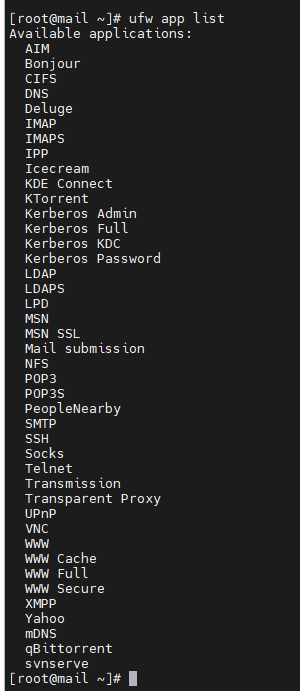
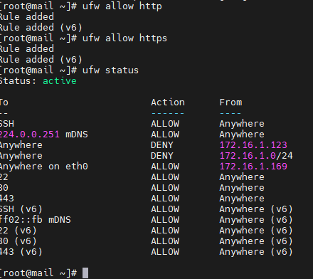

# Giới thiệu về UFW

- UFW (Uncomplicated Firewall) là một giao diện với iptables nhằm hướng tới việc đơn giản hoá quá trình cấu hình tường lửa. Vì iptables là một công cụ vững chắc và linh hoạt nên người mới bắt đầu sử dụng sẽ thấy rất khó để thiết lập đúng cấu hình tường lửa.

## Các qui tắc và các lệnh phổ biến
### Cài đặt ufw
+ yum install ufw -y

### Kiểm tra xem ufw có được bật hay không:

+ sudo ufw status

### Như ta đã thấy thì ufw chưa được bật

### Bật UFW:
+ Để bật ufw dùng lệnh sau:

+ sudo ufw enable

### Dùng lệnh sau để xem trên ufw chặn hoặc cho phép nhưng gì:

+ sudo ufw status

### Tắt UFW:

+ Dùng lệnh sau để tắt:
+ sudo ufw disable
### Chặn địa chỉ ip :
+ ufw deny from 172.16.1.123

    

### Chặn 1 dải mạng:
+ ufw deny from 172.16.1.0/24 

    

### Cho phép các ip kết nối:

+ ufw allow from 172.16.1.69

    

### Cho phép kết nối tới các interface
+ ufw allow in on eth0 from 172.16.1.169

### Xóa rules UFW
- Xem ID các rules:
    + ufw status numbered

- Xóa rule cho phép kết nối tới .1.69
    + ufw delete 5

### Liệt kê  các ứng dụng có sẵn
- ufw app list

### Cho phép SSH:

- Cho phép tất cả các kết nối tới cổng SSH mặc định:
    + ufw allow 22

## Cho phép Nginx:
- ufw app list | grep Nginx
## Cho phép HTTP/HTTPS

- ufw allow http
- ufw allow https 

