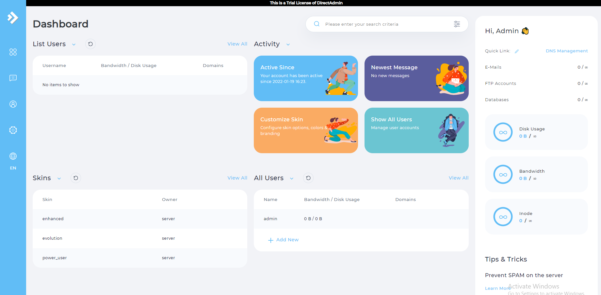
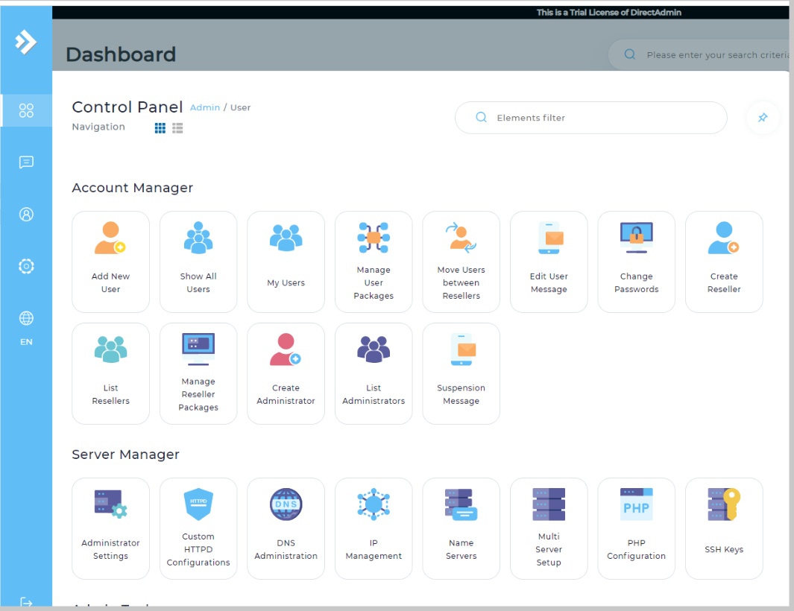

# DirectAdmin và Chức năng
## DirectAdmin là gì?
- DirectAdmin là công cụ quản trị server (web hosting control panel) được phát triển để dễ dàng thực hiện các công việc hàng ngày của webmaster, đặc biệt là những người có ít hoặc không có kinh nghiệm trước đó. DirectAdmin được sử dụng thông qua trình duyệt web, có giao diện trực quan và rất dễ để sử dụng.

- Phần mềm DirectAdmin cung cấp cho người dùng nhiều tính năng như quản lý domain, subdomain, DNS, FTP và cơ sở dữ liệu MySQL. Không những vậy, khi sử dụng DirectAdmin cũng có thể tạo thêm được các email theo tên miền, tạo SSH key, bảo mật SSL, … Với DirectAdmin, người dùng sẽ dễ dàng upload và quản lý các file với File Manager một cách nhanh chóng và dễ dàng.

- Tương tự như cPanel, DirectAdmin có thể chạy rất tốt trong Linux và các bản phân phối chính của nó – CloudLinux, CentOS, Ubuntu, Debian, Red Hat, v.v. Hệ điều hành dựa trên Windows sẽ không được hỗ trợ.

## Ưu nhược điểm
### 1. Ưu điểm

- Về cơ bản, DirectAdmin có một số đặc điểm đáng chú ý mà chắc chắn có thể khiến khách hàng tiềm năng phải trầm trồ. Mặc dù không phải là duy nhất nhưng đó là những lĩnh vực mà DA vượt trội và cải thiện rất nhiều với mỗi phiên bản mới:

    +  Giao diện đồ họa tuyệt vời (GUI): 
        - Nếu bạn đang tìm kiếm sự đơn giản – DirectAdmin chắc chắn là lựa chọn phù hợp. Thay vì quá nhiều phần và tùy chọn, tất cả các tính năng của bạn được xếp chồng lên nhau dưới ba nhánh chính – Trình quản lý tài khoản , Trình quản lý email và Tính năng bổ sung . Các kỳ công có thể nhìn thấy rõ ràng và hầu hết chúng đều tự giải thích ngay cả trước khi bạn nhấp vào chúng.
    + Gói Đăng ký Giá cả phải chăng: 
        - Giá cả hợp lý là điều vẫn giữ cho DirectAdmin cạnh tranh trong thị trường nơi tồn tại các giải pháp hoàn thiện hơn nhiều. Giá của CPanel đã cao ngất ngưởng và Plesk không bị tụt lại xa. So với điều đó, DirectAdmin cung cấp một tài khoản dùng thử miễn phí , cũng như ba tùy chọn trả phí, bắt đầu chỉ từ $ 2 / tháng .
    + Hỗ trợ: 
        - Ngoài sự hỗ trợ của nhà cung cấp dịch vụ lưu trữ, bạn cũng có thể nhận được sự hỗ trợ trực tiếp từ các kỹ thuật viên của DirectAdmin. Người dùng trên gói Lite và Standard có thể được hưởng lợi từ hệ thống ticket bên trong bảng điều khiển. Bằng cách này, nếu có vấn đề với DirectAdmin và các hoạt động của nó – bạn có thể nhận trợ giúp trực tiếp.
    + Phục hồi sự cố tự động: 
        - Một điều tuyệt vời khác của DirectAdmin là tính ổn định của các dịch vụ. Nếu có sự cố bất ngờ xảy ra, trước tiên DA sẽ thử khởi động lại dịch vụ để xem liệu điều này có khắc phục được sự cố hay không. Nếu điều đó không hiệu quả – hệ thống sẽ gửi thông báo khẩn cấp đến quản trị viên web, giúp họ giải quyết vấn đề trong thời gian thích hợp.
    + Tốc độ: 
        - DirectAdmin được thiết kế tương đối nhẹ và nhanh. Việc tải các tài nguyên từ DirectAdmin cũng vô cùng thấp.
    + Giao diện quản trị: 
        - Khác với cPanel khiến người dùng cảm thấy bỡ ngỡ, khó sử dụng khi truy cập lần đầu tiên, thì DirectAdmin sở hữu một giao diện đơn giản, dễ dàng sử dụng và quản lý.
    + Hỗ trợ nhiều phân cấp user:  
        - Hệ thống phân cấp người dùng (admin level, reseller level, user level) hỗ trợ tốt cho việc quản trị người dùng và đối tượng người dùng. Vì thế, DirectAdmin phù hợp với các đơn vị cung cấp hosting cho nhiều người dùng trực thuộc thông qua tài khoản reseller.
    + Manual configuration: 
        - Directmin admin cung cấp hầu hết tính năng thông qua giao diện website, nhưng người dùng cũng có thể config thủ công bằng cách sử dụng command line. Thực tế, nhiều admin quản trị server thích sử dụng cách này hơn so với việc sử dụng giao diện web.
### 2. Nhược điểm
- Khả năng thêm các chức năng: 
    +  Về mặt này thì DirectAdmin còn rất hạn chế. Tuy nhiên, vẫn có thể thêm các chức năng nhưng sẽ tốn thêm chi phí cho việc này.
- Cộng đồng người dùng ít: 
    + Bạn sẽ khó tìm được các câu trả lời hướng dẫn cho DirectAdmin khi gặp một vấn đề nâng cao, khó khăn nào đó vì không có quá nhiều cộng động sử dụng DirectAdmin.
- Giao diện khá nâng cao với người dùng:
    + Người dùng mới có thể gặp khó khăn trong việc tìm kiếm tính năng cần sử dụng. Directadmin được phân chia thành nhiều cấp, và nó mất thời gian để xác định vị trí tính năng mình cần.

## Các tính năng chính của DA

### 1. Chức năng của Administrator trong DirectAdmin
- Create / Modify Admins and Resellers: 
    + Admin có thể tạo Reseller hoặc Admin bổ sung một cách nhanh chóng và dễ dàng với tính năng này.
- Reseller Package: 
    + Admin có thể tạo các gói tài khoản với các thông số được xác định trước bằng cách sử dụng tính năng này. Đến khi tạo tài khoản, Admin chỉ cần chọn một gói thay vì thiết lập thủ công từng tính năng cho tài khoản.
- Show All Users: 
    + Tính năng này cho phép Admin xem nhanh từng tài khoản trên hệ thống và sắp xếp danh sách này theo nhiều cách khác nhau.
- DNS Administration: 
    + NCho phép Admin tạo, sửa đổi hoặc xóa bất kỳ bản ghi DNS nào trên máy chủ.
- IP Manager: 
    + NĐây là nơi Admin đặt địa chỉ IP có sẵn cho máy chủ. Admin cũng có thể phân bổ địa chỉ IP cho Reseller từ menu này.
- Mail Queue Administration: 
    + Công cụ để xem danh sách mail và message. Bao gồm các công cụ để thực hiện hành động đối với các message đó.
- System/Services Info: 
    + Admin có thể xem, dừng, bắt đầu và khởi động lại các dịch vụ từ menu này.
- Complete Usage Statistics: 
    + Tính năng này cung cấp cho Admin  một cái nhìn tổng quan đầy đủ về việc sử dụng hệ thống. Đầu vào và đầu ra chính xác từ card Ethernet của máy chủ cũng được giám sát.
- DNS Clustering: 
    + DirectAdmin giao tiếp với các máy DirectAdmin khác để tự động chuyển dữ liệu DNS giữa chúng. Nó có khả năng kiểm tra máy chủ khác để tìm tên miền và không cho phép các tên miền trùng lặp trên DirectAdmin của bạn.
- SPAM fighting tools in DirectAdmin: 
    + Nhiều công cụ chống SPAM được cung cấp bởi DirectAdmin. 
- Licensing / Updates: 
    + Admin có thể xem trạng thái giấy phép của mình và tải xuống các bản nâng cấp phần mềm và bảo mật DirectAdmin mới nhất từ menu này

### 2. Chức năng của Reseller trong DirectAdmin:
- Create / List / Modify Accounts: 
    + Việc tạo, liệt kê, sửa đổi và xóa tài khoản được thực hiện nhanh chóng và dễ dàng.
- User Packages: 
    + Reseller có thể tạo các Packages được xác định trước bằng cách sử dụng tính năng này. Khi tạo tài khoản, Reseller chỉ cần chọn một Package thay vì thiết lập từng tính năng tài khoản theo cách thủ công.
- Reseller Statistics: 
    + Reseller được cung cấp thông tin tổng quan đầy đủ về tổng mức sử dụng của họ. Reseller cũng có thể sắp xếp dữ liệu theo User để nhanh chóng đánh giá tình hình tổng thể.
- Message All Users: 
    + Reseller có thể nhanh chóng gửi tin nhắn đến tất cả khách hàng của họ bằng cách sử dụng hệ thống hỗ trợ ticket được tích hợp sẵn của DirectAdmin.
- Import / Manage Skins: 
    + Với tùy chọn menu này, Reseller có thể nhanh chóng import và áp dụng giao diện mới chỉ bằng một nút bấm.
- IP Assignment: 
    + Reseller có thể phân bổ địa chỉ IP cho khách hàng của họ bằng cách sử dụng tùy chọn menu này.
- System / Services Information: 
    + Bằng cách nhấp vào tính năng này, Reseller có quyền truy cập tức thì vào trạng thái máy chủ và thông tin hệ thống.
- Name Servers:
    + Reseller có thể tạo nameservers được cá nhân hóa cho khách hàng của họ từ menu này.

### 3. Chức năng của User trong DirectAdmin
- E-mail Administration: 
    + User có thể tạo tài khoản POP / IMAP, địa chỉ e-mail, forwarder, danh sách gửi thư, thư trả lời tự động và webmail. Bộ lọc cho phép người dùng chặn mail theo tên miền, từ khóa và kích thước.
- FTP Management: 
    + User có thể tạo tài khoản FTP và thiết lập quyền thư mục cho từng tài khoản. FTP ẩn danh cũng được hỗ trợ.
- DNS Menu: 
    + User có thể thêm và xóa các bản ghi, thay đổi cài đặt MX và bất kỳ  thứ gì khác với toàn quyền kiểm soát DNS
- Statistics Menu: 
    + User có sẵn mọi thống kê về tài khoản của họ. Các tùy chọn nâng cao hơn và Webalizer cũng được bao gồm.
- Subdomains Menu: 
    + User có thể liệt kê, tạo, xóa và lấy số liệu thống kê về các subdomains.
- File Manager: 
    + Một sự thay thế nhanh chóng và thân thiện với người dùng cho FTP. Bao gồm mọi tính năng cần thiết để xây dựng và duy trì một trang web.
- MySQL Databases: 
    + User có thể dễ dàng tạo, sửa đổi và xóa cơ sở dữ liệu MySQL từ menu này.
- Site Backup: 
    + Sử dụng công cụ hữu ích này, User có thể sao lưu và khôi phục những gì họ muốn.
- Error Pages: 
    + NUser có thể tạo các thông báo và kết quả đầu ra tùy chỉnh cho các mã lỗi 401, 403, 404 và 500.
- Directory Password Protection:
    + User có thể đặt mật khẩu bảo vệ bất kỳ thư mục nào bằng tên username và password.
- PHP Selector: 
    + Cho phép khách hàng chọn phiên bản PHP nào sẽ được liên kết với phần mở rộng .php.
- Advanced Tools: 
    + User có thể cài đặt chứng chỉ SSL, xem thông tin máy chủ và các mô-đun perl đã cài đặt, đặt cron job, mime types và trình xử lý apache, đồng thời cho phép chuyển hướng trang web và trỏ tên miền.
### 4. Chức năng chung trong DirectAdmin
- Integrated Ticket Support System: 
    + Với hệ thống tích hợp hỗ trợ ticket của DirectAdmin, bạn sẽ cung cấp dịch vụ hỗ trợ khách hàng tốt hơn với ít rắc rối hơn. “Bạn có XX tin nhắn đang chờ” được hiển thị mỗi khi bạn đăng nhập – và bạn có thể đặt DirectAdmin thông báo cho bạn về các yêu cầu hỗ trợ qua e-mail, đảm bảo rằng không có yêu cầu nào bị bỏ qua. Nếu bạn muốn cung cấp hỗ trợ theo một cách khác, chỉ cần tắt tính năng này.
- Two-Factor Authentication: 
    + Cho phép bất kỳ tài khoản DirectAdmin nào yêu cầu Xác thực hai yếu tố bằng mã từ ứng dụng trên smartphone.
- Plugin System: 
    + Cho phép mở rộng chức năng DirectAdmin một cách dễ dàng.
- Live Updates: 
    + Quản trị viên máy chủ có thể nhấp vào nút “licensing / updates” để xem trạng thái phiên bản và giấy phép hiện tại. Không cần phải tải xuống, giải nén và cài đặt theo cách thủ công – DirectAdmin tự động thực hiện tất cả các bản cập nhật.
- Completely Customizable: 
    + DirectAdmin được thiết kế để trở nên độc đáo như doanh nghiệp của bạn. Mọi khía cạnh của giao diện DirectAdmin đều có thể được thay đổi và các thiết kế mới được import dễ dàng thông qua menu “skin”
- Automatic Recovery From Crashes: 
    + DirectAdmin TaskQueue đảm bảo rằng tất cả các dịch vụ luôn hoạt động. Nếu có sự cố, DirectAdmin sẽ cố gắng khắc phục sự cố bằng cách khởi động lại dịch vụ. Nếu không thành công, DirectAdmin sẽ thông báo cho quản trị viên máy chủ ngay lập tức.
- We Support Your Customers Through Site-Helper: 
    + Site-Helper được thiết kế để giúp bạn và khách hàng của bạn sử dụng DirectAdmin.