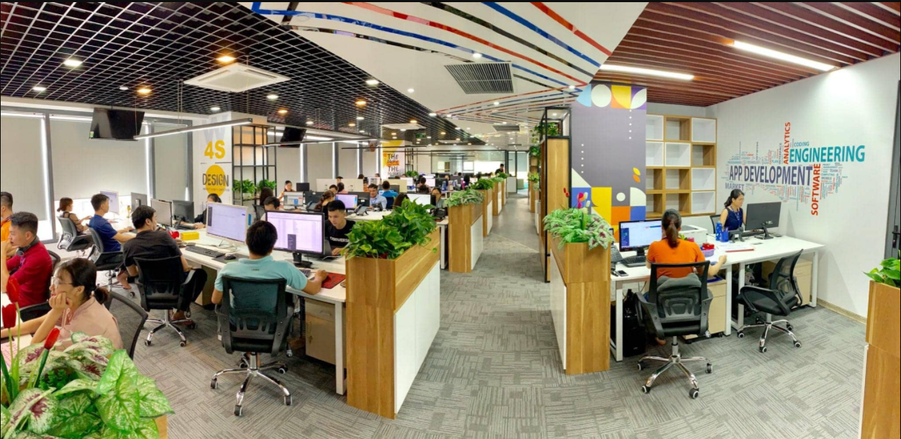

# 1. Giới thiệu về Nhân Hòa
## 1.1 Lịch sử hình thành

- Được thành lập năm 2002 do nhu cầu tất yếu hội nhập của nền kinh tế, hiện tại Nhân Hòa đang cung cấp dịch vụ cho hơn 100.000 khách hàng trong và ngoài nước. Chúng tôi luôn nỗ lực sáng tạo không ngừng nhằm xây dựng công ty thành một tổ chức hùng mạnh, hiện đại và văn hóa với mong muốn mở rộng hợp tác với các đối tác trong và ngoài nước tạo nền tảng cho những bước tiến bền vững.
- Trải qua 20 năm thành lập và phát triển, Nhân hòa đã được tạo sự tin tưởng, tin cậy trong lòng khách hàng. Với hàng trăm đại lý trên toàn quốc, chúng tôi luôn nỗ lực đem đến sự hài lòng về sản phẩm dịch vụ và giải pháp công nghệ tốt nhất cho tất cả mọi người.
- Không chỉ gặt hái được những thành công trong hoạt động kinh doanh, với phương châm lấy chữ “Nhân” làm tôn chỉ, tập thể lãnh đạo, nhân viên Nhân Hòa đã xây dựng được một môi trường văn hóa doanh nghiệp lành mạnh. Ngôi nhà Nhân Hòa không chỉ là nơi các thành viên lao động, sáng tạo mà còn là nơi gắn kết, sẻ chia mọi tâm tư, nguyện vọng.
## 1.2 Chặng đường phát triển
## 1.3 Sứ mệnh, tầm nhìn, giá trị cốt lõi, chiến lược
# 2. Các dịch vụ của Nhân Hòa
