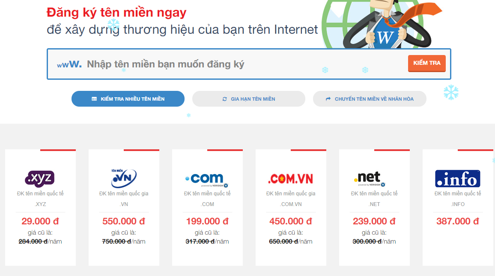
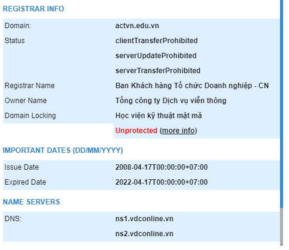
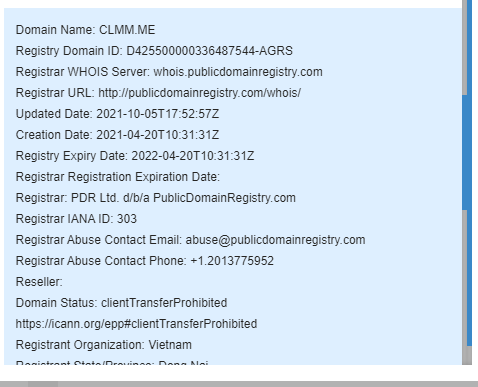
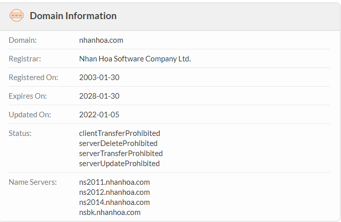
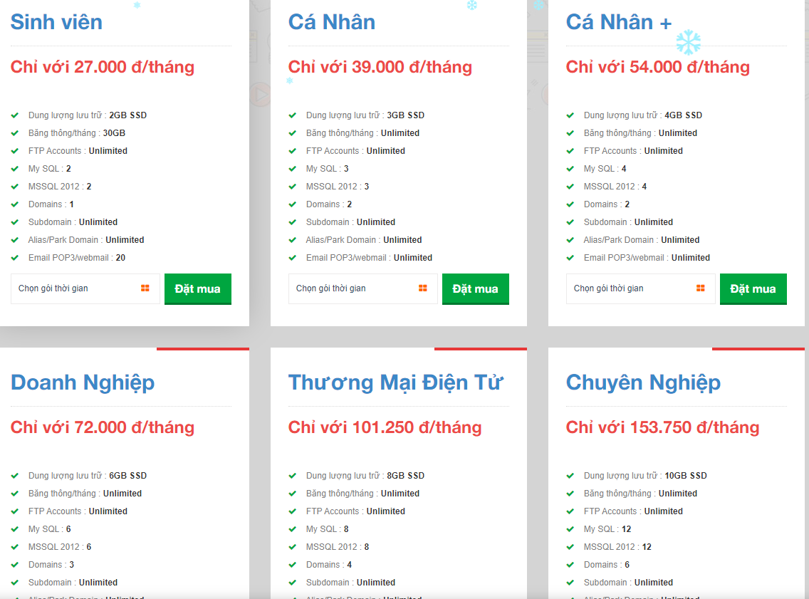
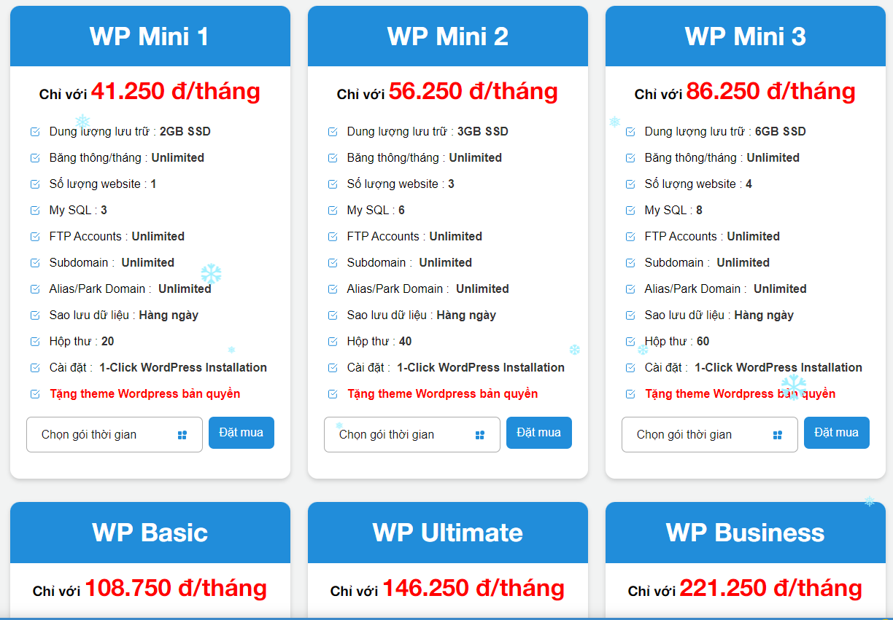
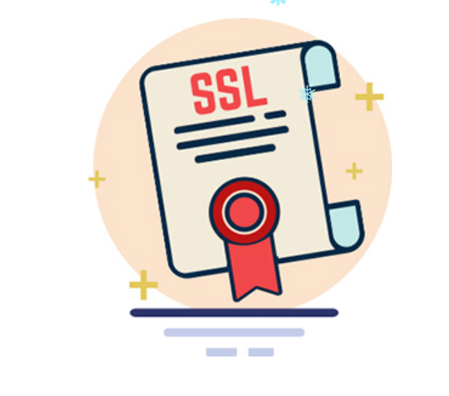

# 1. Giới thiệu về Nhân Hòa
## 1.1 Giới thiệu chung

- Được thành lập năm 2002 do nhu cầu tất yếu hội nhập của nền kinh tế, hiện tại Nhân Hòa đang cung cấp dịch vụ cho hơn 100.000 khách hàng trong và ngoài nước.
- Luôn nỗ lực sáng tạo không ngừng nhằm xây dựng công ty thành một tổ chức hùng mạnh, hiện đại và văn hóa với mong muốn mở rộng hợp tác với các đối tác trong và ngoài nước tạo nền tảng cho những bước tiến bền vững.
- Trải qua 20 năm thành lập và phát triển, Nhân hòa đã được tạo sự tin tưởng, tin cậy trong lòng khách hàng. Với hàng trăm đại lý trên toàn quốc, luôn nỗ lực đem đến sự hài lòng về sản phẩm dịch vụ và giải pháp công nghệ tốt nhất cho tất cả mọi người.
- Không chỉ gặt hái được những thành công trong hoạt động kinh doanh, với phương châm lấy chữ “Nhân” làm tôn chỉ, tập thể lãnh đạo, nhân viên Nhân Hòa đã xây dựng được một môi trường văn hóa doanh nghiệp lành mạnh. Ngôi nhà Nhân Hòa không chỉ là nơi các thành viên lao động, sáng tạo mà còn là nơi gắn kết, sẻ chia mọi tâm tư, nguyện vọng.

## 1.2 Lịch sử hình thành và phát triển
+ 2002: Thành lập công ty Nhân Hòa. Đại lí tên miền quốc tế chính thức của ResellerClub.
+ 2002-2004: Khách hàng lớn nhất của nhà cung cấp dịch vụ máy chủ The Planet tại Việt Nam.
+ 2005: Top 3 nhà cung cấp dịch vụ tên miền và web hosting tại Việt Nam.
+ 2007: Thành lập chi nhánh Hồ Chí Minh.
+ 2010: Nhận giải thưởng Thương Hiệu Uy Tín - Trusted Brand.
+ 2012: Năm thứ 3 nhận giải thưởng Thương Hiệu Uy Tín - Trusted Brand. Ra mắt sản phẩm Web4S.
+ 2013: Trở thành nhà đăng ký trên miền chính thức của ICANN và VNNIC.
+ 2014: Nhận giải thưởng Sao Khuê cho dịch vụ Web4S.
+ 2015-2016: Giải thưởng cho nhà đăng ký tăng trưởng tốt nhất của VNNIC 2 năm liên tiếp.
+ 2016: Ra mắt sản phẩm dịch vụ thoại trên nển tảng IP - CLOUDCALL.
+ 2018: Sản phẩm điện toán đám mây trên nền tảng nguồn mở OpenStack. Thành lập công ty 4S.
+ 2019: Hệ sinh thái điện toán đám mây phục vụ chuyển đổi số. Ra mắt thương hiệu VFONE. Partner Google Gsuite tại Việt Nam. Hóa đơn điện tử HOADON.BIZ
+ 2021: Thành lập chi nhánh Vinh - Nghệ An. Ra mắt Hợp đồng điện tử ESOC. Top 10 Doanh nghiệp cung cấp hạ tầng số, Bảo mật, an toàn thông tin VINASA.

## 1.3 Sứ mệnh, tầm nhìn, giá trị cốt lõi, chiến lược
- Tầm nhìn: Trở thành doanh nghiệp cung cấp dịch vụ, giải pháp tổng thể và nền tảng hàng đầu trong lĩnh vực Công nghệ thông tin.
- Sứ mệnh: Mang lại giá trị giúp doanh nghiệp phát triển bền vững, đi đầu về công nghệ nhằm thúc đầy nền Công nghệ thông tin phát triển.
- Giá trị cốt lõi:
    + Tận tâm: Lấy khách hàng & đối tác làm trung tâm cho mọi hành động.
    + Sáng tạo: Đổi mới, tạo ra những sản phẩm và giá trị mới.
    + Cam kết: Thực hiện lời nói đi đôi với hành động.
    + Văn hoá và trải nghiệm: Chuyên nghiệp hoá nhân sự, xây dựng nền tảng văn hoá công ty vững chắc.
- Chiến lược: Phát triển bền vững,  nền tảng văn hoá với con người làm cốt lõi, tiên phong về công nghệ và luôn đổi mới sáng tạo.
# 2. Các dịch vụ của Nhân Hòa
## 2.1 Tên miền
### 2.1.1 Đăng ký tên miền
- Cung cấp các loại tên miền với các mức giá khác nhau : .xyz, .vn, .com, .com.vn, .net, .info...

- Nguyên lí đăng ký tên miền: 
    + Tên miền không được vượt quá 63 ký tự, bao gồm cả phần .com, .net, .org ...
	+ Tên miền chỉ gồm các ký tự trong bảng chữ cái (a-z), các số (0-9) và dấu trừ (-).
	+ Các khoảng trắng và các ký tự đặc biệt trong tên miền khác đều không hợp lệ.
	+ Không thể bắt đầu bằng hoặc kết thúc tên miền bằng dấu trừ (-).
	+ Tên miền càng ngắn càng tốt, dễ nhớ, không gây nhầm lẫn, khó viết sai.
	+ Tên miền phải liên quan đến tên chủ thể và lĩnh vực hoạt động.
	+ Chủ động nộp phí duy trì trước khi tên miền hết thời hạn sử dụng, tự chịu trách nhiệm khi tên miền bị mất do hết hạn sử dụng mà không đóng phí.

### 2.1.2 Kiểm tra tên miền
- Giúp kiểm tra tên miền đã có hay chưa, đề xuất những tên miền chưa được sử dụng và mức giá tương ứng.
    Nếu tên miền đã được đăng ký, ta có thể xem những thông tin của tên miền đó như:
    
	+ Registrar Info
	+ Important Date
	+ Name Server			
	+ Raw Registry Data(có thể)
    
### 2.1.3 Chuyển tên miền về Nhân Hòa
- Là chức năng chuyển tên miền từ nhà quản lí khác về Nhân Hòa để dễ quản lí và hỗ trợ.
- Một số lưu ý khi chuyển tên miền như:
    + Tên miền còn thời gian duy trì trên 30 ngày.
    + Tên miền đăng ký được sau 60 ngày mới có thể chuyển qua nhà đăng ký khác.
    + Yêu cầu Nhà đăng ký cũ mở khóa tên miền và cung cấp mã xác thực tên miền (authencode).
    + Cung cấp thông tin authencode và bản khai chuyển đổi Nhà đăng ký có xác nhận của chủ thể cho Nhân Hòa. 
    + Gửi mẫu chuyển đổi nhà đăng ký đến Nhân Hòa làm thủ tục chuyển đổi. Lấy biên bản tiếp nhận hồ sơ. 
    + Chủ động theo dõi việc chuyển đổi đến khi việc chuyển đổi hoàn thành.
    + Được cung cấp Password & Controlpanel quản lý tên miền.
    + Hỗ trợ đầy đủ các chức năng thay đổi các record như 1 tên miền quốc tế hoàn toàn miễn phí thông qua CP https://zonedns.com
### 2.1.4 Giữ chỗ tên miền
- Dịch vụ giữ chỗ tên miền (Backorder domain) của Nhân Hòa là dịch vụ giúp khách hàng lựa chọn và đăng ký lại những tên miền sắp tự do.
- Khi một tên miền đã hết hạn và chủ thể không gia hạn nữa, tên miền sẽ bị tạm ngưng 35 ngày và chờ trả về trạng thái tự do là trạng thái cho phép đăng ký tên miền. Dịch vụ backorder domain của Nhân Hòa sẽ theo dõi và đăng ký ngay lập tức tên miền cho khách hàng khi tên miền chuyển sang trạng thái tự do.
- Dịch vụ chỉ áp dụng cho những tên miền Việt Nam.
### 2.1.5 Khóa tên miền
- Domain Locking hay Khóa tên miền là dịch vụ bảo vệ tên miền cấp cao nhất - tuyệt đối an toàn, tránh khỏi những nguy cơ và tác động không mong muốn như:
    + Lộ mật khẩu
    + Mất thông tin email
    + Bị hacker xâm nhập
    + Do sự bất cẩn vô tình hay cố ý của nhân viên.
- Tên miền được bảo vệ bằng dịch vụ Khóa tên miền khi kiểm tra công cụ Whois sẽ có thêm các trường thông tin trạng thái sau:
    + serverDeleteProhibited
    + serverUpdateProhibited
    + serverTransferProhibited
    + clientTransferProhibite
    
## 2.2 Hosting
### 2.2.1 Windows Hosting
- Có 6 tùy chọn đăng ký với các thông số khác nhau để phù hợp với nhiều đối tượng :
    + Sinh viên
    + Cá nhân
    + Cá nhân plus
    + Doanh nghiệp
    + Thương mại điện tử
    + Chuyên Nghiệp
    
- Đặc tính kĩ thuật:
    + Windows hosting Hỗ trợ nhiều ngôn ngữ lập trình với các phiên bản khác nhau.
    + Miễn phí tạo, quản lý hộp thư điện tử (Email) theo tên miền riêng.
    + Miễn phí tạo tên miền con (Subdomain).Sử dụng nhiều tên miền cho 1 website.
    + Quản lý nhiều website trên cùng 1 tài khoản hosting.
    + Quản lý đăng nhập, giám sát thông số băng thông và dung lượng.
    + Sao lưu dự phòng và khôi phục dữ liệu.
- Thông số kĩ thuật:
    + Hệ điều hành: Windows server 2012/2016
    + Ngôn ngữ hỗ trợ: .NET(v1.1,2.0,3.5,4.0,4.6) / PHP 5.x-7.x / ASP
    + Cơ sở dữ liệu: Microsoft Access / MSSQL Server 2012 / MySQL Server / Hỗ trợ ODBC/ OLEDB
    + Hệ thống email: WebMail / Email Forwarding / Email Alias/ Catch-all Account / Antivirus / Anti Spam
    + Tính năng truy cập: FTP Account / WebBase Control Panel / WebBase File Manager
    + Bảng điều khiển: Plesk Onyx (17) / Plesk Obsidian (18)
    + Tính năng khác: Hotlink Protection/ Protected Directories/ Webprotect/ Sub domain/ Parked Domain/ Add on Domain/ Bandwidth Status / Disk Usage Viewer/ Error Log/ Customer Error Pages / MIME Type Manager/ Redirect Manager/ Backup Manager/ Database Backup/ DataWeb Backup/ FrontPage Extensions
- Ngoài ra khách hàng có thể đăng ký thêm các dịch vụ bổ sung như :
    + Dùng thêm Bandwidth
    + Thêm 1 địa chỉ IP
    + Thêm lượt truy cập
### 2.2.2 Linux Hosting
- Có 6 tùy chọn đăng ký với các thông số khác nhau để phù hợp với nhiều đối tượng :
    + Sinh viên
    + Cá nhân
    + Cá nhân plus
    + Doanh nghiệp
    + Thương mại điện tử
    + Chuyên Nghiệp
- Đặc tính kĩ thuật:
    + Giống Wordpress Hosting, Hosting Linux hỗ trợ nhiều ngôn ngữ lập trình với các phiên bản khác nhau.
    + Miễn phí tạo, quản lý hộp thư điện tử (Email) theo tên miền riêng.
    + Miễn phí tạo tên miền con (Subdomain).
    + Sử dụng nhiều tên miền cho 1 website.
    + Quản lý nhiều website trên cùng 1 tài khoản hosting linux nhằm giảm chi phí thuê hosting.
    + Quản lý đăng nhập, giám sát thông số băng thông và dung lượng.
    + Sao lưu dự phòng và khôi phục dữ liệu.
- Thông số kĩ thuật:
    + Hệ điều hành: Cloudlinux 6/7/8
    + Ngôn ngữ hỗ trợ: Multi PHP (PHP 5.x/7.x) / Perl / Python
    + Cơ sở dữ liệu: MySQL Server / Postgre SQL
    + Hệ thống email doanh nghiệp: WebMail / Email Forwarding / Email Alias/ Catch-all Account / Antivirus / Anti Spam
    + Tính năng truy cập: FTP Account / WebBase Control Panel / WebBase File Manager
    + Bảng điều khiển: cPanel
    + Web Server: LiteSpeed
    + Bảo mật: Bảo mật nhiều lớp với công nghệ Cloudlinux và giải pháp bảo mật Imunify360 tiên tiến
    + Tính năng khác: Hotlink Protection/ Protected Directories/ Webprotect/ Sub domain/ Parked Domain/ Add on Domain/ Bandwidth Status / Disk Usage Viewer/ Error Log/ Customer Error Pages / MIME Type Manager/ Redirect Manager/ Backup Manager/ Database Backup/ DataWeb Backup/ FrontPage Extensions
- Ngoài ra khách hàng có thể đăng ký thêm các dịch vụ bổ sung như :
    + Dùng thêm Bandwidth
    + Thêm 1 địa chỉ IP
    + Thêm lượt truy cập
### 2.2.3 WordPress Hosting
- Là một dịch vụ mới của Nhân Hòa.
- Có 6 tùy chọn đăng kí với các thông số khác nhau để phù hợp với nhiều đối tượng:
    + WP Mini 1
    + WP Mini 2
    + WP Mini 3
    + WP Basic
    + WP Ultimate
    + WP Business
    
- Sự khác biệt trong Wordpress Hosting của Nhân Hòa:
    + TỐI ƯU HÓA CHO WORDPRESS
    + Hệ thống Wordpress Hosting của Nhân Hòa sử dụng 100% ổ cứng SSD Enterprise, kết hợp với LiteSpeed Webserver/ Memcached/ Redis giúp tối ưu hóa tốt nhất cho Wordpress.
    + TỶ LỆ UPTIME DỊCH VỤ TỚI 99,9%
    + Hệ thống vận hành trên nền tảng điện toán đám mây ưu việt, khắc phục triệt để các tồn tại của các giải pháp lưu trữ thông thường, đảm bảo thời gian online gần như tuyệt đối.
    + AN TOÀN DỮ LIỆU GẦN NHƯ TUYỆT ĐỐI
    + Dữ liệu của khách hàng được sao lưu liên tục hằng ngày trong 15 ngày gần nhất. Ngoài ra khách hàng có thể chủ động sao lưu dữ liệu bất kỳ lúc nào chỉ với 1 click chuột.
    + HỖ TRỢ TỪ CHUYÊN GIA
    + Đội ngũ chuyên gia hàng đầu về dịch vụ luôn túc trực 24/7/365 hỗ trợ khách hàng trong suốt quá trình sử dụng.
- Các tính năng nổi bật tích hợp trong dịch vụ
    + 100% ổ cứng SSD Enterprise
    + Backup 15 ngày liên tiếp
    + Quản trị với Cpanel tốt nhất
    + 1-Click WordPress Installation
    + Tối ưu tốc độ với Litespeed/ Memcached
    + Chống Local Attack với Cloudlinux
    + Bảo mật dữ liệu với SSL
    + Quét mã độc với Imunify360
    + Hỗ trợ Multi PHP
- Ngoài ra còn có hướng dẫn chi tiết bằng video để cài đặt, sử dụng các ứng dụng:
    + cPanel
    + Plesk
    + DirectAdmin
## 2.3 Dịch vụ SSL
### 2.3.1 Giới thiệu về SSL
- SSL là gì?
    + SSL là viết tắt của từ Secure Sockets Layer. Đây là một tiêu chuẩn an ninh công nghệ toàn cầu tạo ra một liên kết giữa máy chủ web và trình duyệt. Liên kết này đảm bảo tất cả dữ liệu trao đổi giữa máy chủ web và trình duyệt luôn được bảo mật và an toàn.
    + SSL đảm bảo rằng tất cả các dữ liệu được truyền giữa các máy chủ web và các trình duyệt được mang tính riêng tư, tách rời. SSL là một chuẩn công nghệ được sử dụng bởi hàng triệu trang web trong việc bảo vệ các giao dịch trực tuyến với khách hàng của họ.

- SSL làm việc như thế nào?
    + Công nghệ SSL bảo vệ những giao dịch trực tuyến và nâng cao mức độ tin cậy của website đối với khách hàng chỉ trong 3 bước cơ bản:
    + SSL mã hóa các thông tin nhạy cảm trong quá trình giao dịch trực tuyến.
    + Mỗi chứng chỉ SSL được tạo ra cho một Website duy nhất.
    + Một cơ quan uy tín đã xác thực danh tính của chủ nhân Website trước khi cấp chứng chỉ SSL
    + Những gì xảy ra khi một máy tính kết nối với một Website đã được chứng thực ?
    + Đầu tiên trình duyệt yêu cầu Website cung cấp thông tin xác nhận danh tính
    + Sau đó Website gửi cho trình duyệt chứng chỉ SSL của nó đã được cấp.
    + Trình duyệt kiểm tra chứng chỉ SSL có thực hay không. Nếu đúng, nó thông báo lại cho Website là SSL của nó đã được chấp nhận.
    + Website gửi ngược lại chữ kí số sẽ dùng để mã hóa và giải mã trong suốt quán trình giao dịch tiếp theo.
    + Cuối cùng là dữ liệu giữa trình duyệt và website đã được mã hóa.
- Trình duyệt làm thế nào để kiểm tra một SSL là có thực hay không ?
    + Khi Website gửi cho trình duyệt một chứng chỉ SSL, trình duyệt sẽ gửi chứng chỉ này đến một máy chủ lưu trữ các chứng chỉ số đã được phê duyệt.
    + Về mặt kỹ thuật, SSL sử dụng mã hóa công khai. Kỹ thuật này giúp cho Website và trình duyệt tự thỏa thuận (bước 4 ở hình trên) một bộ khóa sẽ dùng trong suốt quá trình trao đổi thông tin sau đó. Bộ khóa sẽ thay đổi theo mỗi trong lần giao dịch kế tiếp, một người khác sẽ không thể giải mã ngay cả khi có được dữ liệu của máy chủ lưu trữ chứng chỉ số nói trên.
- Tại sao nên sử dụng SSL?
    + Khi đăng ký domain để sử dụng các dịch vụ website, email v.v... -> luôn có những lỗ hổng bảo mật -> hacker tấn công -> SSL bảo vệ website và khách hàng của bạn.
    + Bảo mật dữ liệu: dữ liệu được mã hóa và chỉ người nhận đích thực mới có thể giải mã.
    + Toàn vẹn dữ liệu: dữ liệu không bị thay đổi bởi tin tặc.
    + Chống chối bỏ: đối tượng thực hiện gửi dữ liệu không thể phủ nhận dữ liệu của mình.
- Lợi ích khi sử dụng SSL?
    + Khi đăng ký domain để sử dụng các dịch vụ website, email v.v… -> luôn có những lỗ hổng bảo mật -> hacker tấn công -> SSL bảo vệ website và khách hàng của bạn.
    + Bảo mật và mã hóa các thông điệp trao đổi giữa trình duyệt và server.
    + Bảo mật các giao dịch giữa khách hàng và doanh nghiệp, các dịch vụ truy nhập hệ thống.
    + Bảo mật webmail và các ứng dụng như Outlook Web Acess, Exchange, và Office Communication Server.
    + Bảo mật các ứng dụng ảo hóa như Citrix Delivery Platform hoặc các ứng dụng điện toán mây.
    + Bảo mật dịch vụ FTP.
    + Bảo mật truy cập Control panel.
    + Bảo mật các dịch vụ truyền dữ liệu trong mạng nội bộ, file sharing, extranet.
    + Bảo mật VPN Access Servers, Citrix Access Gateway.
    + Nâng cao hình ảnh, thương hiệu và uy tín doanh nghiệp
    + Nâng cao thứ hạng website trên kết quả tìm kiếm Google (SEO)
    + Tạo lợi thế cạnh tranh, tăng niềm tin của khách hàng đối với website, tăng số lượng giao dịch, giá trị giao dịch trực tuyến của khách hàng. Website không được xác thực và bảo mật sẽ luôn ẩn chứa nguy cơ bị xâm nhập dữ liệu, dẫn đến hậu quả khách hàng không tin tưởng sử dụng dịch vụ.
- DV-SSL
    + Domain Validation (DV): chứng thư số SSL chứng thực cho Domain Name - Website . Khi 1 Website sử dụng DV SSL thì sẽ được xác thực tên domain , website đã được mã hoá an toàn khi trao đổi dữ liệu
- OV-SSL
    + Organization Validation (OV): chứng thư số SSL chứng thực cho Website và xác thực doanh nghiệp đang sở hữu website đó
- EV-SSL
    + Extended Validation (EV): cho khách hàng của bạn thấy Website đang sử dụng chứng thư SSL có độ bảo mật cao nhất và được rà soát pháp lý kỹ càng.
Với thanh đại chỉ sang màu xanh với hiển thị đầy đủ thông tin của công ty, cung cấp một cấp độ cao hơn tin tưởng vào website.
- Wildcard SSL
    + Wildcard SSL Certificate : sản phẩm lý tưởng dành cho các cổng thương mại điện tử. Các website dạng này thường có thể tạo ra các trang e-store dành cho các chủ cửa hàng trực tuyến, mỗi e-store là một sub domains và được chia sẻ trên một địa chỉ IP duy nhất. Khi đó, để triển khai giải pháp bảo bảo mật giao dịch trực tuyến (khi đặt hàng, thanh toán, đăng ký & đăng nhập tài khoản,...) bằng SSL, chúng ta có thể dùng duy nhất một chứng chỉ số Wildcard cho tên miền chính của website và dùng chung một địa chỉ IP duy nhất để chia sẻ cho tất cả mọi sub domains.
### 2.3.2 Dịch vụ SSL của Nhân Hòa
- Comodo SSL:
    Cung cấp 7 gói đăng ký với thông số và mức giá khác nhau để phù hợp với nhiều đối tượng người dùng:
    + Positive SSL
    + Positive SSL Multi-domain
    + Positive SSL Wildcard
    + Commodo Multi-domain SSL
    + Comodo EV SSL
    + Premium SSL Wildcard
    + Comodo EV Multi Domain SSL
- Geotrust SSL
    Cung cấp 9 gói đăng ký với thông số và mức giá khác nhau để phù hợp với nhiều đối tượng người dùng:
    + Rapid SSL
    + Quick SSL Premium
    + Rapid SSL Wildcard
    + True BusinessID
    + True BusinessUD with EV
    + True BusinessID Multi-Domain
    + QuickSSL Premium Wildcard
    + True BusinessID Multi-Domain EV
    + True BusinessID Willcard
- Digicert SSL
    Cung cấp 7 gói đăng ký với thông số và mức giá khác nhau để phù hợp với nhiều đối tượng người dùng:
    + Secure Site
    + Secure Site with EV
    + Secure Site Pro
    + Secure Site Multi-Domain SSL
    + Secure Site Pro EV
    + Secure Site Wildcard
    + Secure Site EV Multi-Domain SSL
## 2.4 Email
### 2.4.1 Umail

- Đặc điểm
    + Email theo tên miền doanh nghiệp
    + Đăng kí và thiết lập cực kì đơn giản
    + An toàn và bảo mật
    + Tương thích với mọi thiết bị
    + Giao diện thân thiện

- Tính năng

    Nâng tầm thương hiệu

    + Khẳng định thương hiệu
        Từ nay email của bạn sẽ chuyên nghiệp hơn với dạng tên miền riêng abc@tencongty.com (vd info@umail.vn) chứ không còn đơn điệu như trước đây.
    + Bảo mật an toàn
        Email người dùng được mã hóa trong suốt quá trình truyền tải. Ngoài ra UMail thay đổi cổng kết nối POP3/ IMAP bằng SSL/ TLS giúp nâng cao tính năng bảo mật.
    + Di chuyển email dễ dàng
        UMail với tùy chọn di chuyển qua máy chủ IMAP/ POP giúp bạn có thể chuyển đổi dễ dàng tất cả email cũ sang UMail để có những trải nghiệm đỉnh cao.
    + Hỗ trợ kỹ thuật 24/7
        Đội ngũ kỹ thuật UMail giàu kinh nghiệm, chuyên nghiệp luôn sẵn sàng hỗ trợ 24/7, mang đến bạn sự tin tưởng, yên tâm khi sử dụng .
    Quản trị mạnh mẽ:
    + Chứng thực email
        Chứng thực SPF/ DKIM giúp tăng độ tin cây địa chỉ email gửi đi là đúng chủ thể, không bị giả mạo, hạn chế tối đa mail bị đánh dấu spam.
    + Quản lý chuyên nghiệp
        Trang quản trị tiện lợi giúp quản trị viên dễ dàng thêm/ xóa/ quản lý nhóm, người dùng và linh hoạt tùy chỉnh dung lượng email trên từng tài khoản.
    + Không lo bỏ sót
        Cấu hình Catch-all giúp nhận được tất cả email gửi đến bất kể người gửi nhập sai tên email, không còn phải lo bỏ sót bất kỳ thông tin quan trọng nào.
    + Hoạt động xuyên suốt
        Luôn có các máy chủ định tuyến và dự phòng SMTP trong trường hợp email không gởi được nhằm đảm bảo hoạt động ổn định của khách hàng.
    Nhiều tính năng hữu ích khác như:
    + Bộ lọc thư rác
        Với bộ lọc thư rác/ spam thông minh, UMail giúp bạn không phải mất thời gian để đọc và xóa những email không mong muốn, tập trung hơn vào công việc chính.
    + Chuyển hướng tự động
        Dễ dàng tạo quy tắc để tự động chuyển hướng email người gửi vào đúng thư mục chỉ định, giúp hộp thư của bạn chuyên nghiệp và gọn gàng hơn.
    + Tìm kiếm tất cả
        Không phải khó khăn tìm từng email, tìm kiếm nhanh chóng theo tất cả những gì bạn muốn từ nội dung, chủ đề, tên, địa chỉ mail,….
    + Ứng dụng chuyên nghiệp
        Giờ đây việc check mail đã dễ dàng hơn bao giờ hết, thực hiện mọi lúc mọi nơi với ứng dụng UMail trên 2 nền tảng iOS và Android.
- Nhân Hòa còn cung cấp 4 gói đăng ký Umail với các thông số và mức giá khác nhau đề phù hợp với nhiều đối tượng.
    + Cá Nhân
  	    Dung lượng 2GB/user 
    + Cơ bản
        Dung lượng 5GB/user
    + Doanh nghiệp
  	    Dung lượng 10GB/user
    + Chuyên Nghiệp
  	    Dung lượng 20 GB/user
### 2.4.2 GG WorkSpace
- Giới thiệu
    + Google Workspace là bộ công cụ làm việc trực tuyến bao gồm Gmail, Meet, Chat, Lịch, Drive, Tài liệu, Trang tính, Trang trình bày,… được thay đổi tên thương hiệu từ G Suite.
    + Sự ra đời của Google Workspace nhằm mang lại một diện mạo mới cho dòng sản phẩm chủ đạo hướng tới khách hàng doanh nghiệp. Về cơ bản sản phẩm vẫn kế thừa toàn bộ các tính năng của bộ công cụ G Suite, tên gọi được thay đổi và cải tiến một số yếu tố nhằm phù hợp hơn với nhu cầu khách hàng.
    + Google Workspace đã và đang trở thành lựa chọn của hơn 6 triệu người dùng doanh nghiệp trên thế giới, đặc biệt phải kể đến là các tổ chức giáo dục, các start up hay các doanh nghiệp vừa và nhỏ. Những lợi thế về việc tiết giảm chi phí lưu trữ tài liệu, rút ngắn thời gian triển khai cũng như mức độ bảo mật dựa trên nền tảng Google Cloud Platform đáng tin cậy là những điểm nhấn thu hút sự chú ý của các nhà lãnh đạo và quản trị CNTT.
- Cung cấp 4 gói với 4 mức giá cùng thông số khác nhau đề phù hợp với nhiều loại khách hàng.
    + Business Starter
    + Business Standard
    + Business Plus
    + Enterprise
### 2.4.3 Microsoft
- Ưu điểm
KHÔNG CẦN ĐẦU TƯ HẠ TẦNGEmail 365 được cung cấp như 1 dịch vụ thuê bao hàng tháng trên nền điện toán đám mây. Khách hàng không cần trả trước cho việc đầu tư mua mới/nâng cấp phần cứng, tiết kiệm chi phí điện năng, chi phí vận hành.LUÔN CẬP NHẬT BẢN MỚI NHẤTEmail 365 luôn luôn được cập nhật phiên bản mới nhất, không cần đến những bản vá lỗi hay nâng cấp phần mềm Microsoft sẽ liên tục bổ sung các chức năng mới mà khách hàng không phải trả thêm bất kỳ khoản chi phí nào.TRUY CẬP MỌI LÚC MỌI NƠICho phép người dùng dù ở bất cứ nơi đâu, bất cứ lúc nào, dù trực tuyến hay ngoại tuyến bạn đều có thể làm việc với phiên bản mới nhất của tài liệu và được thực hiện trên hầu hết mọi thiết bị: Máy tính, máy tính bảng, điện thoại di động.ĐƠN GIẢN HÓAGiảm các công việc liên quan đến vận hành và quản trị Cở sở hạ tầng IT, dữ liệu của Doanh nghiệp được đảm bảo sao lưu liên tục và có khả năng phục hồi sau sự cố một cách nhanh chóng, khả năng mở rộng không giới hạn.
Cung cấp 4 gói với 4 mức giá cùng thông số khác nhau đề phù hợp với nhiều loại khách hàng.

. Office 365 F3

. Microsoft 365 Business Office

. Microsoft 365 Apps for Business

. Microsoft 365 Business Standard
### 2.4.4 Email Server riêng
- Giới thiệu
Email Server của Nhân Hòa là giải pháp email chuyên nghiệp dành cho các tổ chức, doanh nghiệp có nhu cầu giao dịch email thường xuyên đòi hỏi cao về tính ổn định, tin cậy của hệ thống. Dịch vụ email theo tên miền riêng là sự kết hợp giữa nền tảng máy chủ Cloud, giải pháp phần mềm quản lý Mail Server và giải pháp SMTP ưu việt nhằm mang lại hiệu quả cao nhất cho người dùng. Với nền tảng máy chủ Cloud sử dụng công nghệ ảo hóa KVM đảm bảo hệ thống luôn hoạt động ổn định 24/24, thời gian uptime lên tới 99%. Dữ liệu của khách hàng luôn được đảm bảo an toàn ở mức độ cao, tốc độ xử lý được tối ưu hơn nhiều so với máy chủ thông thường. Người dùng được lựa chọn 1 trong các phần mềm quản lý mail server chuyên nghiệp là Kerio và Zimbra. Đây là những phần mềm quản lý mail server tốt nhất hiện nay với khả năng tùy biến cao khi cài đặt, giao diện người dùng thân thiện, người dùng có thể dễ dàng cài đặt dịch vụ theo các yêu cầu riêng của từng doanh nghiệp. Điểm khác biệt lớn nhất của dịch vụ email Nhân Hòa so với các dịch vụ email thông thường nằm ở giải pháp SMTP mới với công nghệ ưu việt mà chúng tôi đang sử dụng. Giải pháp SMTP này là yếu tố rất quan trọng để tăng mức độ uy tín của các email gửi đi đối với các hệ thống chống SPAM. Hệ thống có SMTP dự phòng trong mọi trường hợp để đảm bảo việc gửi nhận email của khách hàng luôn được thông suốt...Đồng thời hệ thống mail server của khách hàng còn được hỗ trợ cài đặt đầy đủ các bản ghi DKIM, PTR, SPF (chứng thực người dùng) nhằm tăng độ uy tín của hệ thống. Bên cạnh đó chúng tôi cũng trợ giúp khách hàng cài đặt dịch vụ theo đặc thù riêng của từng doanh nghiệp. Ngoài hướng dẫn sử dụng, chúng tôi có khuyến cáo chi tiết cho người dùng, giúp người dùng tránh hoặc hạn chế được các hành động có thể gây ảnh hưởng không tốt cho hệ thống trong quá trình sử dụng. Đây chính là những yếu tố quan trọng trong giải pháp Email Server của Nhân Hòa nhằm giảm tối đa chỉ số đánh giá SPAM của các hệ thống chống SPAM và đảm bảo tỷ lệ gửi email vào inbox của khách hàng lên tới 99% - điều mà các hệ thống email thông thường khó có thể đáp ứng được.

Với những tính năng vượt trội, dịch vụ Email Server của Nhân Hòa là giải pháp email phù hợp cho các doanh nghiệp, giúp hoạt động giao dịch email của Quý khách trở nên hiệu quả và chuyên nghiệp hơn. Mọi vấn đề của Quý khách được hỗ trợ nhanh chóng 24/7 trong suốt quá trình sử dụng. Với 16 năm kinh nghiệm cung cấp dịch vụ, chúng tôi tin rằng Quý khách sẽ hài lòng với dịch vụ. Chúng tôi có chính sách hoàn lại tiền nếu Quý vị không hài lòng như một lời cam kết về chất lượng dịch vụ mà Nhân Hòa cung cấp.
Cung cấp 4 gói với 4 mức giá cùng thông số khác nhau đề phù hợp với nhiều loại khách hàng.

. Mini 
. Starter 
. Advanced 
. Extremmer
## 2.5 Máy chủ
## 2.6 Thiết kế Web
## 2.7 Tổng đài VFone
## 2.8 Hóa đơn điện tử
## 2.9 Hợp đồng điện tử
## 2.10 Phần mềm

