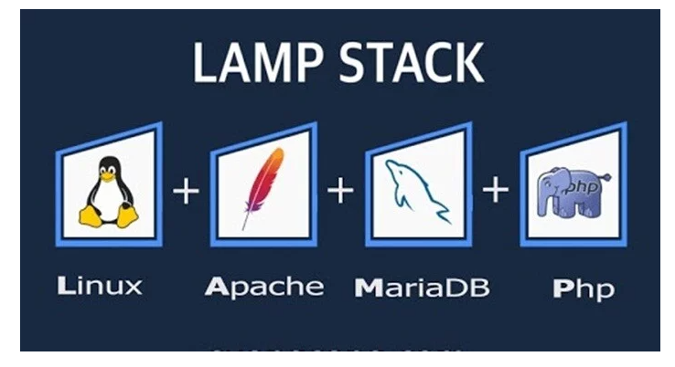

## LAMP là gì?
- LAMP là tên gọi chung cho quá trình tạo nên một môi trường máy chủ Web có khả năng chứa và phân phối các trang Web động thông qua việc kết hợp 4 thành phần bao gồm: Linux, Apache, MySQL và ngôn ngữ lập trình có thể là: PHP hay Perl hoặc Python.
- Đó chính là sự kết hợp của 4 chữ cái đầu tiên trong gói đấy, chúng thường sẽ có tên là LAMP hoặc LAMP Stack.
- Mỗi trong số đó là các gói phần mềm riêng lẻ được kết hợp để tạo thành một giải pháp máy chủ linh hoạt. Bốn phần mềm nói trên tạo thành một gói phần mềm LAMP.
    
    
    
- Trong một số trường hợp, MySQL có thể thay thế bằng PostgreSQL hoặc MariaDB (một nhánh miễn phí của MySQL) để lập thành gói phần mềm LAMP với các khả năng kỹ thuật tương tự.
## Cấu trúc LAMP
### Linux
- Linux là lớp đầu tiên trong stack. Hệ điều hành này là cơ sở nền tảng cho các lớp phần mềm khác.
- Linux là tên gọi của một hệ điều hành máy tính và cũng là tên hạt nhân của hệ điều hành. Đây là một phần mềm tự do phát triển (mã nguồn mở), có thể sử dụng với đa dạng mục đích và thường được dùng để quản lý, điều phối các tài nguyên (resource) của hệ thống (bao gồm cả phần cứng hardware và các phần mềm software khác).

- Linux còn được gọi là Open Source Unix (OSU).
### Apache
- Lớp thứ hai bao gồm phần mềm web server, thường là Apache Web (HTTP) Server. Lớp này nằm trên lớp Linux. Web server chịu trách nhiệm chuyển đổi các web browser sang các website chính xác của chúng.

- Đây là phần mềm máy chủ web phổ biến nhất trên mạng với độ an toàn, nhanh chóng, và đáng tin cậy. Có thể tùy chỉnh để Apache hỗ trợ các ngôn nhữ web khác nhau như PHP, CGI / Perl, SSL, SSI, ePerl, và thậm chí ASP.

### MySQL
- Lớp thứ ba là nơi cơ sở dữ liệu database được lưu trữ.

- MySQL lưu trữ các chi tiết có thể được truy vấn bằng script để xây dựng một website.

- Với tốc độ ổn định; độ bảo mật thông tin cao, dễ sử dụng và có tính khả chuyển, MySQL trở thành hệ quản trị cơ sở dữ liệu nguồn mở phổ biến nhất trên thế giới.

- MySQL có thể được cài đặt trên nhiều nền tảng hệ điều hành khác nhau như Windows, Linux và Mac OS X.

### PHP/Python/Perl
1. PHP
- PHP là lớp trên cùng của stack. Lớp script bao gồm PHP và / hoặc các ngôn ngữ lập trình web tương tự khác. Các website và ứng dụng web chạy trong lớp này.

- PHP được phát triển như là một ngôn ngữ kịch bản trên máy chủ (server-side scripting language). Nó được phát triển bởi Rasmus Lerdorf, và những người khác.
2. Python
- Python là một ngôn ngữ lập trình bậc cao và là một trong những ngôn ngữ đa năng nhất cho đến thời điểm hiện tại. Lần đầu ra mắt vào 1990 bởi Guido van Rossum, cho đến ngày hôm nay, Python vẫn là một ngôn ngữ thông dụng vì có cấu trúc rõ ràng, dễ học và giúp những người mới tiếp cận lập trình tiếp cận và tiếp thu.
3. Perl
- Perl được phát triển và xây dựng bởi Larry Wall từ năm 1987, mục đích chính của ông là tạo ra một ngôn ngữ lập trình có khả năng quản lý một lượng lớn dữ liệu và thực hiện các xử lý như lọc kết quả tìm kiếm. Có thể bạn sẽ không nghe nhiều về ngôn ngữ này do Perl tập trung vào việc quản trị hệ thống và xử lý các trang web, Perl không nổi tiếng như PHP hay Python.
