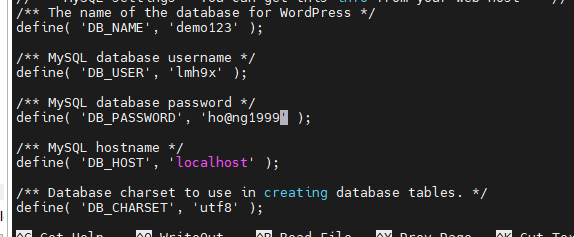

## LEMP là gì?
- LEMP server là một server chạy Linux, Nginx (đọc là Engine x), MySql và PHP (hoặc Perl/Python). Nó tương tự như LAMP server ngoại trừ việc web server nền tảng được giám sát bằng Nginx thay vì Apache.
- Đọc lại về LAMP tại :https://github.com/minhhoang699x/thuctap_lmh/blob/main/LAMP/lamp.md

## Cách triển khai LEMP trên Centos7
### Cài Nginx và tạo Vhost 
1. Update 
- yum update
2. Cài Nginx
- yum install nginx -y
3. Tạo thư mục chứa vhost
- cd /var/www/html/
- mkdir lmhlmh9x.xyz
4. Tạo file index.html
- nano /var/www/html/lmhlmh9x.xyz/index.html
5. Tạo 2 folder chứa config của vhost.
- cd /etc/nginx/
- mkdir sites-available
- mkdir sites-enabled
6. Cấu hình nginx.conf để nhận các config trong sites-enabled.
- nano /etc/nginx/nginx.conf
- Thêm dòng 'include /etc/nginx/sites-enabled/*.conf; ' vào cuối:

7. Tạo file config cho vhost và cấu hình:
- cd /etc/nginx/sites-available
- nano lmhlmh9x.xyz.conf
- Điền nội dung theo :

    

>       server {
>
>           listen 80;
>
>           listen [::]:80;
>
>           server_name lmhlmh9x.xyz;
>
>           root /var/www/html/lmhlmh9x.xyz;
>
>           index index.html;
>
>           location / {
>
>                   try_files $uri $uri/ =404;
>
>           }
>
>           }
8. Copy file conf vừa vấu hình vào sites-enabled
- cp /etc/nginx/sites-available/lmhlmh9x.xyz.conf  /etc/nginx/sites-enabled/
9. Reload nginx
- systemctl reload nginx
10. Kết quả: 

    

### Cài PHP.
- Thêm Remi repo
    + rpm -Uvh http://rpms.remirepo.net/enterprise/remi-release-7.rpm
- Cài yum-untils để lấy tiện ích yum-config-manager:

    + yum -y install yum-utils
- Cập nhật:
    + yum update
- Cài đặt PHP 7.0
    + yum-config-manager --enable remi-php70
    + yum -y install php php-opcache
- Cấu hình lại file conf của vhost với nội dung:
>  
server {
    listen       80 default_server;
    server_name lmhlmh9x.xyz www.lmhlmh9x.xyz;

    location / {
        root   /var/www/html/lmhlmh9x.xyz;
        index index.php index.html index.htm;
        try_files $uri $uri/ /index.php?q=$uri&$args;
    }

    error_page  404              /404.html;
    location = /404.html {
        root   /usr/share/nginx/html;
    }

    error_page   500 502 503 504  /50x.html;
    location = /50x.html {
        root   /usr/share/nginx/html;
    }

    # pass the PHP scripts to FastCGI server listening on 127.0.0.1:9000
    #
    location ~ \.php$ {
        root           /var/www/html/lmhlmh9x.xyz;
        fastcgi_pass   127.0.0.1:9000;
        fastcgi_index  index.php;
        fastcgi_param  SCRIPT_FILENAME   $document_root$fastcgi_script_name;
        include        fastcgi_params;
    }
}
>
- NOTE: MẤY CÁI CẤU HÌNH NÊN COPY. CHÚ Ý KHÔNG THIẾU NHỮNG KÍ TỰ ĐẶC BIỆT ($uri, /). 
- Xóa file index.html và đổi thành index.php
- Kết quả:

    

### Cài MariaDB
- MySQL được thay thế bằng MariaDB trong CentOS 7. Phải bổ sung kho yêu cầu: 

    + rpm --import /etc/pki/rpm-gpg/RPM-GPG-KEY*
    + yum -y install epel-release

- Cài đặt gói máy chủ MariaDB
    + yum -y install mariadb-server mariadb
- Khởi động MariaDB:
    + systemctl enable mariadb.service
    + systemctl start mariadb.service
- Chạy mysql_secure_installation để bảo vệ:
    + mysql_secure_installation

### Cài đặt hỗ trợ MySQL trong PHP
- yum search php
- yum -y install php-mysql
- yum -y install php-gd php-ldap php-odbc php-pear php-xml php-xmlrpc php-mbstring php-soap curl curl-devel
- Lệnh trên cài đặt những module phổ biến
- KHởi động lại nginx.
### Cài đặt wordpress
1. Vào nơi lưu trữ vhost:
- cd /var/www/html/lmhlmh9x.xyz/
2. Tải về WP mới nhất
- wget https://wordpress.org/latest.tar.gz

3. Giải nén
- tar xzvf latest.tar.gz
4. Thiết lập quyền tránh vấn đề phát sinh sau này
- chown -R nginx/nginx /var/www/html/lmhlmh9x.xyz/
5. Chuyển tập tin trong thư mục ra ngoài:

- mv wordpress/* /var/www/html/lmhlmh9x.xyz/
### Tạo cơ sở dữ liệu
1. Đăng nhập vào MariaDB:

    + mysql -u root -p
2. Tạo cơ sở dữ liệu và người dùng mới có quyền sử dụng nó:

    + CREATE DATABASE demo;
    + GRANT ALL PRIVILEGES on demo.* to 'lmh9x'@'localhost' identified by 'ho@ng1999';
- PHẢI CÓ @'localhost'

    + FLUSH PRIVILEGES;

    
3. Thoát khỏi MariaDB

### Cấu hình WP kết nối với DB
1. Đổi tên chỉnh sửa tệp cấu hình Wordpress.
- cd /var/www/html/lmhlmh9x.xyz/
- mv wp-config-sample.php wp-config.php
2. Chỉnh sửa cấu hình
- nano wp-config.php
- thay đổi giá trị DB_NAME, DB_USER, DB_PASSWORD

    
- systemclt reload nginx
3. Thế là xong
- Chọn ngôn ngữ, cấu hình thông tin rồi đăng nhập vào.
- Vào trang quản trị thêm /wp-amin ở sau url.

