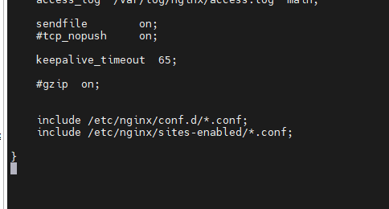

## LEMP là gì?
- LEMP server là một server chạy Linux, Nginx (đọc là Engine x), MySql và PHP (hoặc Perl/Python). Nó tương tự như LAMP server ngoại trừ việc web server nền tảng được giám sát bằng Nginx thay vì Apache.
- Đọc lại về LAMP tại :https://github.com/minhhoang699x/thuctap_lmh/blob/main/LAMP/lamp.md

## Cách triển khai LEMP trên Centos7
### Cài Nginx và tạo Vhost 
1. Update 
- yum update
2. Cài Nginx
- yum install nginx -y
3. Tạo thư mục chứa vhost
- cd /var/www/html/
- mkdir lmhlmh9x.xyz
4. Tạo file index.html
- nano /var/www/html/lmhlmh9x.xyz/index.html
5. Tạo 2 folder chứa config của vhost.
- cd /etc/nginx/
- mkdir sites-available
- mkdir sites-enabled
6. Cấu hình nginx.conf để nhận các config trong sites-enabled.
- nano /etc/nginx/nginx.conf
- Thêm dòng 'include /etc/nginx/sites-enabled/*.conf; ' vào cuối:

7. Tạo file config cho vhost và cấu hình:
- cd /etc/nginx/sites-available
- nano lmhlmh9x.xyz
- Điền nội dung theo :

    
>
> server {
>
>       listen 80;
>
>       listen [::]:80;
>
>       server_name lmhlmh9x.xyz;
>
>       root /var/www/html/lmhlmh9x.xyz;
>
>       index index.html;
>
>       location / {
>
>               try_files $uri $uri/ =404;
>
>       }
>
>}
>

### Cài MariaDB
### Cài 
