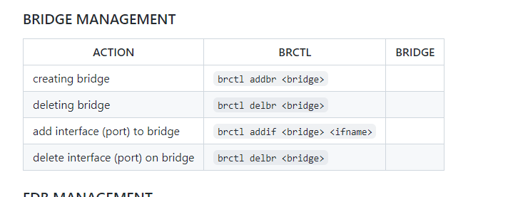
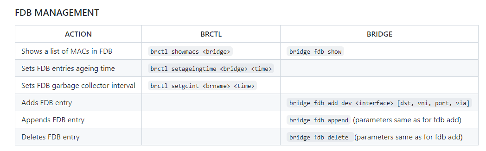
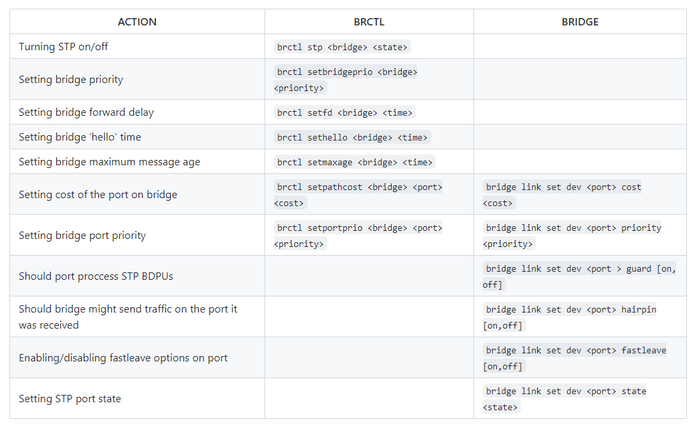
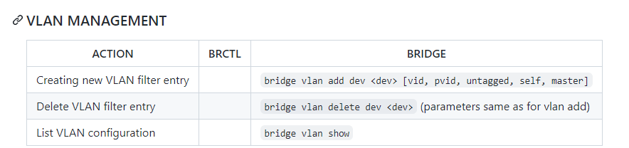
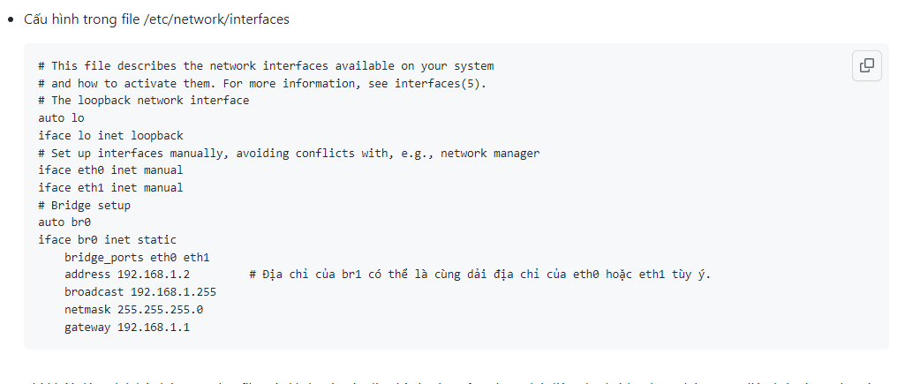

# Tìm hiểu về Linux Bridge

## Giới thệu
- Linux bridge là một soft switch – 1 trong 3 công nghệ cung cấp switch ảo trong hệ thống Linux (bên cạnh macvlan và OpenvSwitch), giải quyết vấn đề ảo hóa network bên trong các máy vật lý.

- Bản chất, linux bridge sẽ tạo ra các switch layer 2 kết nối các máy ảo (VM) để các VM đó giao tiếp được với nhau và có thể kết nối được ra mạng ngoài. Linux bridge thường sử dụng kết hợp với hệ thống ảo hóa KVM-QEMU.

- Linux Bridge thật ra chính là một switch ảo và được sử dụng với ảo hóa KVM/QEMU. Nó là 1 module trong nhân kernel. Sử dụng câu lệnh brctl để quản lý .

## Cấu trúc hệ thống sử dụng Linux bridge

Khái niệm về physical port và virtual port:

- Virtual Computing Device: Thường được biết đến như là máy ảo VM chạy trong host server

- Virtual NIC (vNIC): máy ảo VM có virtual network adapters(vNIC) mà đóng vai trò là NIC cho máy ảo.

- Physical swtich port: Là port sử dụng cho Ethernet switch, cổng vật lý xác định bởi các port RJ45. Một port RJ45 kết nối tới port trên NIC của máy host.

- Virtual swtich port: là port ảo tồn tại trên virtual switch. Cả virtual NIC (vNIC) và virtual port đều là phần mềm, nó liên kết với virtual cable kết nối vNIC

### Cấu trúc và các thành phần
1. Cấu trúc Linux Bridge:

Một số khái niệm liên quan tới linux bridge:

- Port: tương đương với port của switch thật

- Bridge: tương đương với switch layer 2

- Tap: hay tap interface có thể hiểu là giao diện mạng để các VM kết nối với bridge cho linux bridge tạo ra (nó nằm trong nhân kernel, hoạt động ở lớp 2 của mô hình OSI)

- fd: forward data - chuyển tiếp dữ liệu từ máy ảo tới bridge.

2. Các tính năng
- STP: Spanning Tree Protocol - giao thức chống loop gói tin trong mạng.

- VLAN: chia switch (do linux bridge tạo ra) thành các mạng LAN ảo, cô lập traffic giữa các VM trên các VLAN khác nhau của cùng một switch.

- FDB: chuyển tiếp các gói tin theo database để nâng cao hiệu năng switch.

3. Các thao tác quản lý Linux Bridge
- Cài đặt công cụ phần mềm quản lý Linux Bridge
Linux bridge được hỗ trợ từ version nhân kernel từ 2.4 trở lên. Để sử dụng và quản lý các tính năng của linux birdge, cần cài đặt gói bridge-utilities (dùng các câu lệnh brctl để sử dụng linux bridge). Cài đặt dùng lệnh như sau:

sudo apt-get install bridge-ultils -y

- Một số câu lệnh quản lý:

4. Ghi chép về một số khái niệm liên quan

- Port
    + Trong networking, khái niệm port đại diện cho điểm vào ra của dữ liệu trên máy tính hoặc các thiết bị mạng. Port có thể là khái niệm phần mềm hoặc phần cứng. Software port là khái niệm tồn tại trong hệ điều hành. Chúng thường là các điểm vào ra cho các lưu lượng của ứng dụng. Tức là khái niệm port mức logic. Ví dụ: port 80 trên server liên kết với Web server và truyền các lưu lượng HTTP.

- Hardware port (port khái niệm phần cứng): là các điểm kết nối lưu lượng ở mức khái niệm vật lý trên các thiết bị mạng như switch, router, máy tính, … ví dụ: router với cổng kết nối RJ45 (L2/Ethernet) kết nối tới máy tính của bạn.

- Physical switch port: Thông thường chúng ta hay sử dụng các switch L2/ethernet với các cổng RJ45. Một đầu connector RJ45 kết nối port trên switch tới các port trên NIC của máy tính.

- Virtual switch port: giống như các physical switch port mà tổn tại như một phần mềm trên switch ảo. cả virtual NIC và virtual port đều duy trì bởi phần mềm, được kết nối với nhau thông qua virtual cable.

- Uplink port
    + Uplink port là khái niệm chỉ điểm vào ra của lưu lượng trong một switch ra các mạng bên ngoài. Nó sẽ là nơi tập trung tất cả các lưu lượng trên switch nếu muốn ra mạng ngoài.

    + Khái niệm virtual uplink switch port được hiểu có chức năng tương đương, là điểm để các lưu lượng trên các máy guest ảo đi ra ngoài máy host thật, hoặc ra mạng ngoài. Khi thêm một interface trên máy thật vào bridge (tạo mạng bridging với interface máy thật và đi ra ngoài), thì interface trên máy thật chính là virtual uplink port.

    + Tap interface
    Ethernet port trên máy ảo VM (mô phỏng pNIC) thường gọi là vNIC (Virtual NIC). Virtual port được mô phỏng với sự hỗ trợ của KVM/QEMU.

    + Port trên máy ảo VM chỉ có thể xử lý các frame Ethernet. Trong môi trường thực tế (không ảo hóa) interface NIC vật lý sẽ nhận và xử lý các khung Ethernet. Nó sẽ bóc lớp header và chuyển tiếp payload (thường là gói tin IP) tới lên cho hệ điều hành. Tuy nhiên, với môi trường ảo hóa, nó sẽ không làm việc vì các virtual NIC sẽ mong đợi các khung Ethernet.

    + Tap interface là một khái niệm về phần mềm được sử dụng để nói với Linux bridge là chuyến tiếp frame Ethernet vào nó. Hay nói cách khác, máy ảo kết nối tới tap interface sẽ có thể nhận được các khung frame Ethernet thô. Và do đó, máy ảo VM có thể tiếp tục được mô phỏng như là một máy vật lý ở trong mạng.

    + Nói chung, tap interface là một port trên switch dùng để kết nối với các máy ảo VM.

## Cấu hình linux bridge khởi động cùng hệ điều hành
- Khi tạo bridge bằng command brctl addbr thì bridge là non-persistent bridge (tức là sẽ không có hiệu lực khi hệ thống khởi động lại).
- Vì vậy phải cấu hình trong file /etc/network/interfaces.

