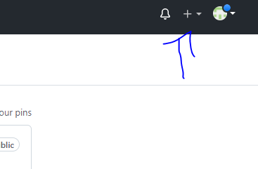
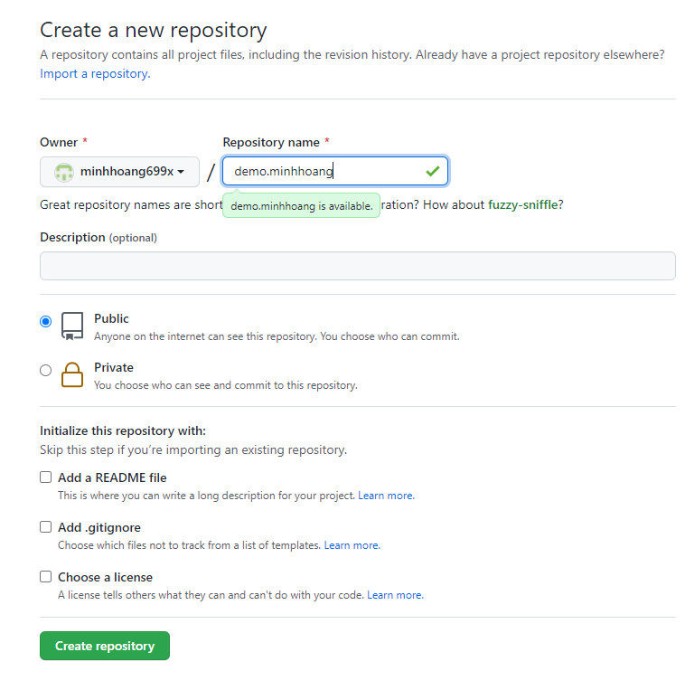
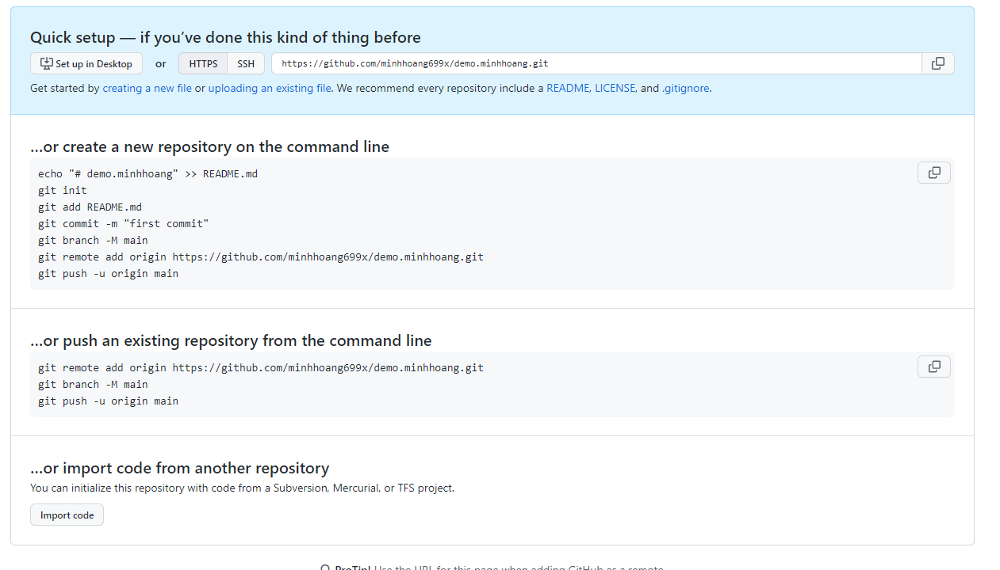
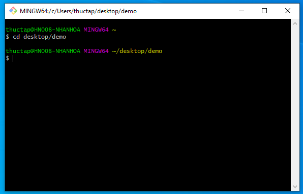
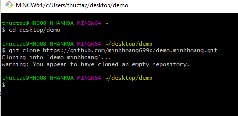
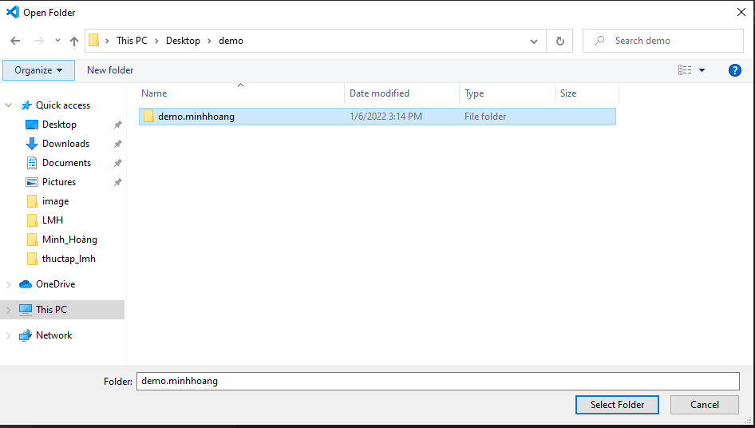
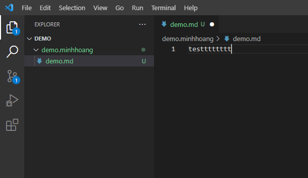
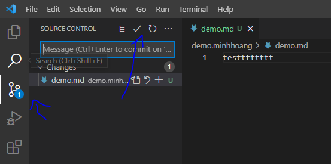
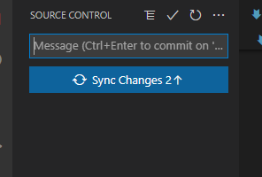

### 1. Các bước

**Click dấu +, chọn new repository.**

**Nhập tên repo muốn tạo, rồi chọn create.**

**Copy lấy đường dẫn đến repo mới tạo để clone về máy.**

**Bật Git Bash, dùng câu lệnh: "cd desktop/demo " để truy cập thư mục demo trên desktop - nơi chọn để lưu clone của repo trên máy local.**

**Dùng câu lệnh "git clone <đường dẫn> " để clone repo về máy. Có cảnh báo là vừa clone 1 cái repo rỗng về.**

**Trên Visual Studio Code, Sau khi đã liên kết với tài khoản Github, ta chọn thư mục demo.minhhoang làm nơi làm việc.**

**Tạo một file demo.md để test thử.**

**Khi muốn đồng bộ code lên github, ta chọn theo hình rồi chọn dấu tích để commit.**

**Sau khi nhập message để commit, ta chọn sync change để đồng bộ chúng lên github.**

