## Cài đặt Plesk trên Windows.
1. Chọn ngôn ngữ và nhập pass admin của server

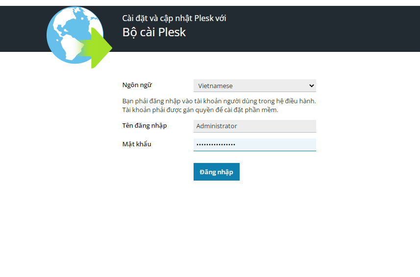

2. Chọn phần cài đặt hoặc gỡ bỏ Plesk
3. Tiếp tục, sau khi khởi tạo password cho Plesk thì quá trình cài bắt đầu.

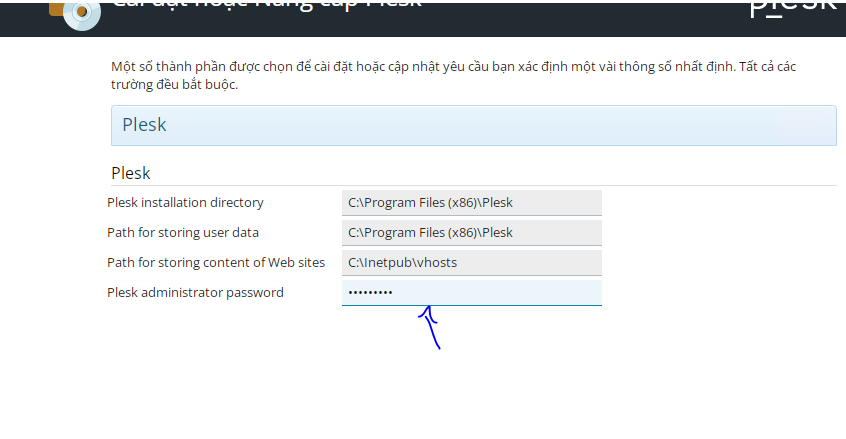

4. Khi quá trình cài đặt hoàn tất, restart hệ thống.

5. Đăng nhập
- Username là admin, mật khẩu khởi tạo lúc cài đặt.

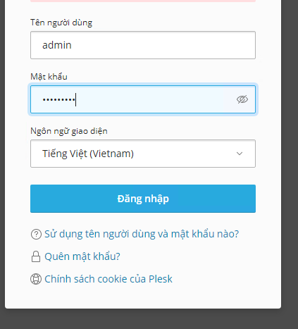

6. Khởi tạo một số thông tin và nhập Key

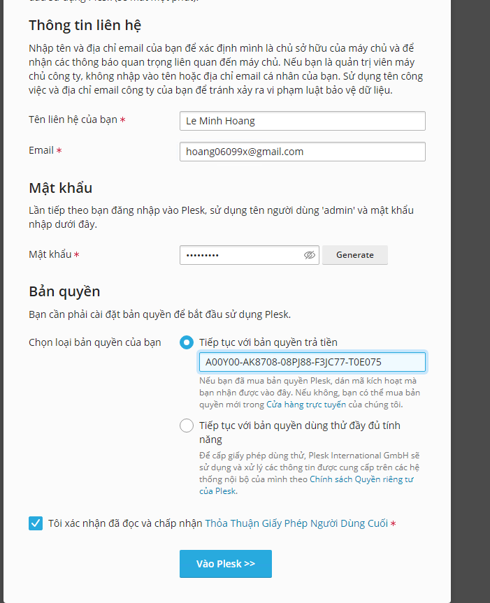

7. Chọn tạo web sau để vào trang quản trị Plesk.

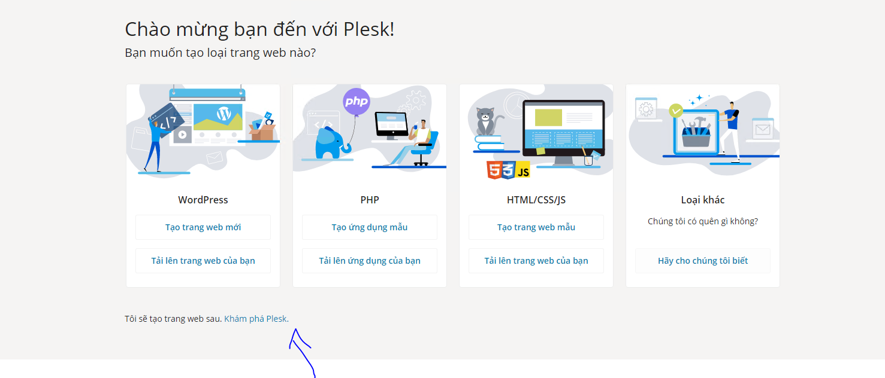

## Thêm tên miền trên Plesk
1. Vào phần trang web và tên miền để thêm tên miền.

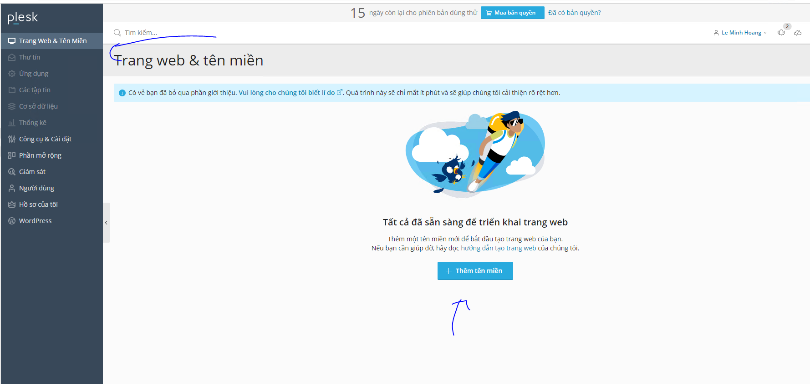

2. Cấu hình thông tin

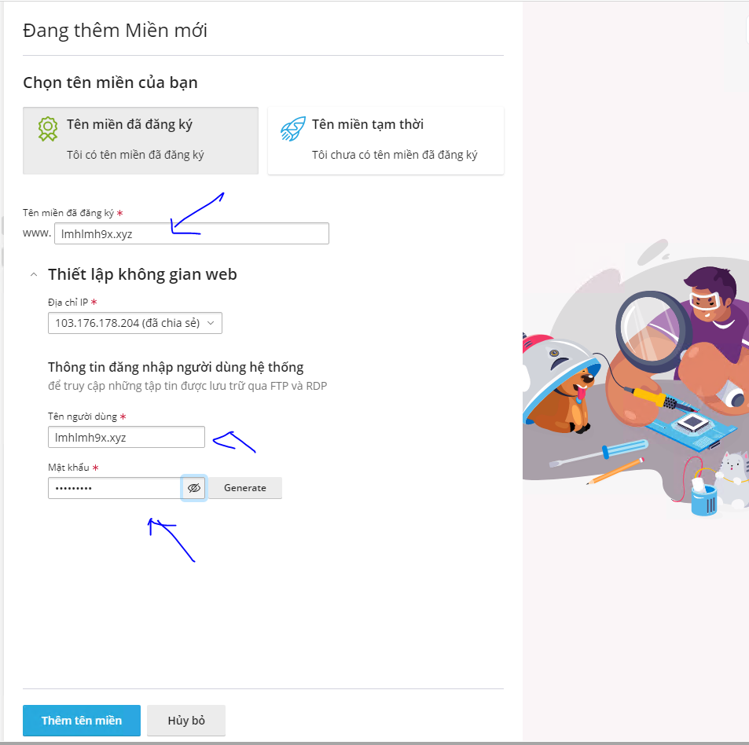

## Thêm người dùng trong Plesk
1. Vào mục tạo tài khoản

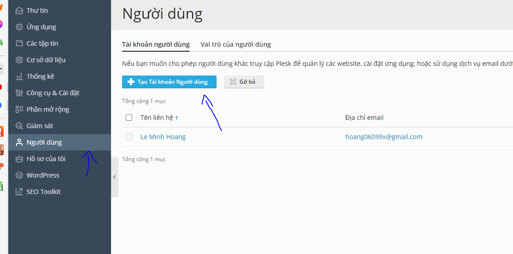

- Nhập các thông tin liên quan, chỉnh theo mục đích tạo ra user đấy.

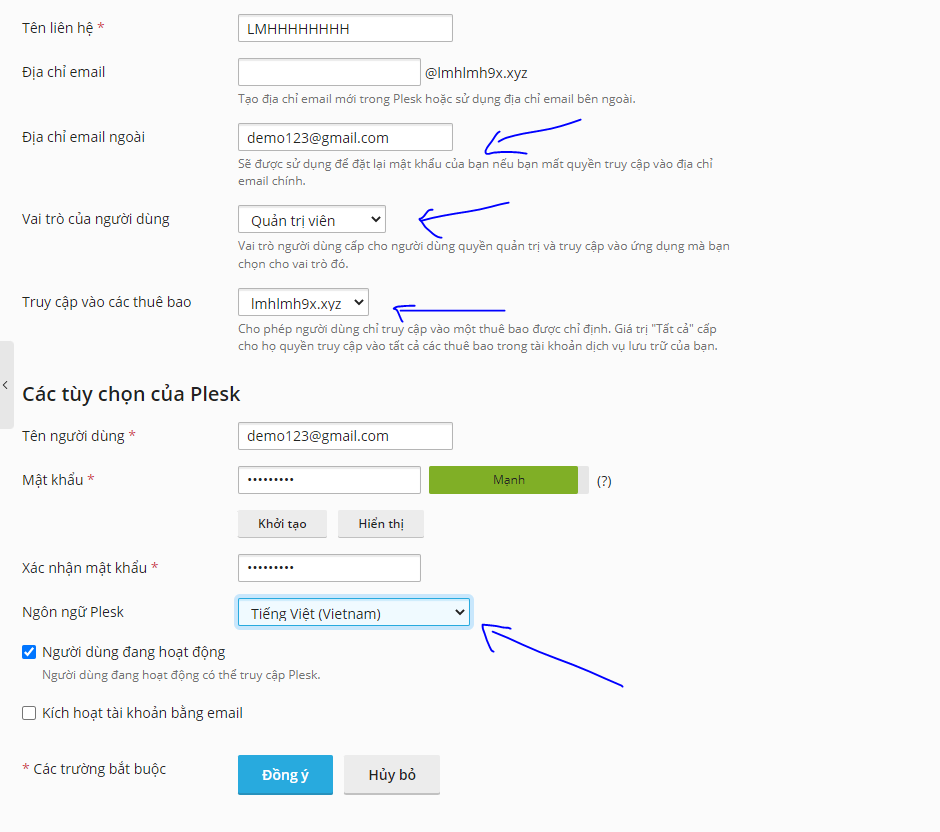

2. Test thử đăng nhập

- Nhập thông tin vừa khởi tạo khi nãy:

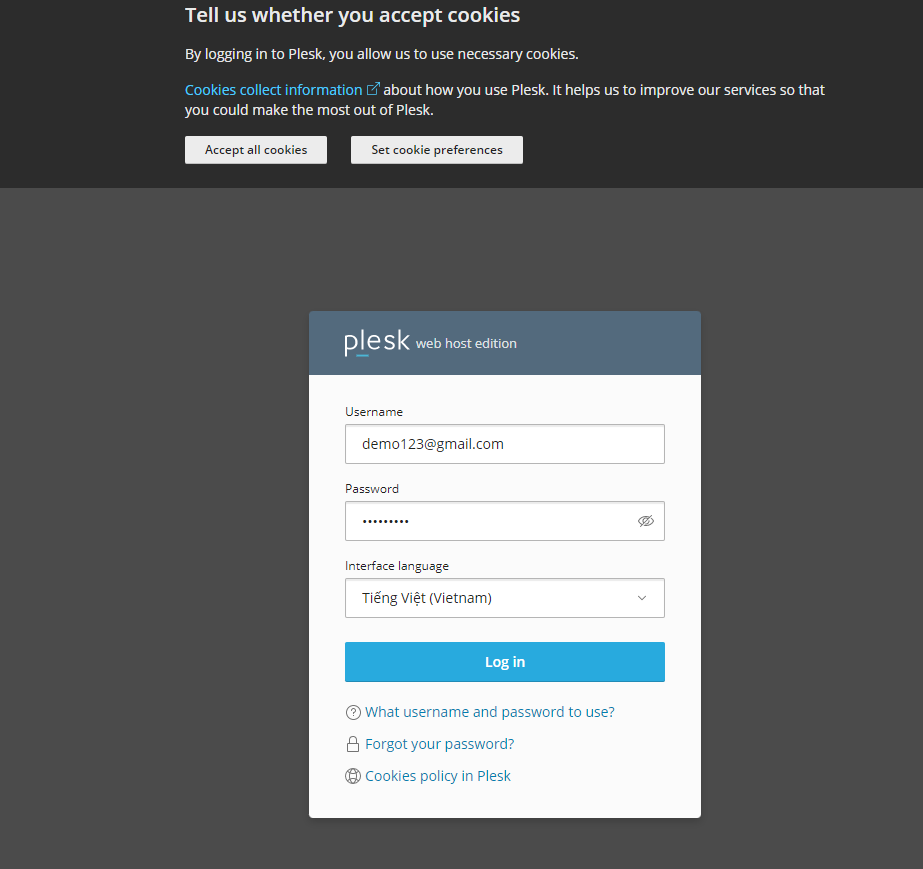

- Ok :

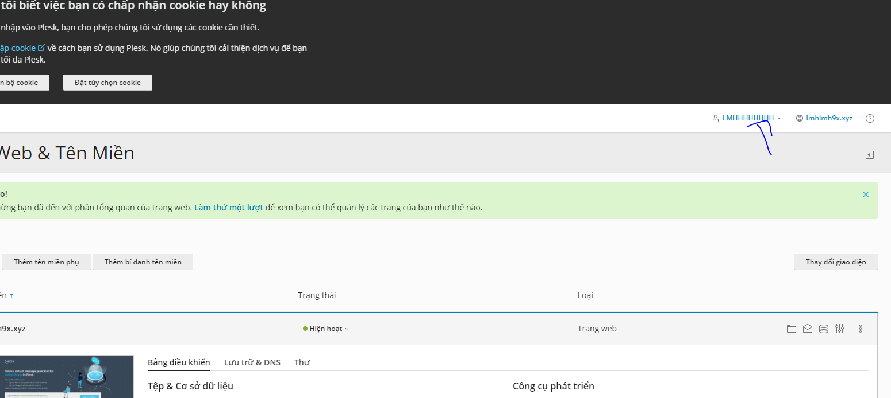

## Tạo gói dịch vụ

1. Ở trag chủ vào gói dịch vụ, chọn thêm gói dịch vụ

    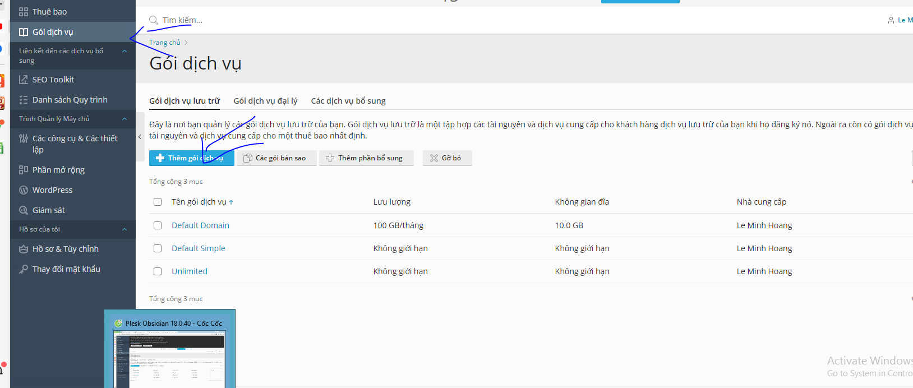

2. Đặt tên gói, rồi chỉnh các tùy chọn 

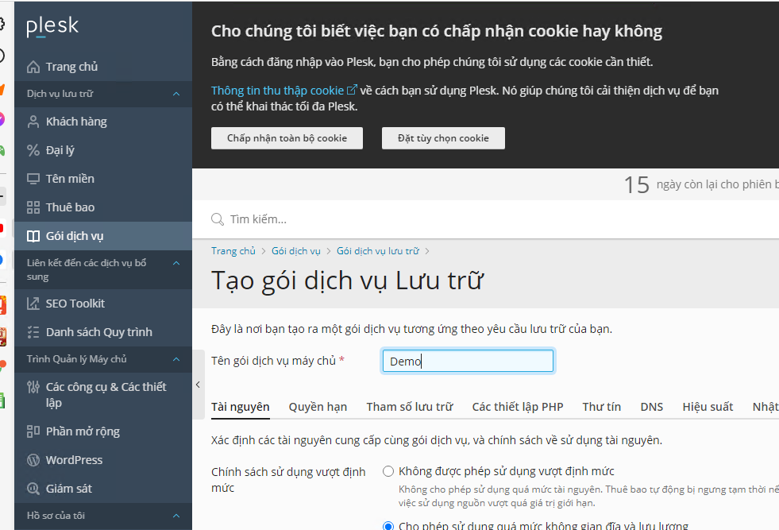

- *Có thể cài SSL/TLS của Let's Encrypt ngay trên Plesk*

- *port để vào Plesk là 8443 cho HTTP, 8880 cho HTTPS*