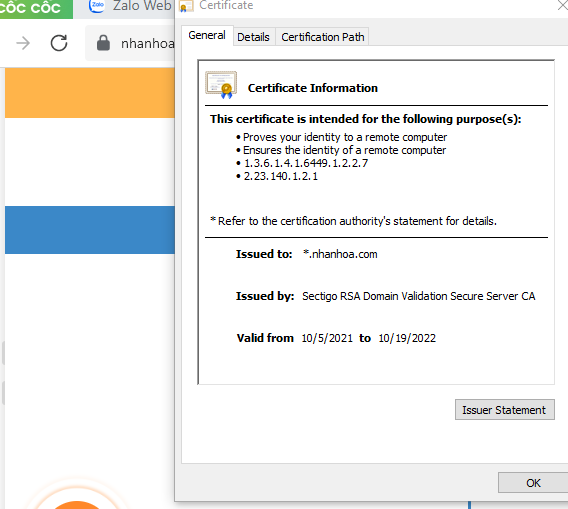
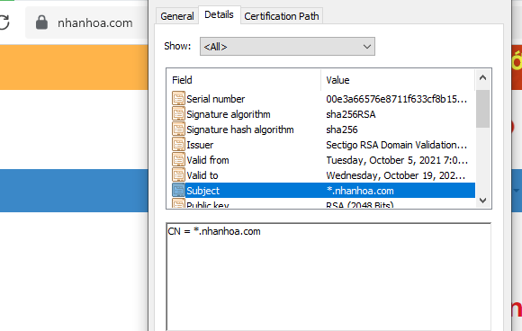
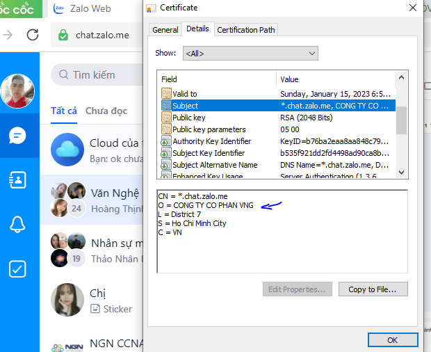
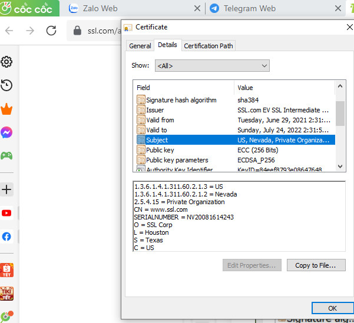

# Các loại chứng chỉ SSL
*Thông tin tham khảo tại: https://www.ssl.com/article/dv-ov-and-ev-certificates/*
## Sự khác biệt giữa các loại chứng chỉ
- Mặc dù tất các các chứng chỉ X.509 sử dụng các phương pháp tương tự để đảm bảo mã hóa, xác thực và toàn vẹn, chúng vẫn khác nhau đáng kể về thông tin mà chúng sẽ bảo mật.
- Một cách dễ dàng để phân loại chứng chỉ là theo phương pháp được CA sử dụng để xác thực thông tin chủ thể có trong chứng chỉ:
    + Xác thực tên miền - Domain Validated(DV): Là mức xác thực thấp nhất và xác minh rằng bất kì ai yêu cầu chứng chỉ sẽ kiểm soát tên miền mà nó bảo vệ.
    + Xác thực tổ chức - Organization Validated(OV): Xác minh danh tính của tổ chức (ví dụ: Doanh nghiệp, tổ chức phi lợi nhuận hoặc tổ chức chính phủ) của người đăng kí chứng chỉ.
    + Xác thực cá nhân - Individual Validated(IV): Xác minh danh tính của cá nhân yêu cầu chứng chỉ.
    + Xác thực mở rộng - Extended Validated (EV): Giống như xác minh danh tính tổ chức OV. Tuy nhiên, EV đại diện cho tiêu chuẩn tin cậy cao hơn OV và yêu cầu kiểm tra xác thực nghiêm ngặt hơn để đáp ứng tiêu chuẩn CA/Browser Forum’s Extend.
## Cách xem chứng chỉ của trang web
- Chúng ta có thể ấn vào biểu tượng ổ khóa trên thanh url của trình duyệt để xem thông tin chứng chỉ. Chọn phần chứng chỉ để hiện thông tin chi tiết gồm: cấp cho ai, người cấp, thời gian cấp và thời gian hết hạn...

## Chứng chỉ DV
- Chứng chỉ DV là loại chứng chỉ SSL/TLS phổ biến nhất. Chúng chỉ được xác minh bằng cách sử dụng tên miền. Thông thường, CA trao đổi email xác nhạn với một địa chỉ được liệt kê trong bản ghi Whois của tên miền. Ngoài ra, CA cung cấp tệp xác minh mà chử sở hữu đặt trên trang web để được bảo vệ hoặc người đăng ký tạo bản ghi DNS xác minh quyền kiểm soát của CA chính thức. Bất kì phương pháp nào trong số này đều xác nhận rằng miền được kiểm soát bởi bên yêu cầu chứng chỉ.
- Có thể xem sâu hơn bằng các xem trường Subject của chứng chỉ, sau đó xem trường CN(Common name), chúng là tên miền mà chứng chỉ bảo vệ.

## Chứng chỉ OV và IV
- Chứng chỉ xác thực tổ chức OV và xác thực cá nhân IV yêu cầu xác thực nhiều hơn DV, nhưng cấp cấp tin cậy nhiều hơn. Đối với những loại này, CA sẽ xác minh tổ chức hoặc cá nhân thực tế đang cố gắng lấy chứng chỉ. 
- Tên của tổ chức hoặc cá nhân cũng được liệt kê trong chứng chỉ, tạo thêm sự tin tưởng rằng cả trang web và chủ sở hữu nó đều uy tín.
- Chứng chỉ OV thường sử dụng bởi các công ty, chính phủ, tổ chức muốn cung cấp thêm một lớp tin cậy cho khách hàng của họ. 
- OV và IV còn được dùng để kí mã, kí tài liệu, xác thực ứng dụng khách, email S/MINE
- Đối với chứng chỉ OV, sẽ có thêm trường O trong details.

## Chứng chỉ EV
- Chứng chỉ EV cung cấp mức độ tin cậy tối đa cho người truy cập và cũng yêu cầu CA nỗ lực xác thực .
- Như OV, EV liệt kê tên các công ty trong chứng chỉ. Chứng chỉ EV chỉ cấp cho tổ chức, doanh nghiệp, không cấp cho cá nhân.
- Chứng chỉ EV sẽ trông như: 

# Các phương pháp xác thực SSL
## Phương pháp truyền thống
- Phương pháp truyền thống thông qua DCV-Email: Người dùng sẽ nhận được một email xác thực tương ứng với email đăng ký SSL. Email sẽ chứa một mã xác nhận duy nhất và một liên kết. Nhấp vào liên kết và nhập mã để xác nhận việc sở hữu tên miền.
- Địa chỉ email hợp lệ: Các email nhận link/ mã xác thực bắt buộc là dạng @tenmien và phải là 1 trong các user: admin@, administrator@, postmaster@, hostmaster@, webmaster@
## Phương pháp thay thế DCV
- HTTP-based DCV, HTTPS-based DCV: Là phương pháp xác thực qua file. Nhà cung cấp sẽ gửi cho khách hàng nội dung của file xác thực kèm đường dẫn để khách hàng khởi tạo file theo đường dẫn được cung cấp trên server.
- DNS CNAME-based : Xác thực qua DNS. Nhà cung cấp sẽ gửi cho khách hàng nội dung một record để khách hàng xác thực SSL qua hệ thống DNS domain.