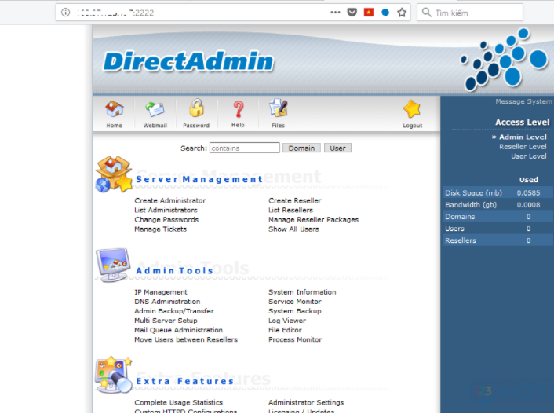

# So sánh Plesk, DirectAdmin, cPanel

### Sau quá trình sử dụng và test 1 số chức năng cơ bản, thường dùng - đã đưa ra được bản so sánh với các tiêu chí như sau:

## Khả năng tương thích hệ điều hành

### Plesk
- Hỗ trợ cả Windows và Liunx. 
- Theo tìm hiểu thêm thì tương thích tốt với Windows Server, Linux(Cloud Linux, Debian, Ubuntu, CentOS, RedHat)
### DirectAdmin
- Chỉ tương thích với Linux
- Cụ thể là : CentOS RedHat, FreeBSD, Debian
## cPanel
- Chỉ tương thích với Linux
- Cụ thể là: CentOS, RedHat, FreeBSD, Debian

## Giao diện người dùng
### Plesk
- Đẹp. 
- Rất đẹp.
- Bảng điều khiển na ná bảng điểu khiển WordPess, rất dễ dàng cho những người mới dùng.

### DirectAdmin
- Xấu.
- Nhưng rất đơn giản.
- 3 cấp bập giao diện tương ứng với 3 loại tài khoản người dùng: Admin, Reseller, User.

### cPanel
- Không xấu không đẹp.
- Rất chi là rối mắt.
- Có thêm WHM riêng - rất khó cho người mới, tìm muốn lòi con mắt.

- Giao diện Cpanel hiển thị toàn bộ chức năng trên bảng điều khiển, ctrl-F mà không thấy là không có, phải vào WHM để cài.

## Lấy key dùng thử
- Plesk với cPanel thì khá dễ dàng, đơn giản
- DirectAdmin phức tạp, trùng IP, tài khoản.... 

## Hỗ trợ Webserver
### Plesk
- IIS
- Nginx
- Apache
### DirectAdmin
- Apache
- Nginx
- Đặc biệt có kết hợp nginx_apache
- Litespeed, OpenLitespeed

## cPanel
- Chỉ hỗ trợ apache
## Tính năng, công cụ
- Ngoài cung cấp những tính năng và công cụ giống nhau: tạo package, FTP, DNS, email, DB.... còn những điểm khác

- Plesk và cPanel cung cấp bộ WP Toolkit để cài Wordpress trong 1 nốt nhạc, rất dễ sử dụng, người không biết gì cũng dùng được. Plesk có sẵn, cPanel phải cài.

- DirectAdmin có công cụ CustomBuild xịn xò, cài đặt remove các nền tảng bằng vài cú click chuột hoặc vài dòng lệnh đơn giản.

- Các thao tác với các chứng năng cũng tương tự nhau, không khác biệt nhiều.

- cPanel có nguyên một mục mail riêng.

- cPanel có easyapache, gần giống CB của DA nhưng chỉ cho các service của apache.

## Ngôn ngữ
- Plesk và cPanel có Tiếng Việt
- Direct Admin thì không.

## Port truy cập

- Plesk
    + 8880 với HTTP
    + 8443 với HTTPS

- Direct Admin
    + 2222 : tứ quý 2 dễ nhớ :vv
- cPanel
    + 2087 để vào WHM quản trị
    + 2083 để vào cPanel 

