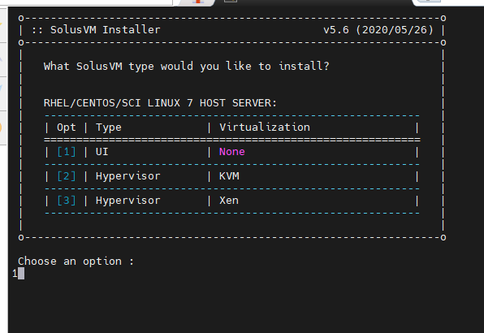
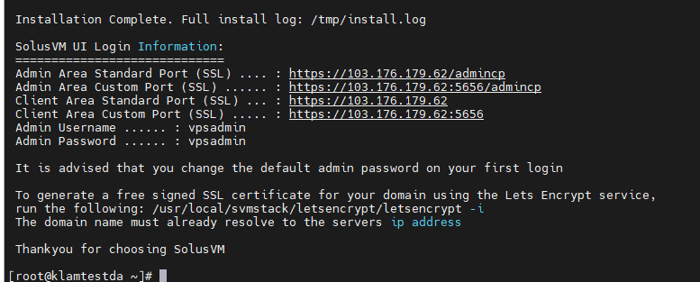
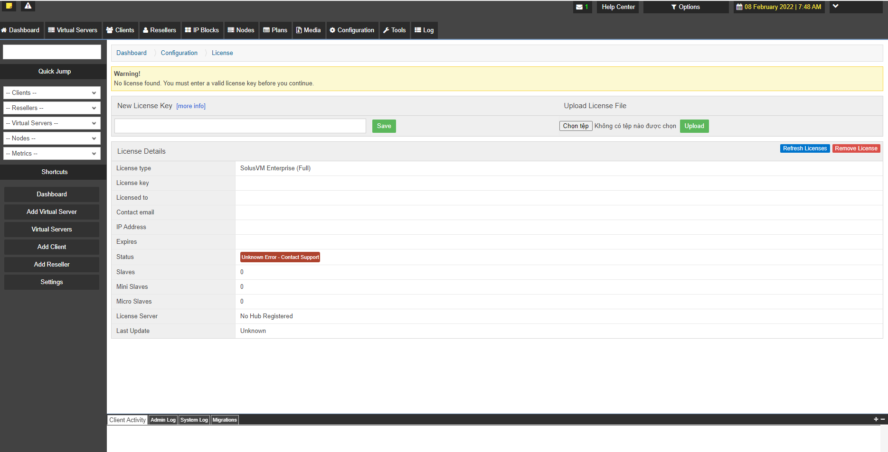
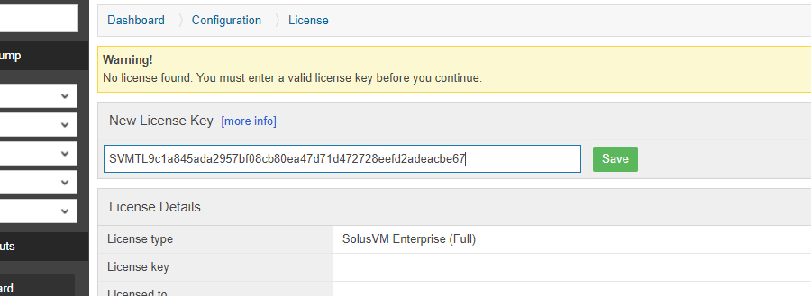

# SolusVM
## Giới thiệu 
- Solus Virtual Manager (SolusVM) là một hệ thống quản lý VPS bằng WebGUI hỗ trợ đầy đủ OpenVZ, Linux KVM, Xen Paravirtualization, Xen HVM. Tựu chung đây cũng là phần mềm quản lý ảo hóa như Virtualizor, SolusVM cho phép quản lý một cụm VPS một cách an toàn và dễ dàng.

## Yêu cầu hệ thống
- SolusVM Master phải được cài đặt trên một máy chủ nguyên sạch: máy chủ mới cài đặt và được cập nhật lên phiên bản mới nhất với lệnh `yum update`
- SolusVM Master chỉ hỗ trợ ảo hóa OpenVZ. Còn Xen và KVM chỉ có thể chạy trên SolusVM Slave.
- SolusVM Slave có thể được cài đặt trên một máy chủ có VPS đang chạy trên đó và có thể nhập chúng vào hệ thống SolusVM.
- Không được cài đặt SolusVM Slave trên máy chủ có phần mềm tương tự như Virtualizor.
- Nên sử dụng trên các hệ điều hành dựa trên cơ sở RHEL7

# Cài đặt SolusVM

*Nên cài đặt trên Centos trắng*

1. Tiến hành update
- yum update -y

2. Tải về tập tin cài đặt

- wget https://files.soluslabs.com/install.sh
3. Cài đặt

- sh install.sh

- Xong

# Dùng thử

1. Đăng nhập vào bằng link: https://103.176.179.62/admincp
- username: vpsadmin
- password: vpsadmin

2. Giao diện 

3. Phải có key để dùng

- Lên trang chủ của SolusVM đăng kí dùng thử 30 ngày.

