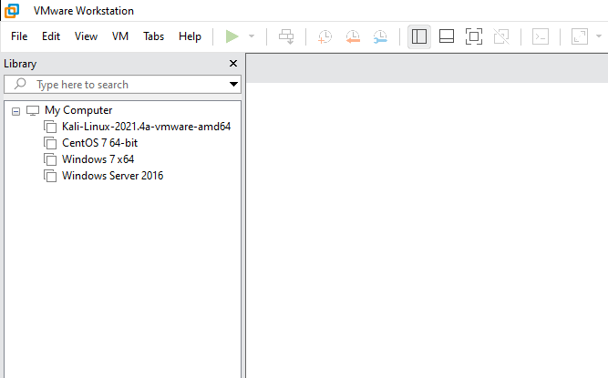

 ### Cài đặt được phần mềm Vmware, sử dụng trial 15 ngày

### Cài đặt được thêm 4 máy ảo

1. Kali Linux
    - Tải trực tiếp virtual disk ở trên trang trủ của Kali.
    - Cài đặt mật khẩu root.
    - Tạo snapshot ban đầu.

2. Centos 7
    - Cài bằng iso Centos7 64 bit
    - Tạo snap shot ban đầu.

3. Windows 7
    - Cài phiên bản Windows 7 Professional 64 bit qua file iso.
    - Tạo mật khẩu đăng nhập.
    - Tạo snap shot ban đầu.

4. Winserver 2016  
    - Cài phiên bản WinServer 2016 Standard 64 bit bằng file iso.
    - Cài mật khẩu đăng nhập.
    - Tạo snap shot ban đầu.

