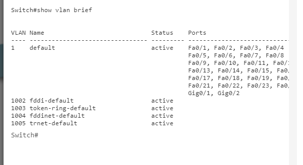
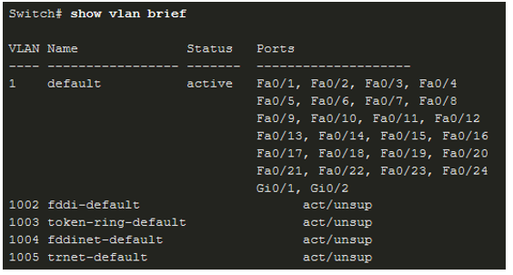
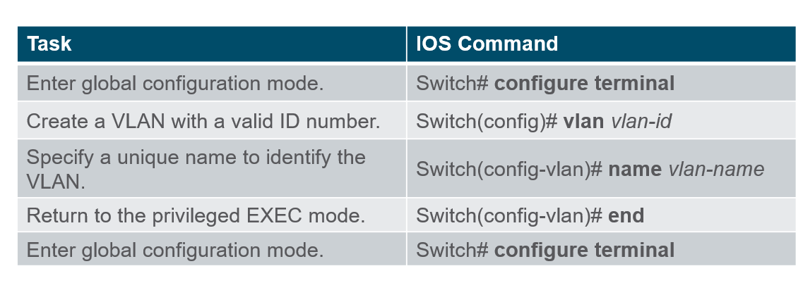
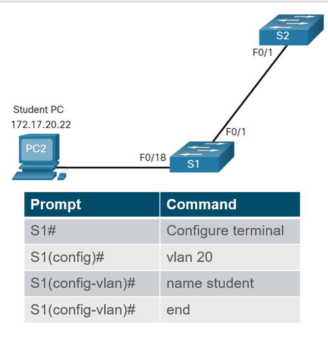
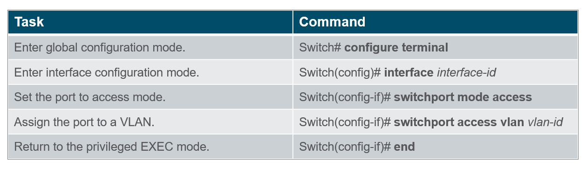
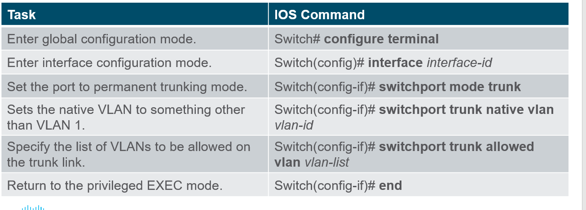
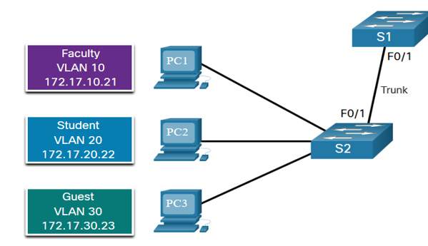
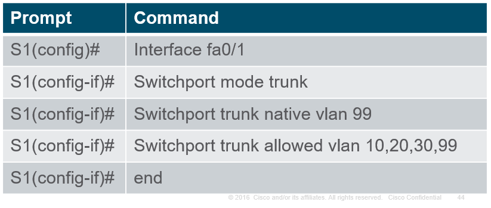
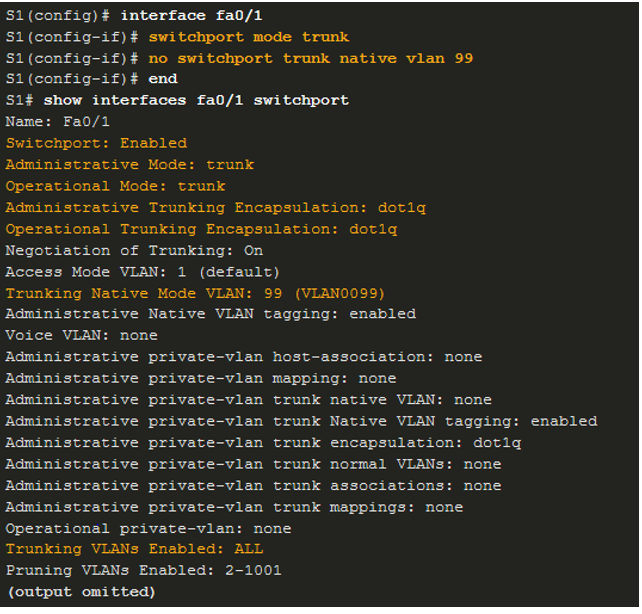
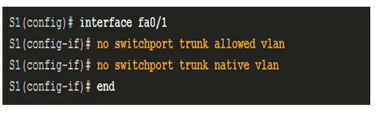

# 1. Tổng quan về Vlans
## 1.1 Giới thiệu

- VLAN là viết tắt của Virtual Local Area Network hay còn gọi là mạng LAN ảo. Một VLAN được định nghĩa là một nhóm logic các thiết bị mạng và được thiết lập dựa trên các yếu tố như chức năng, bộ phận, ứng dụng… của công ty.

- Việc đặt các thiết bị vào các VLAN khác nhau có các đặc điểm sau:
    + Cung cấp phân đoạn các nhóm thiết bị khác nhau trên cùng một switch.
    + Cung cấp tổ chức dễ quản lý hơn
    + Broadcast, multicast và unicast được tách biệt trong VLAN riêng lẻ
    + Mỗi VLAN sẽ có dải địa chỉ IP riêng
    + Miền quảng bá nhỏ hơn

## 1.2 Lợi ích khi sử dụng Vlan: 
- Miền quảng bá nhỏ hơn: Chia mạng Lan ra nhỏ hơn, từ đó làm giảm kích thước miền quảng bá 
- Cái thiện về bảo mật: Chỉ có người dùng ở cùng Vlan mới có thể giao tiếp được với nhau
- Nâng cao hiệu quả IT: Vlans có thể nhóm các thiết bị với các yêu cầu tương ứng.
- Giảm chi phí: Một switch có thể hỗ trợ nhiều nhóm hoặc VLans khác nhau. 
- Hiệu năng tốt hơn: Với miền quảng bá nhỏ, sẽ giảm lưu lượng và tăng băng thông.
- Quản lí đơn giản hơn: Những nhóm tương tự nhau sẽ cần những ứng dụng giống nhau.

## 1.3 Phân loại Vlan

- Default Vlan: Vlan 1 là

    

    + Default Vlan
    + Dafault Native Vlan
    + Default Management Vlan
    + Không thế xóa hoặc đổi tên
- Data Vlan
    + Dành riêng cho lưu lượng truy cập của người dùng (email hoặc lướt web)
    + Vlan 1 là default data Vlan bởi vì tất cả các interface đều chỉ định tới với Vlan này
- Native Vlan
    + Chỉ sử dụng cho liên kết trunk
    + Tất cả frame đều được gán nhãn 802.1Q trừ các frame trên Native Vlan
- Management Vlan
    + Được sử dụng cho những traffic VTY telet/ssh và không dùng với traffic end user.
    + Thông thường, Vlan này là SVI cho switch layer 2.
- Voice Vlan   
    

    + Cần có 1 Vlan riêng vì Voice Traffic yêu cầu:
        - Băng thông đàm bảo
        - Ưu tiên QoS cao (Quaility of Service)
        - Khả năng tránh tắc nghẽn
        - Trễ ít hơn 150 ms từ nguồn đến đích
        - Toàn bộ mạng phải được thiết kế để hỗ trợ giọng nói

# 2. Vlan là một môi trường Multi Switched
- Định nghĩa một Vlan Trunks
    
    + Đường trunk là một liên kết điểm - điểm giữa hai thiết bị mạng.
    + Các chức năng của trunk cisco: 
        - Cho phép nhiều hơn một VLAN
        - Mở rộng VLAN trên toàn bộ mạng
        - Theo mặc định, hỗ trợ tất cả các VLAN
        - Hỗ trợ 802.1Q trunking

    

    + Nếu không cấu hình Vlan, tất cả các thiết bị kết nối với switch sẽ nhật được tất cả traffic unicast, multicast và broadcast.

    

    + Khi có Vlan, traffic unicast, multicast và broadcast được giới hạn trong một Vlan. Nếu không có thiết bị Layer 3 để kết nối các Vlan, các thiết bị trong Vlan khác nhau không thể giao tiếp.

- Định nghĩa Vlan với 1 tag
 
    
    + Header IEEE 802.1Q có độ dài 4 byte
    + Khi tag được tạo, FCS phải được tính toán lại.(frame check sequence)
    + Khi gửi tới điểm cuối, tag này phải được xóa và FCS được tính toán lại như lúc ban đầu.

    |Trường 802.1Q Vlan tag|Function|
    |----------------------|-------------------------------------------|
    |Type|2 bytes, với giá trị hex là 0x8100, được dùng như 1 Tag Protocal ID|
    |Ưu tiên người dùng|3 bit  |
    |CFI(Canonical Format Identifier)|1 bit, có thể hỗ trợ token ring frame trong Ethernet|
    |Vlan ID(VID)|12 bit, hỗ trợ lên đến 4096 Vlan|

- Native Vlan và tag 802.1Q: Đường trunk 802.1Q đơn giản:
    
    + Việc gắn thẻ thường được thực hiện trên tất cả các VLAN.
    + Việc sử dụng một VLAN gốc được thiết kế để sử dụng kế thừa, giống như hub ở trong hình.
    + Trừ khi được thay đổi, VLAN1 là Native Vlan.
    + Cả hai đầu của một liên kết trunk phải được cấu hình với cùng một VLAN gốc.
    + Mỗi trunk được cấu hình riêng biệt, vì vậy có thể có VLAN gốc khác nhau trên các trung kế riêng biệt.
# 3. Cấu hình Vlan

    
- Catalyst switch 2960 và 3650 hỗ trợ đế 4000 Vlan
- Dải Vlan thường từ vlan 1- 1005
    + Sử dụng từ nhỏ đến vừa cho việc kinh doanh
    + 1002 -1005 được lưu trữ lại
    + 1, 1002-1005 được tạo tự động và không thể xóa
    + Lưu trữ tại file vlan.dat trong bộ nhớ flash
    + VTP có thể đồng bộ giữa 2 switch
- Dải Vlan mở rộng từ 2006-4095
    + Được sử dụng bởi nhà cung cấp dịch vụ
    + Luôn chạy ở running-config
    + Hỗ trợ nhiều feature Vlan hơn
    + Yêu cầu cấu hình VTP

- Câu lệnh tạo Vlan
    + Vlan được thông tin chi tiết và lưu trữ tại vlan.dat, nên muốn tạo vlan chúng ta phải vào global config.

    
     
    + Ví dụ:
        - Khi muốn cấu hình vlan 20 , ta cấu hình id trước, sau đó đặt tên sau
        - Nếu không đặt tên cho vlan, cisco sẽ đặt cho vlan 1 tên mặc định, ví dụ như vlan0020.

    

- Câu lệnh assign port cho vlan.
    + Bất khì vlan nào được tạo, ta đều có thể assign cho nó chính xác 1 interface.

    

# 4. Vlans Trunk

- Trunk ở layer2 và mang traffic cho tất cả các Vlan.
- Câu lệnh cấu hình trunk: 

    

- Ví dụ:
    Có mô hình : 

    

    + Subnet cho từng Vlan là: 
        VLAN 10 - Faculty/Staff - 172.17.10.0/24
        VLAN 20 - Students - 172.17.20.0/24
        VLAN 30 - Guests - 172.17.30.0/24
        VLAN 99 - Native - 172.17.99.0/24
    + F0/1 được cấu hình làm trunk port

    

- Để xác nhận cấu hình trunk, ta dùng câu lệnh :
    Show int fa0/1 switchport

    

    Trả về các giá trị:
    + Đã bật switchport
    + Admin mode đã bật
    + Đã bật mode hoạt động cho trunk
    + Đóng gói bằng dot1q
    + Native Vlan là 99
    + Tất cả Vlan được tạo trên Switch đều có thể traffic qua trunk này.

- Để reset một trunk về cấu hình mặc định, ta dùng các câu lệnh:
    
    

# 5. Dynamic Trunking Protocol

- Dynamic Trunking Protocol (DTP) là một giao thức độc quyền của Cisco
- DTP có hững đặc điểm như:
    + Cài đặt mặc định trên Switch Catalyst 2960 và 2950
    + Chế độ Dynamic-auto có mặc định trên Switch Catalyst 2950 và 2960
    + Có thể tắt bằng lệnh không thương lượng.
    + Có thể bật lại bằng các cài đặt interface thành dynamic-auto
    + Đặt chuyển đổi thành static trunk static access sẽ tránh được các vấn đề thương lượng với switchport mode trunk hoặc các lệnh truy cập chế độ cổng chuyển đổi. 

- Khi muốn xác thực DTP mode, ta dùng câu lệnh show dtp interfaces.