## Giới thiệu về CustomBuild

- Đi kèm với DirectAdmin chúng ta sẽ có một công cụ cực kì mạnh mẽ là CustomBuild. CustomBuild là một công cụ cực kỳ tiến bộ giúp quản lý phần mềm nhưng cũng cung cấp một phương thức khá đơn giản để người dùng có thể tùy chỉnh mọi thứ.

- Danh sách những gì CB có thể build được: 

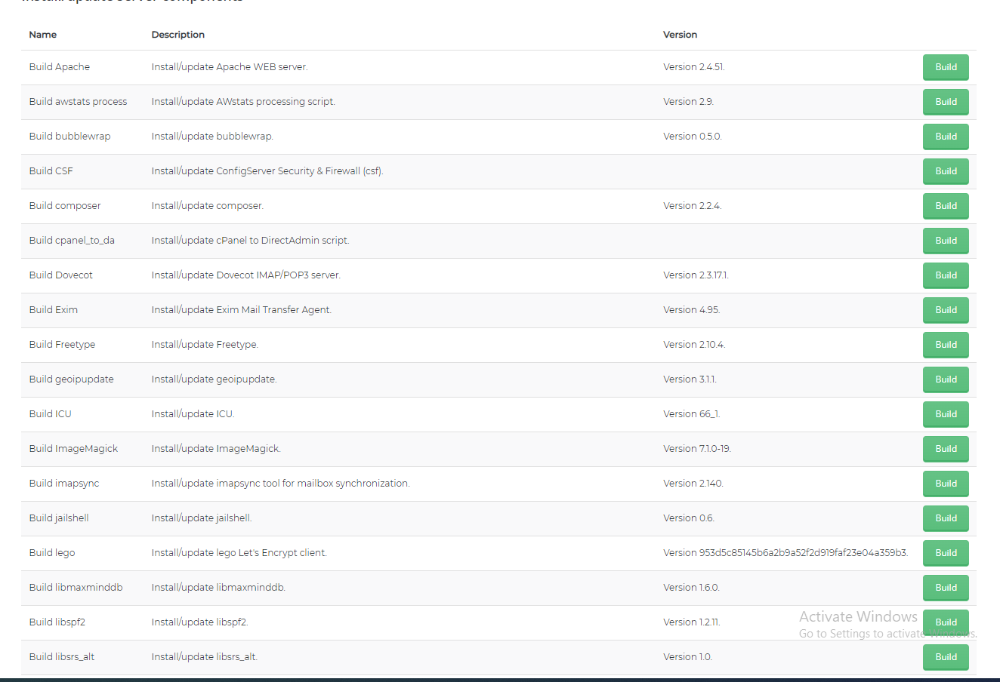
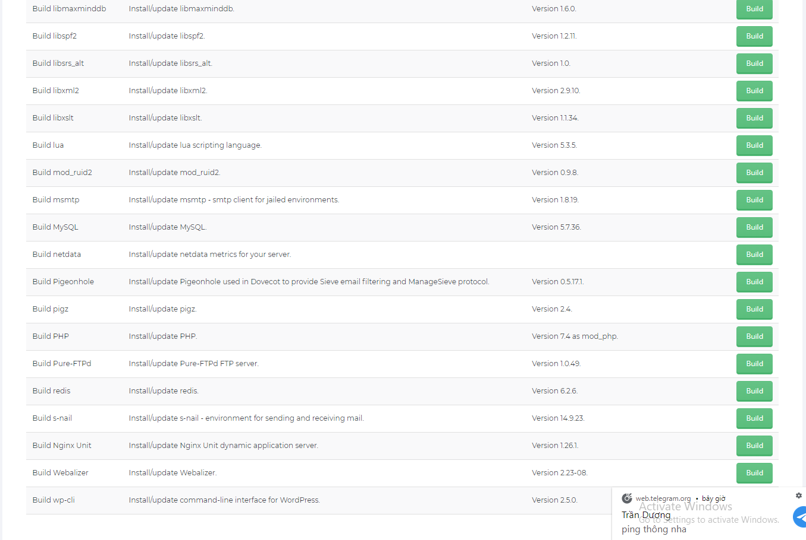
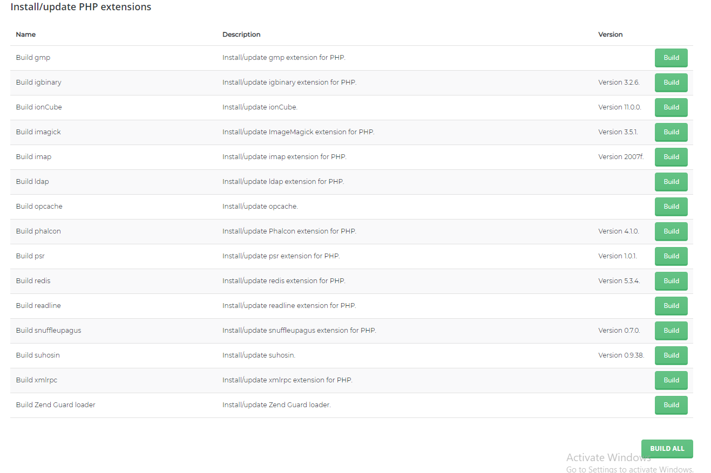

## Build PHP
### 1. Vào thư mục của CB
- cd /usr/local/directadmin/custombuild
### 2. Tạo 4 php mode :
- ./build set php1_mode php-fpm
- ./build set php2_mode php-fpm
- ./build set php3_mode php-fpm
- ./build set php4_mode php-fpm
### 3. Gán các phiên bản php cho từng mode
- ./build set php1_release 5.6
- ./build set php2_release 7.0
- ./build set php3_release 7.3
- ./build set php4_release 7.4

### 4. Kiểm tra lại 
- cat options.conf |grep php

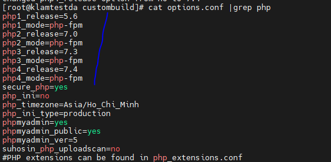

- Thông tin đúng với ta khai báo là ok.

### 5. Chạy dịch vụ
- ./build php n

### 6. Chạy lại cấu hình

- ./build rewrite_confs

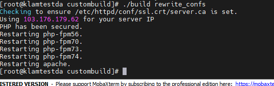

### 7. Thay đổi phiên bản và kiểm tra kết quả
1. Đầu tiên login vào DA bằng tài khoản user.
- Tiếp làm theo hình để test: 

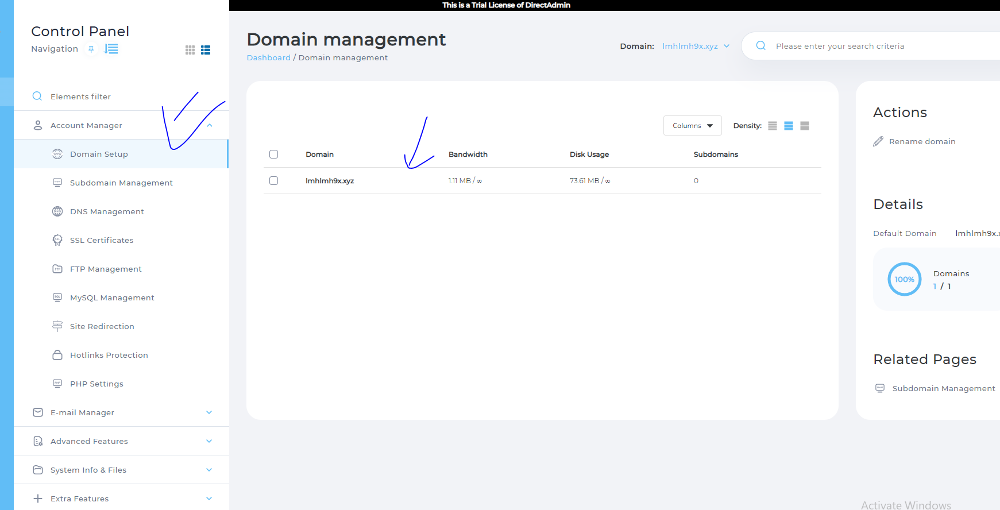
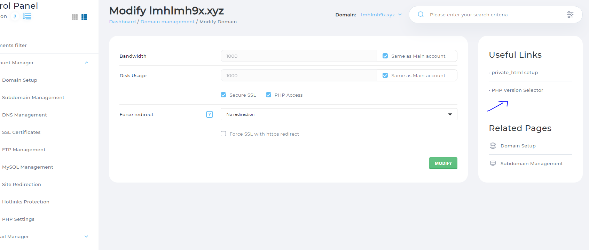
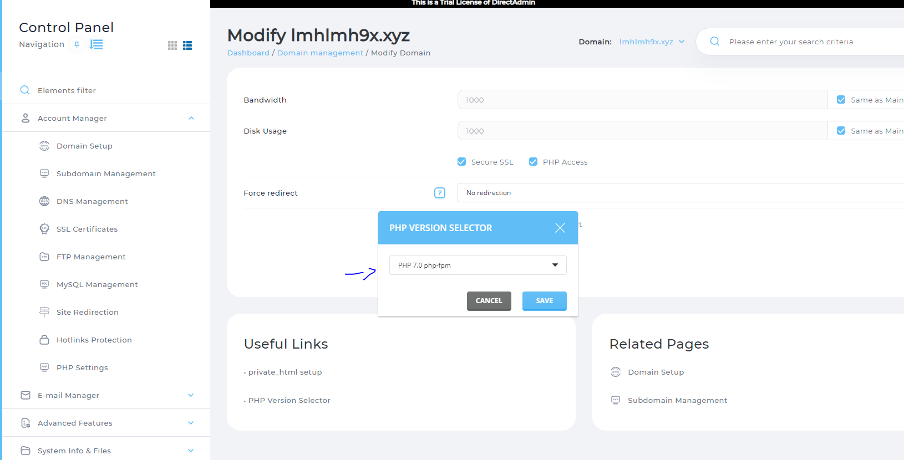

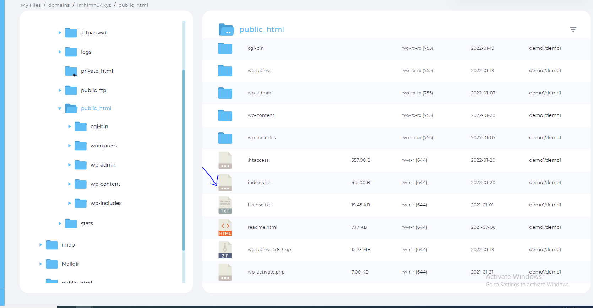

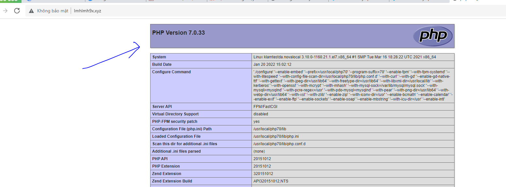

## Cài Webserver
1. Vào thư mục của CB
- cd /usr/local/directadmin/custombuild 
2. Mở file option 
- nano option.conf

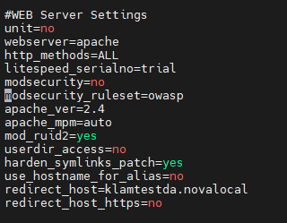

- Hiện tại đang chạy apache
- Dùng câu lệnh : httpd -v để kiểm tra lại

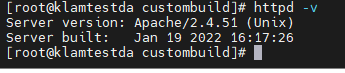

- Sửa lại cấu hình webserver setting tại file option thành nginx

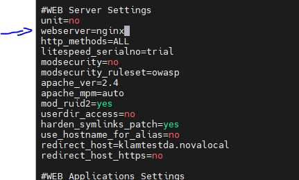

3. Chạy lệnh ./build nginx để nginx thay thế apache
- Sau khi xong chạy lệnh :
- ./build rewrite_confs

# *Khi gặp phải lỗi nginx: [emerg] bind() to [::1]:80 failed (99: Cannot assign requested address) khi build từ apache sang nginx*

1. Lỗi là do không bind được localhost Ipv6

2. Khắc phục
- nano /etc/sysctl.conf
- thêm dòng : net.ipv6.ip_nonlocal_bind = 1
- reboot

- là okkkk

## Chuyển từ nginx sang apache
- Làm tương tự, chỉ dổi ở trong file option.conf từ nginx sang apache.

## Chuyển webserver sang apache

- Đổi php mode sang lsphp
- mod_ruid2 ở webserver config chuyển thành no
- Chạy các lệnh:
    + ./build update
    + ./build php n
    + ./build openlitespeed
    + ./build rewrite_confs

- 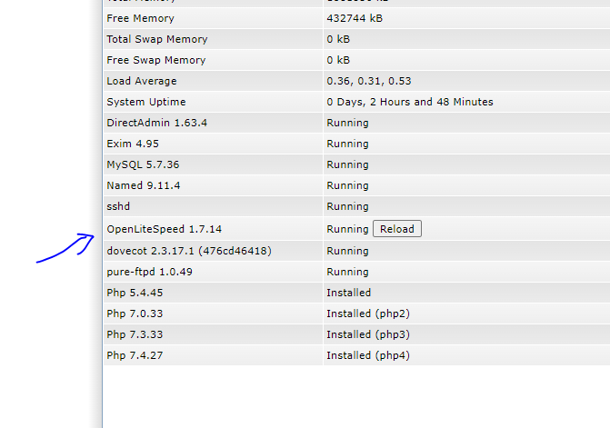