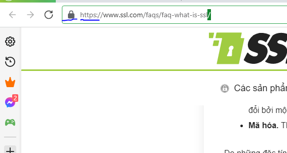
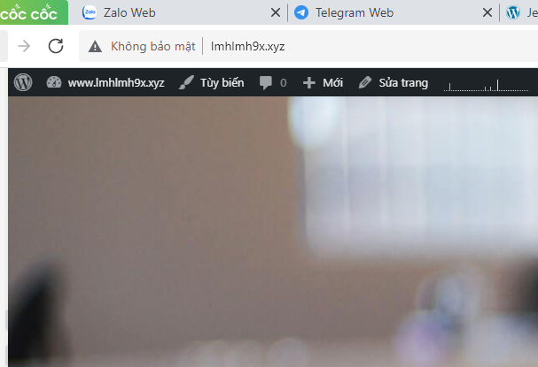

# SSL - Secure Sockets Layer
*Tài liệu tham khảo: https://www.ssl.com/faqs/faq-what-is-ssl/*
## 1. SSL là gì?
- SSL - Secure Sockets Layer, và đệ của nó TLS - Transport Layer Security, là các giao thức để thiết lập các liên kết được xác thực và mã hóa giữa các máy tính kết nối với nhau qua mạng. Mặc dù SSL không được chấp nhận khi phát hành TLS 1.0 vào 1999, nhưng người ta vẫn thường gọi các công nghệ liên quan này là SSL hoặc SSL/TLS.
## 2. Chứng chỉ SSL là gì
- Chứng chỉ SSL ( còn gọi là chứng chỉ TLS hoặc SSL/TLS) là một tài liệu kĩ thuật số liên kết danh tính của một trong web với một cặp khóa mật mã gồm khóa công khai và khóa riêng tư. Khóa công khai, có trong chứng chỉ, cho phép trình duyệt web bắt đầu phiên giao tiếp được mã hóa với máy chủ web thông qua giao thức TLS và HTTPS. Khóa riêng tư được giữ an toàn trên máy chủ và được sử dụng để kỹ điện tử các trang web và các tài liệu khác.
- Chúng chỉ SSL cũng bao gồm thông tin nhận dạng về một trang web, bao gồm tên miền, tùy chọn, thông tin nhận dạng về chủ sở hữu của trang web. Nếu chứng chỉ SSL của máy chủ web được ký bỏi tổ chức phát hành chứng chỉ đáng tin cậy công khai (CA) như SSL.com, nội dung được ký số từ máy chủ sẽ được trình duyệt web và hệ điều hành của người dùng cuối tin tưởng là xác thực
*SSL là một chứng chỉ X.509*
## 3. TLS là gì
- Transport Layer Security - TLS được phát hành vào 1999, là sự kế thừa của giao thức SSL để xác thực và mã hóa.
- TLS 1.3 được định nghĩa trong RFC -8446 vào tháng 8-2018.
## 4. Cổng được khuyến nghị để sử dụng SSL/TLS.
- Theo nguyên lí là bất cứ cổng nào cũng có thể dùng cho SSL/TLS. Nhưng để có sự tương thích tốt nhất, 443 được chọn .
## Cách hoạt động của SSL/TLS
### Khóa
- SSL/TLS hoạt động bằng cách ràng buộc danh tính của các thực thể như trang web, công ty với cặp khóa thông qua các tài liệu kĩ thuật gọi là chứng chỉ X.509. Mỗi cặp khóa gồm 1 khóa riêng và 1 khóa công khai. Khóa riêng được giữa an toàn và khóa công khai được phân phối rộng rãi thông qua chứng chỉ.
- Mối quan hệ giữa 2 khóa trong 1 cặp là có thể sử dụng khóa không khai để mã hóa một thông điệp mà chỉ có thể được giải mã bằng khóa riêng. Hơn nữa, người nắm giữ khóa riêng có thể dùng nó để ký các tài liệu kỹ thuật số khác, và bất kì ai có khóa công khai đều có thể xác minh chữ ký này
- Hai thuật toán được dùng rộng rãi nhất trong SSL/TLS là ECDSA và RSA.
### Chứng chỉ
- Nếu bản thân chứng chỉ SSL/TLS được ký bởi CA như SSL, thì chứng chỉ sẽ được phần mềm ứng dụng khách như trình duyệt web và hệ điều hành hoàn toàn tin cậy.
- Các CA đáng tin cậy công khai đã được các nhà cung cấp phần mềm lớn chấp thuận để xác thực danh tính sẽ được tin cậy trên nền tảng của họ.
- Các thủ tục xác nhận và cấp chứng chỉ của một CA public phải được kiểm tra thường xuyên, nghiêm ngặt để duy trì trạng thái đáng tin cậy này.
### Bắt tay
- Thông qua bắt tay SSL/TLS, khóa cá nhân và khóa công khai có thể được sử dụng với chứng chỉ đáng tin cậy công khai để thương lượng một phiên giao tiếp được mã hóa và xác thực qua internet.
- Thực tế này chính là nền tảng của duyệt web an toàn và thương mại điện tử.
*Không phải tất cả các ứng dụng SSL/TLS đều yêu cầu sự tin cậy của công chúng. Ví dụ: một công ty có thể phát hành chứng chỉ riêng của mình để sử dụng nội bộ.*
## SSL/TLS và Duyệt web an toàn
- Việc sử dụng SSL/TLS phổ biến và nổi tiếng nhất là duyệt web an toàn thông qua giao thức HTTPS. Trang web HTTPS công khai được định hướng cấu hình đúng các bao gồm chứng chỉ SSL/TLS được ký bởi CA đáng tin cậy.
- Người dùng truy cập trang web HTTPS có thể yên tâm về:
    + Tính xác thực: Máy chỉ xuất trình chứng chỉ sở hữu khóa riêng phù hợp với khóa công khai trong chứng chỉ.
    + Tính tin cậy: Các tài liệu được ký bở chứng chỉ không bị thay đổi bởi tấn công man in the middle.
    + Mã hóa: Thông tin liên lác được mã hóa
- Một trang web được cấp chứng chỉ SSL/TLS sẽ có biểu tượng ổ khóa trên thanh  url, và đầu của url là https.

    

- Một trang web chưa có SSL/TLS sẽ không có https và sẽ có cảnh báo không bảo mật từ trình duyệt web.

## Các phương pháp xác thực chính 
- Tùy vào phương pháp xác thực và mức độ tin cậy mà chứng chỉ đem lại, chúng được chia thành 3 loại:
    + DV
    + OV và IV
    + EV

- Xem thêm thông tin tại: https://github.com/minhhoang699x/thuctap_lmh/blob/main/C%C3%A1c%20lo%E1%BA%A1i%20ch%E1%BB%A9ng%20ch%E1%BB%89%20SSL/C%C3%A1c%20lo%E1%BA%A1i%20SSL.md