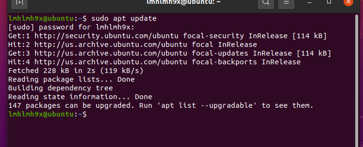
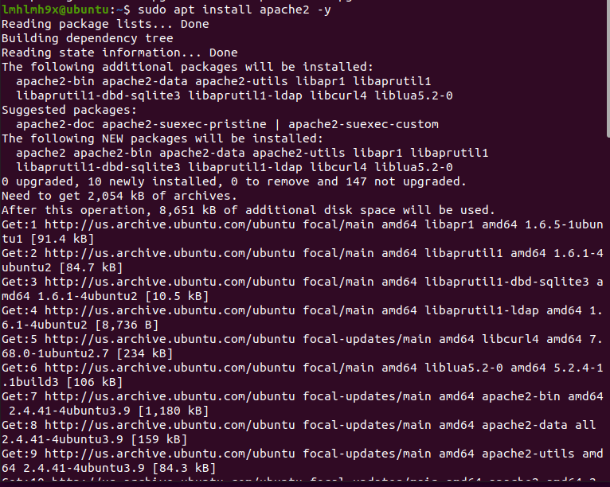
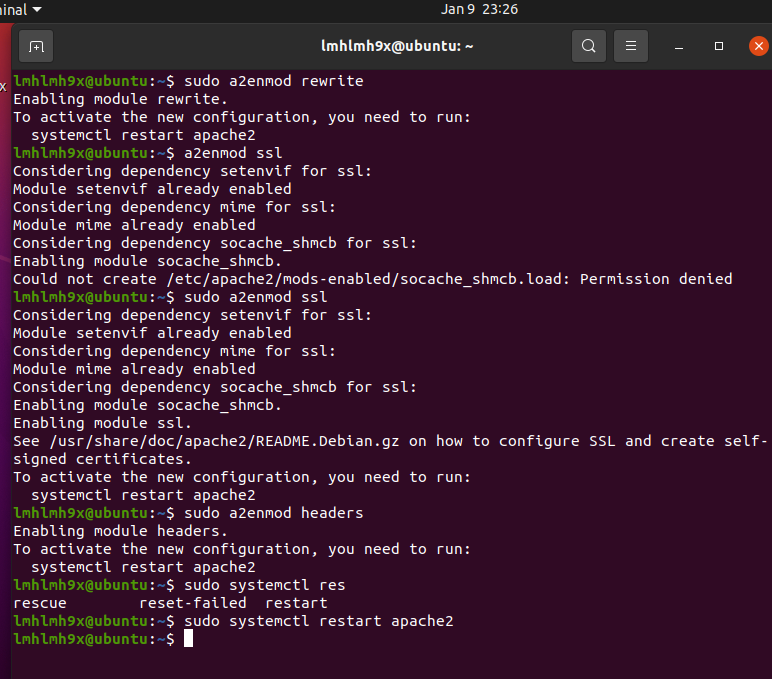
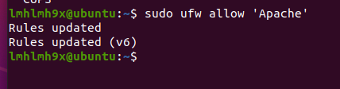

# Các bước cài Webserver trên Ubuntu
## 1. Cài đặt apache
- Apache có sẵn trong kho phần mềm của Ubuntu, có thể cài dặt bằng công cụ quản lý gói thông thường như apt. 
- Cập nhật apt
    + sudo apt update

    

- Sau đó, cài đặt apache2 bằng cách chạy lệnh:
    + sudo apt install apache2 -y

        

- Tiếp theo cần bật một số mod cần thiết như SSL, rewrite, header

    + sudo a2enmod rewrite
    + sudo a2enmod ssl
    + sudo a2enmod headers
    + sudo systemctl restart apache2

    
## Cấu hình tường lửa
- Trước khi kiểm tra Apache, cần phải sửa đổi các cài đặt tường lửa để có thể truy cập vào các cổng web mặc định. Trong quá trình cài đặt, Apache tự đăng ký với UFW để cung cấp một vài cấu hình ứng dụng có thể được sử dụng để bật hoặc tắt quyền truy cập vào Apache thông qua tường lửa.

- Có thể liệt kê các hồ sơ ứng dụng trong ufw bằng cách chạy lệnh sau:
    + sudo ufw app list

    

- Nên kích hoạt cấu hình hạn chế nhất để đảm bảo vừa cho phép lưu lượng truy cập mà bạn đã cấu hình vừa đảm bảo vấn đề bảo mật. Thông thường đổi với dịch vụ web các bạn chỉ cần mở port 80 cho giao thức HTTP và port 443 cho giao thức HTTPS:

    + sudo ufw allow 'Apache'

    

## Kiểm tra trang web. 
- Sau khi kết thúc quá trình cài đặt, Ubuntu 20.04 sẽ tự khởi động Apache và không cần chạy thêm bất kỳ lệnh nào để khởi động Apache. Để kiểm tra xem Apache đã thực sự hoạt động hay chưa các bạn sử dụng lệnh sau:

    + sudo systemctl status apache2

    

- Ngoài ra, để xác định việc cấu hình UFW Firewall đã thành công và có thể truy cập website từ bên ngoài hãy truy cập http://127.0.0.1 trên trình duyệt để kiểm tra.

    

## Quản lý Apache
- Có thể quản lí Apache bằng các lệnh như: 
- Để dừng Apache các bạn dùng lệnh:
    + sudo systemctl stop apache2
- Để khởi động Apache các bạn dùng lệnh:
    + sudo systemctl start apache2
- Để khởi động lại Apache các bạn dùng lệnh:
    + sudo systemctl restart apache2
- Nếu bạn chỉ đơn giản là thực hiện thay đổi cấu hình, Apache có thể tải lại mà không làm mất kết nối. Để làm điều này, sử dụng lệnh sau:
    + sudo systemctl reload apache2
- Theo mặc định, Apache được cấu hình khởi động cùng máy chủ (Auto start). Nếu bạn không muốn Apache khởi động cùng máy chủ hãy dùng lệnh sau:
    + sudo systemctl disable apache2
- Để kích hoạt cấu hình khởi động cùng máy chủ hãy dùng lệnh sau:
    + sudo systemctl enable apache2
## Thiết lập Virtual Host
- Tạo thư mục lưu trữ source code cho website:
    + sudo mkdir -p /var/www/html/leminhhoang/public_html
- Tạo file index.html cho website leminhhoang.com:
    + sudo nano /var/www/html/leminhhoang/public_html/index.html

    

- Phân quyền cho thư mục lưu trữ website: 
    + sudo chown -R www-data:www-data /var/www/html/leminhhoang/public_html
    + sudo chmod -R 755 /var/www/html

- Tạo Virtual Host cho Website:
    + sudo nano /etc/apache2/sites-available/leminhhoang.com.conf

    

-  Kích hoạt file config của Apache Virtual Hosts

    + sudo a2dissite 000-default.conf
    + sudo a2ensite leminhhoang.conf

- Sau đó khởi động lại Apache

    + sudo systemctl reload apache2
- Kết quả: 

    
