## Cài đặt IIS
1. Ở Server Manager, chọn Add Roles...
 
 

2. Next đến chỗ 

 
+ Chọn Add features xong next.
3. Next tiếp xong install, thiếu features nào cài sau.

4. Vào chỗ Tools, chọn IIS manager 

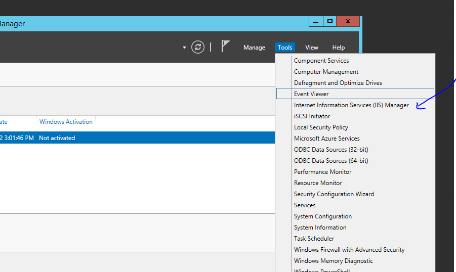

## Tạo web html
1. Mở notepad bằng quyền admin, type ....
2. Save vào thư mục C:/interput/wwwroot với tên index.html

3. Kiểm tra bằng cách vào trình duyệt của máy gõ 127.0.0.1 hoặc localhost.

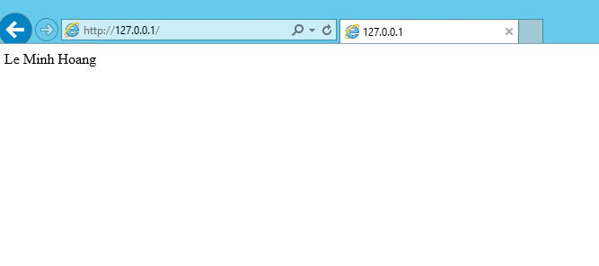

*Thiếu features nào thì cài* 

## Dựng web PHP
1. Dowload PHP theo link: https://windows.php.net/download/
2. Dowload Wincache theo link: https://sourceforge.net/projects/wincache/files/
3. Giải nén PHP vừa tạo vào đường dẫn : C:\PHP\
4. Giải nén Wincache vào đường dẫn C:\PHP\ext\

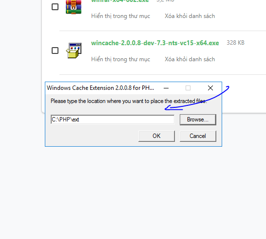

5. Vào Control Panel, chọn System and Security, Click tiếp Advanced SYstem settings.

6. Ở System Properties, chọn tab Advanced, Chọn Environment Variables.
7. Ở system varariables, chọn Path, rồi chọn Edit.

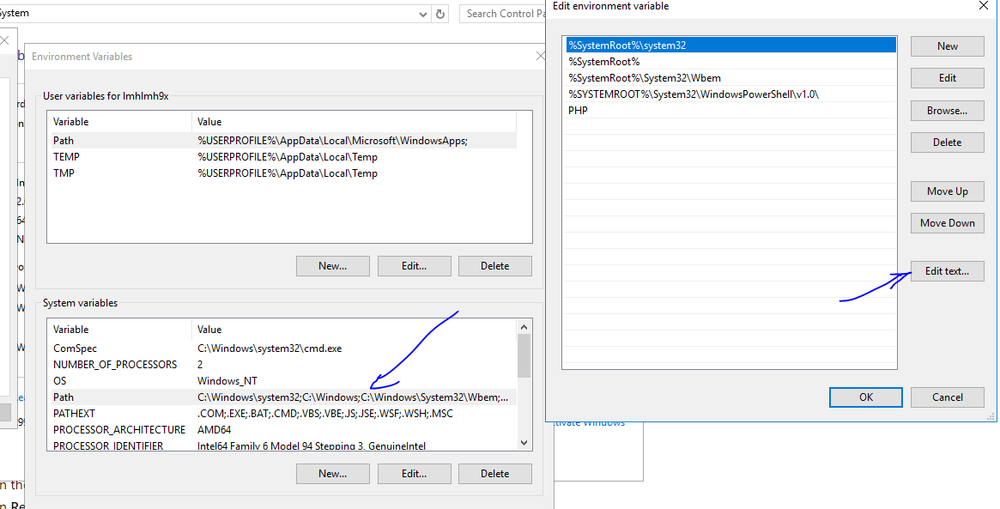

8. Chọn tiếp edit text, Thêm PHP vào cuối, vì đường dẫn vào PHP là C:\PHP. Sau đó OK.

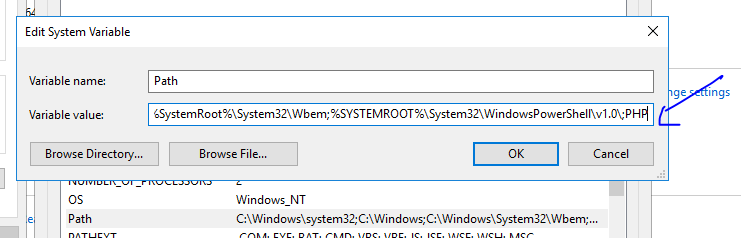

9. Mở IIS Manager, CLick vào tên của máy, sau đó chọn Handler Mappings.

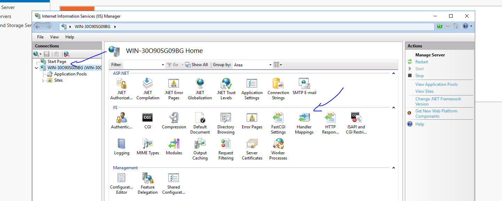

10. Chọn Add module Mapping, nhập tt như hình (tùy thuộc vào đường dẫn nữa), sau đó ok.

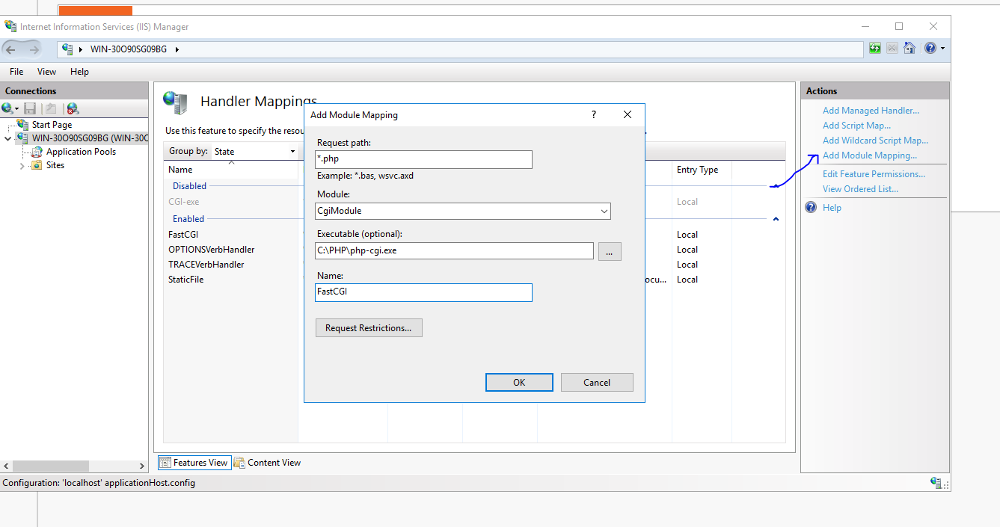

11. Chọn Default Documents, add thêm 2 cái là index.php và Default.php

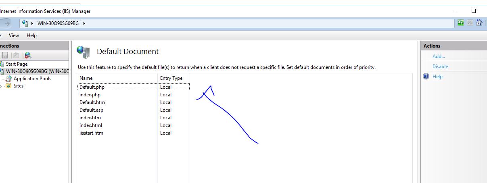

12. Tạo 1 file PHP basic, thêm vào thư mục wwwroot. Kết quả :

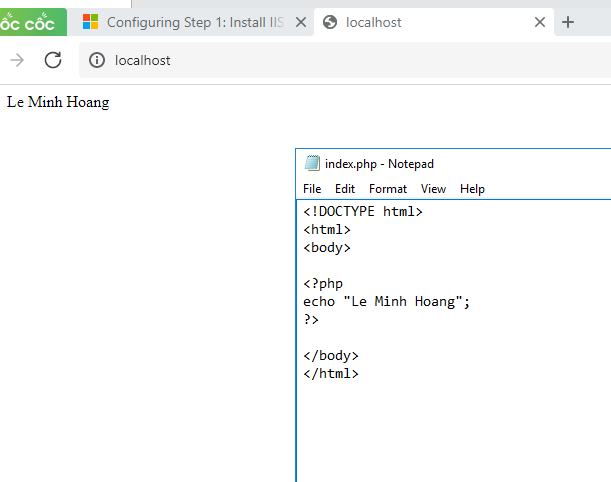

## Dựng Web ASP basic
1. Cài thêm features ASP và ISAPI extentions.

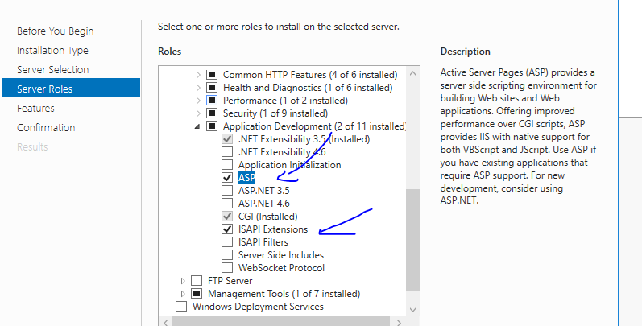

2. Vào IIS Manager để add thêm 1 website ASP hoặc dùng wwwroot thêm 1 index.asp là chạy.

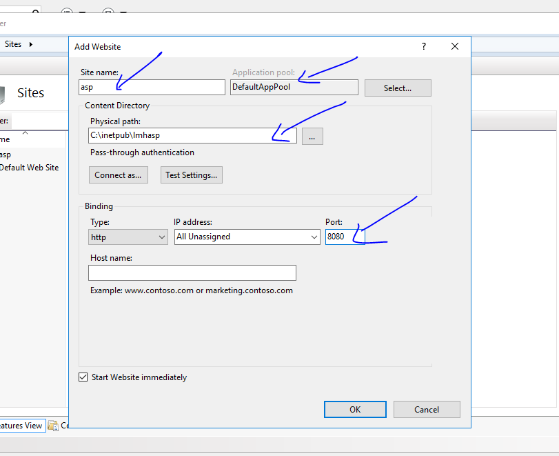

3. Muốn chạy được phải có file config, copy webconfig bên wwwroot ném vào asp là ok. Vào trình duyệt gõ localhost:8080 để ktra kết quả

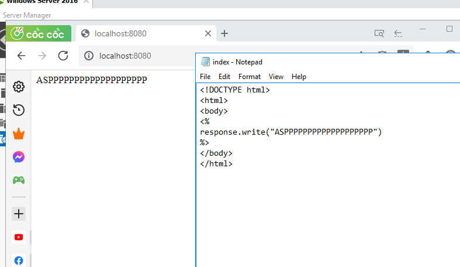
 

## Dựng Web ASP.net

1. Add features, cái nào có rồi thì thôi

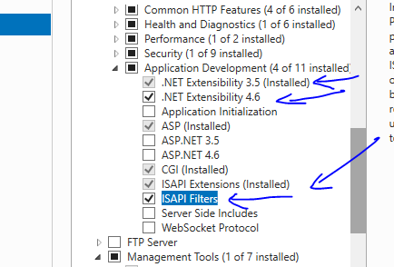

2. Làm tương tự ASP basic.

