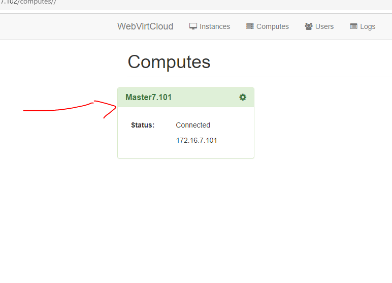
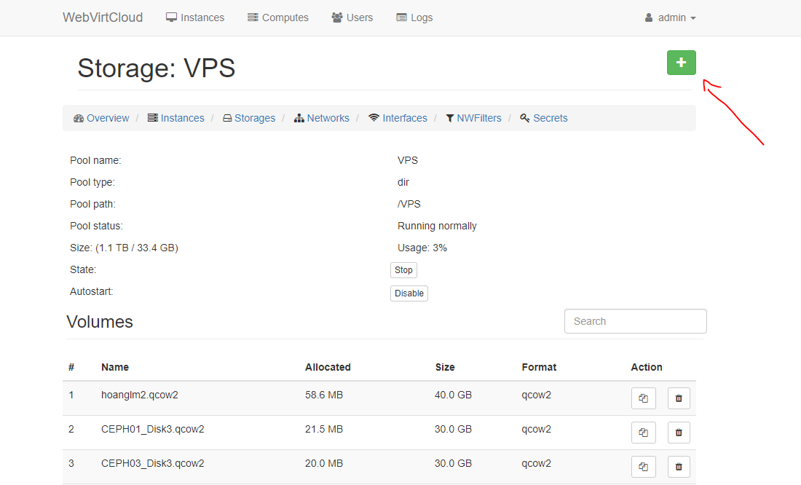
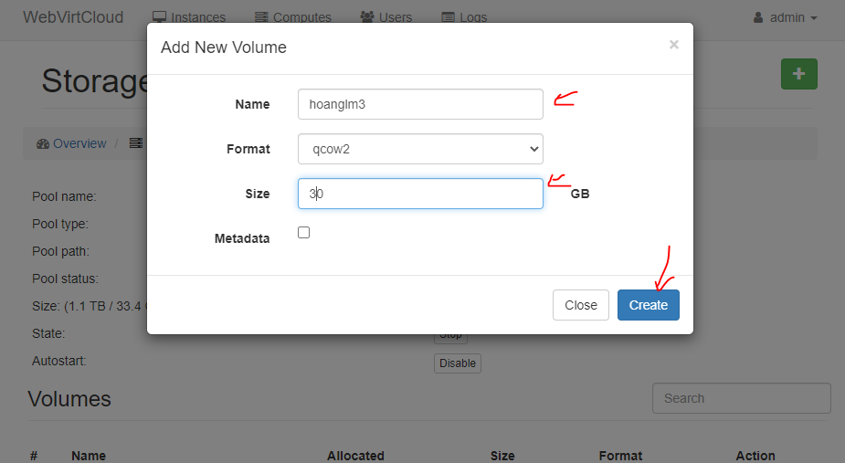
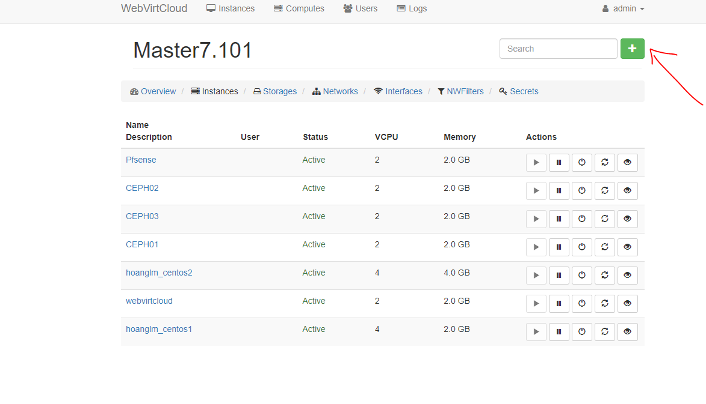
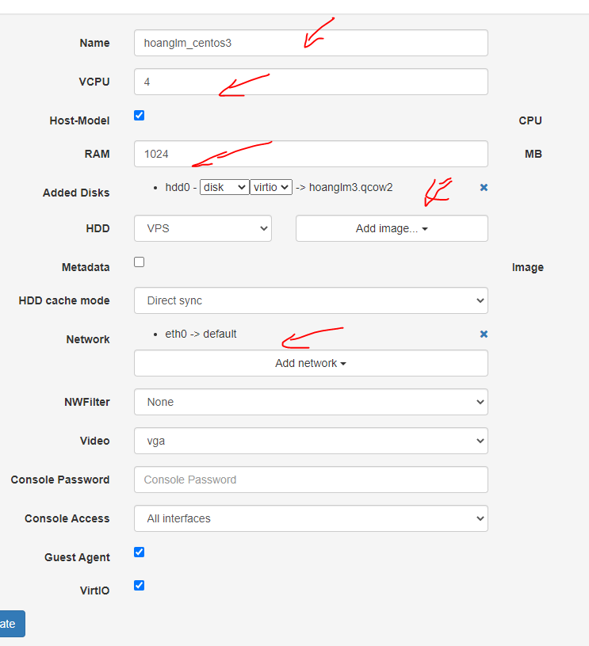
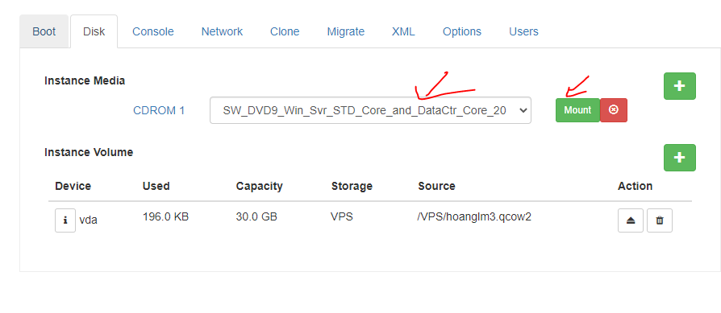
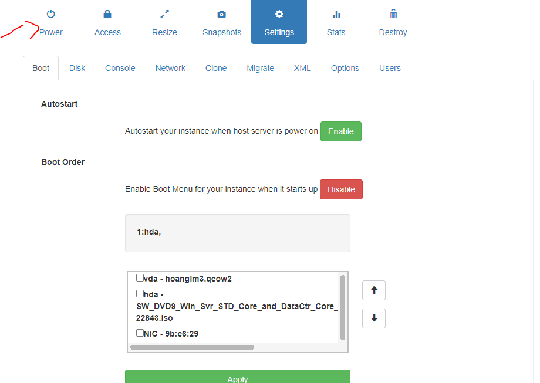
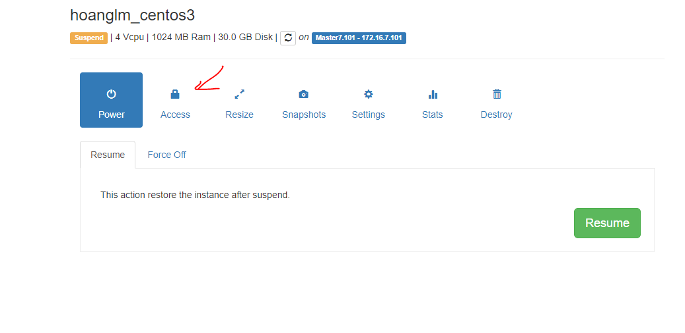
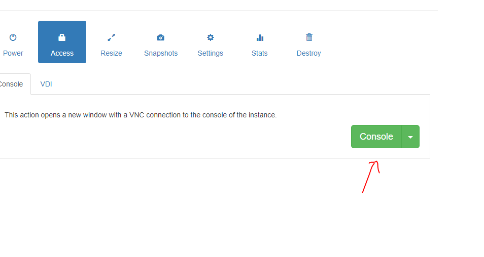
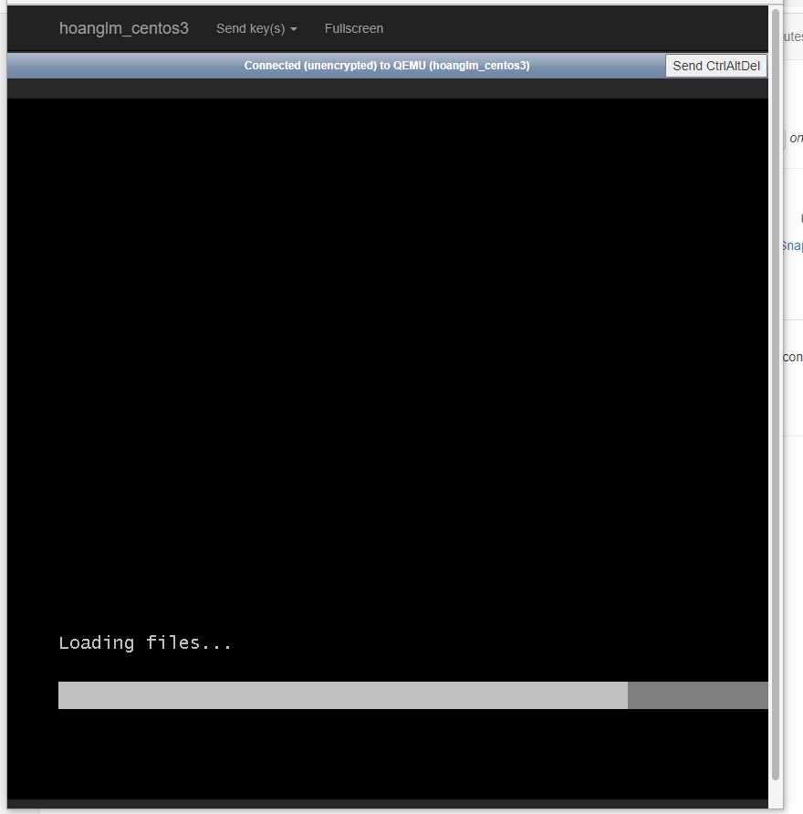

## Các bước

- Đầu tiên đăng nhập vào 

- Chọn computers

- Chọn storages và tạo mới

- Chọn instances và tạo vps mới

- Chọn ổ boot

- Sau đó cấp nguồn, vào access để xem tiến trình....

- Sau khi cài xong nhớ tắt nguồn và tạo snapshot..
