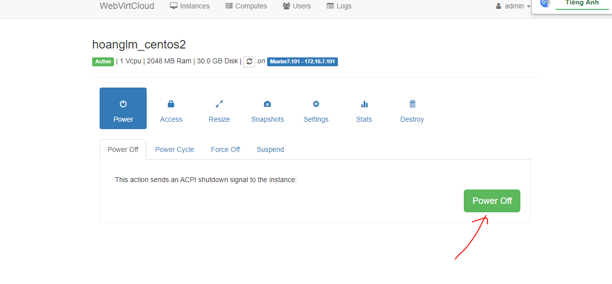
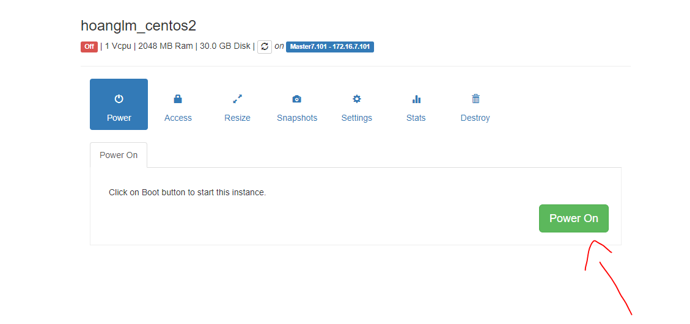

# Các bước thực hiện

1. Đầu tiên chọn vps cần đổi ip ở intances

2. Tắt nguồn máy 

3. Vào setting

4. Chọn network

5. Ở phần nic, nếu chưa ở card vlan172 thì đổi thành vlan 172 sau đó apply,  không thì bỏ qua bước này

6. Cấp nguồn lại

7. Vào accces chọn console

8. Ban đầu chưa có ip, card mạng là eth0

9. Restart card mạng

- ifdown eth0

- ifup eth0

10. Đã có ip động, giờ cần đổi về ip tĩnh

11. Mở file cấu hình mạng
- nano /etc/sysconfig/network-scripts/ifcfg-eth0

12. Cấu hình :

- BOOTPROTO đổi từ DHCP sang Static

- ONBOOT đổi từ yes thành no

- Thêm 3 dòng IPADDR, NETMASK, GATEWAY (Cái này bảo a quản lí con gốc, không cho linh tinh được)

13. Lưu lại rồi restart mạng

- Systemctl restart network

14. Kiểm tra lại và ping thử

- ok đã ăn IP tĩnh

15. Thử kết nối SSH

- OK

